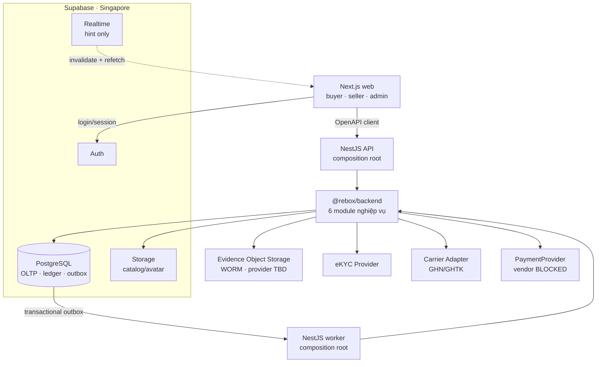
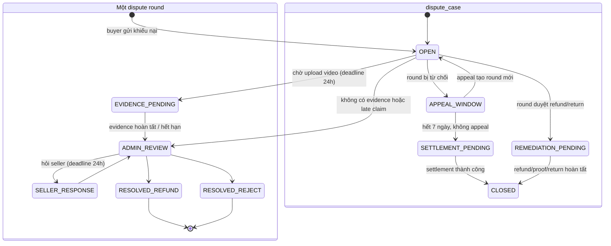

# REBOX - Technical Specification

Phiên bản 1.1 · Trạng thái: Baseline kỹ thuật MVP · Quyết định canonical: `07-ARCHITECTURE-DECISIONS.md`

---

## 1. Phạm vi & mục tiêu kỹ thuật

### 1.1. Trong phạm vi (v1)

Web responsive (Buyer + Seller), Admin Console web, Backend API, Worker, catalog manual/CSV, tích hợp ĐVVC, payment sau legal gate, ví/ledger và xử lý tranh chấp thủ công.

### 1.2. Ngoài phạm vi (v1)

Mobile App, AI Triage tự động, live API Shopee/TikTok, Public API ERP, multi-seller checkout, loyalty/voucher, Redis/BullMQ, Kubernetes, Meilisearch, livestream, đấu giá, chat realtime, đa ngôn ngữ, đa tiền tệ, logistics tự vận hành và blind-box.

### 1.3. Ràng buộc thiết kế bắt buộc

| #   | Ràng buộc                                               | Hệ quả kỹ thuật                                                  |
| --- | ------------------------------------------------------- | ---------------------------------------------------------------- |
| C1  | Mọi listing có `quantity = 1`, không tái tạo            | Cần reservation lock; không dùng mô hình kho số lượng            |
| C2  | Tiền bán hàng **không** đi qua REBOX                    | Không xây escrow tiền hàng; chỉ xây ledger ký quỹ                |
| C3  | Phí sàn chỉ thu được từ ví ký quỹ                       | Ledger phải tuyệt đối chính xác, có kiểm toán                    |
| C4  | Video khiếu nại là chứng cứ pháp lý                     | Lưu WORM, hash SHA-256, chain of custody, không sửa được         |
| C5  | Supabase dùng region Singapore trong dev/staging         | Production cần legal gate về chuyển dữ liệu; không tuyên bố lưu tại VN |
| C6  | Nếu AI GĐ3 được bật, AI không được tự động từ chối       | Chỉ có auto-approve / escalate sau eval và legal gate             |
| C7  | Đội dev 1–2 người ở GĐ1, ngân sách ~2–3tr/tháng hạ tầng | Modular monolith, không microservices; managed service tối thiểu |

---

## 2. Kiến trúc tổng thể

### 2.1. Sơ đồ hệ thống



### 2.2. Nguyên tắc kiến trúc

1. **Modular monolith, không microservices.** Một codebase nghiệp vụ trong `@rebox/backend`, được compose thành API và worker. Ranh giới module qua interface + domain event nội bộ.
2. **AI Triage là GĐ3.** Khi được kích hoạt mới tách Python runtime vì khác profile tài nguyên; MVP xử lý tranh chấp thủ công.
3. **Không gọi HTTP bên ngoài trong DB transaction.** Lookup tương tác được phép gọi ngoài transaction với timeout/fallback; side effect không cần trả ngay đi qua PostgreSQL outbox.
4. **Mọi thao tác tiền là idempotent** và ghi vào sổ cái kép. Không có ngoại lệ.
5. **Event sourcing cục bộ cho ví** - số dư là kết quả suy ra từ sổ cái, bảng balance chỉ là materialized view có version.

### 2.3. Chiến lược web-first và khả năng tái sử dụng cho mobile

> **Quyết định:** làm **web trước, mobile sau**. Mục tiêu là khi làm mobile ở GĐ3 thì tái sử dụng được tối đa, chứ không phải viết lại từ đầu.

#### 2.3.1. Cái gì tái sử dụng được, cái gì không

Không có framework nào "chuyển web thành mobile". React Native **không chạy** HTML/CSS — `<div>`, `<span>`, CSS thật đều không tồn tại. **Tầng giao diện luôn phải viết lại**, bất kể chọn công nghệ gì.

| Tái sử dụng được | Phải viết lại |
|---|---|
| Kiểu dữ liệu, DTO, schema Zod | Toàn bộ màn hình |
| API client (sinh từ OpenAPI) | Điều hướng |
| Logic nghiệp vụ: tính phí, định dạng tiền, state machine | Component UI |
| Quản lý state server (TanStack Query) | |
| Validate form | |

Tổ chức code kỷ luật ⇒ dùng lại **50–60%**. Không kỷ luật ⇒ gần **0%**. **Đây mới là yếu tố quyết định, không phải việc chọn framework nào.**

#### 2.3.2. Vì sao không dùng một codebase duy nhất

Phương án **Expo + React Native Web** cho một codebase chạy cả web lẫn native, tái sử dụng ~85%. Đã cân nhắc và **loại**.

Lý do: nó xuất ra SPA, Google index kém — trong khi kênh thu hút người mua của REBOX phụ thuộc vào việc tìm thấy trang sản phẩm qua tìm kiếm. Next.js SSR giải quyết việc đó.

**Đánh đổi có ý thức:** mất ~35% khả năng tái sử dụng để giữ SEO. Với mô hình marketplace, đáng.

#### 2.3.3. Giao diện chia sẻ token, không chia sẻ component

Web dùng Tailwind; mobile có thể dùng NativeWind ở GĐ3. Hai nền tảng có thể dùng chung tên token và quy ước utility, nhưng **không cam kết JSX/component/class web chạy nguyên xi trên React Native**. Tài sản dùng chung được bảo đảm là `ui-tokens`, schema, API client và logic thuần.

### 2.4. Stack và lý do chọn

| Lớp | Công nghệ | Lý do |
|---|---|---|
| Backend | **NestJS + TypeScript** | Cùng ngôn ngữ với FE ⇒ dùng chung type/DTO/validation. DI giúp test được sổ cái; module boundary ép kỷ luật. ⚠️ Đường học dốc hơn Express — xem §2.6 |
| Platform dữ liệu | **Supabase PostgreSQL + Auth** | PostgreSQL là nguồn sự thật; Auth sở hữu credential/OTP/session; project dùng specific region Singapore |
| ORM | **Drizzle** | SQL-first, type-safe, migration rõ ràng. Quan trọng với module ví: cần nhìn thấy SQL thật đang chạy |
| Lock / Queue | **PostgreSQL row lock + transactional outbox** | Một nguồn bền vững; Redis/BullMQ chỉ thêm khi metric chứng minh cần |
| Object storage | **Supabase Storage cho catalog** + **WORM provider TBD cho evidence** | Supabase Storage không có versioning/Object Lock; evidence có adapter riêng |
| Search | **PostgreSQL FTS** | Không thêm Meilisearch ở MVP |
| **Web + Admin** | **Next.js App Router** | Nền tảng chính của GĐ1; pin exact version khi scaffold/lockfile |
| UI | **Tailwind + shadcn/ui** | shadcn là code copy vào repo, không phải dependency nặng. Tailwind là mắt xích sang NativeWind (§2.3.3) |
| State | **TanStack Query + Zustand** | Query cho server state; Zustand cho UI state cục bộ. Cả hai chạy được trên RN |
| Form | **React Hook Form + Zod** | Zod schema dùng chung với backend qua `packages/shared` |
| **Mobile (GĐ3)** | **Expo + NativeWind** | Thêm sau. `react-native-vision-camera` + ML Kit cho quét barcode/OCR on-device |
| AI service | **GĐ3, chưa scaffold runtime** | Chỉ kích hoạt sau ít nhất 200 vụ manual |
| Deploy | Managed Supabase + host web/API/worker | Kubernetes chưa cần ở GĐ1 |
| Observability | OpenTelemetry → Grafana Cloud free tier / self-host Loki + Prometheus | Bắt buộc có từ ngày đầu vì luồng tiền |

### 2.5. Cấu trúc monorepo — quyết định thật nằm ở đây

```
rebox/
├─ apps/
│  ├─ api/          # NestJS
│  ├─ worker/       # PostgreSQL outbox, dùng chung @rebox/backend với api
│  ├─ web/          # Next.js — buyer + seller + admin
│  ├─ mobile/       # Expo — THÊM Ở GĐ3, để trống bây giờ
│  └─ ai-triage/    # Python FastAPI — GĐ3
├─ packages/
│  ├─ backend/      # ⭐ implementation server-only dùng chung bởi api/worker
│  ├─ shared/       # ⭐ type, enum, Zod schema, hằng số
│  ├─ core/         # ⭐ logic thuần: tính phí, định dạng, state machine
│  ├─ api-client/   # ⭐ sinh từ OpenAPI
│  └─ ui-tokens/    # màu, spacing, typography — dạng token, KHÔNG phải CSS
├─ db/
│  ├─ migrations/
│  └─ seeds/
└─ docs/
```

Ba package đánh dấu ⭐ quyết định việc làm mobile sau này mất **3 tuần hay 3 tháng**.

#### Ba quy tắc bắt buộc giữ từ ngày đầu

| # | Quy tắc | Vi phạm thì sao |
|---|---|---|
| 1 | **Không gọi `fetch` trong component.** Mọi lời gọi API đi qua `packages/api-client` | Làm mobile phải viết lại toàn bộ tầng gọi API |
| 2 | **Không tính toán nghiệp vụ trong component.** Tính phí, quy đổi điểm, kiểm tra điều kiện — nằm trong `packages/core`, là hàm thuần, có test | **Lỗi tốn kém nhất.** Logic tính phí rải trong JSX thì mobile phải viết lại, và hai bên sẽ lệch nhau — nghĩa là hai bản tính tiền khác nhau |
| 3 | **Không import gì từ `apps/web` vào `packages/`** | Package biết mình chạy trên web ⇒ không mang sang native được |

Ba quy tắc này nên là **lint rule**, không phải thỏa thuận miệng. Cấu hình `eslint-plugin-boundaries` hoặc `dependency-cruiser` để CI chặn tự động.

### 2.6. Hai cảnh báo trước khi bắt đầu

**NestJS có đường học dốc.** Decorator, dependency injection, module system — mất khoảng **1 tuần** để quen nếu chưa từng dùng. Vẫn giữ vì hệ thống xử lý tiền cần khung sườn ép kỷ luật. Nhưng **dành hẳn tuần đầu Sprint 1 để học, đừng vừa học vừa code module ví.**

**Quét mã vạch trên trình duyệt có giới hạn thật:**

| | Android Chrome | iOS Safari |
|---|---|---|
| `BarcodeDetector` API | ✅ nhanh | ❌ không hỗ trợ |
| ZXing WASM (dự phòng) | ✅ | ✅ nhưng **chậm hơn rõ rệt** |

Nhân viên kho quét 50 kiện liên tiếp trên iPhone bằng web sẽ thấy khó chịu. Đây là lý do **app mobile cho seller đáng làm trước app cho buyer** ở GĐ3 — ngược với trực giác thông thường.

---

## 3. Phân rã module nghiệp vụ

| Module | Capability bên trong | Seam bên ngoài chính |
|---|---|---|
| **identity** | profile, shop, membership, role, eKYC, notice/processing record, privacy request | Supabase Auth và eKYC adapter |
| **inventory** | catalog, return inventory, manual/CSV import, moderation | marketplace adapter chỉ ở GĐ3 |
| **commerce** | cart, Fee Engine, checkout và order | gọi interface inventory/funds |
| **funds** | wallet, hold, ledger, payment orchestration, reconciliation | `PaymentProvider` |
| **fulfillment** | shipping, label, tracking, carrier settlement | `CarrierAdapter` |
| **claims** | dispute, evidence binding, decision, appeal | interface processing của identity; `ObjectStorage`; AI seam GĐ3 |

`database`, `outbox`, `audit`, `encryption` và `observability` là platform implementation. Notification là output adapter; Public API ERP là inbound adapter GĐ4, không phải một bản nghiệp vụ riêng.

---

## 4. Data model

### 4.1. Quy ước chung

- Aggregate nghiệp vụ công khai dùng **ULID** dạng text (`RBX-01J8...`). Riêng profile dùng UUID của `auth.users.id` do Supabase Auth sở hữu.
- **Tiền: `BIGINT`, đơn vị VNĐ nguyên**. Tuyệt đối không dùng float/decimal cho tiền.
- Timestamp: `TIMESTAMPTZ`, luôn UTC, quy đổi `Asia/Ho_Chi_Minh` ở tầng hiển thị.
- Soft delete chỉ áp dụng cho catalog. `ledger_postings` và audit là append-only; `ledger_transactions` chỉ cho phép finalize một chiều `DRAFT → POSTED` qua posting function, sau đó bất biến. Role ứng dụng không có quyền UPDATE/DELETE trực tiếp.

### 4.2. Bảng lõi (rút gọn - chỉ cột quan trọng)

```sql
-- ========== IDENTITY & SHOP ==========
-- Credential, OTP và session nằm trong auth.users của Supabase.
CREATE TABLE profiles (
  id              UUID PRIMARY KEY REFERENCES auth.users(id),
  full_name_enc   BYTEA,                 -- mã hóa tầng app (AES-GCM, key ở KMS)
  status          TEXT NOT NULL,         -- ACTIVE | SUSPENDED | DELETED
  created_at      TIMESTAMPTZ NOT NULL DEFAULT now()
);

CREATE TABLE shops (
  id                    TEXT PRIMARY KEY,
  display_name          TEXT NOT NULL,
  legal_type            TEXT NOT NULL,   -- INDIVIDUAL | HOUSEHOLD | ENTERPRISE
  tax_code              TEXT,
  kyc_status            TEXT NOT NULL,   -- PENDING | VERIFIED | REJECTED
  kyc_verified_at       TIMESTAMPTZ,
  status                TEXT NOT NULL,   -- ONBOARDING | ACTIVE | PAUSED | LOCKED_INSUFFICIENT_FUND | SUSPENDED
  payout_bank_bin       TEXT,            -- ngân hàng nhận tiền bán hàng
  payout_account_enc    BYTEA,
  payout_verified_at    TIMESTAMPTZ,     -- đã xác thực chủ tài khoản
  locked_at             TIMESTAMPTZ,
  created_at            TIMESTAMPTZ NOT NULL DEFAULT now()
);

CREATE TABLE shop_memberships (
  user_id       UUID NOT NULL REFERENCES profiles(id),
  shop_id       TEXT NOT NULL REFERENCES shops(id),
  role          TEXT NOT NULL, -- OWNER | MANAGER | WAREHOUSE | ACCOUNTING
  status        TEXT NOT NULL,
  created_at    TIMESTAMPTZ NOT NULL DEFAULT now(),
  PRIMARY KEY (user_id, shop_id)
);

CREATE TABLE platform_staff_roles (
  user_id       UUID NOT NULL REFERENCES profiles(id),
  role          TEXT NOT NULL, -- SUPPORT | MODERATOR | DISPUTE_ARBITRATOR | SUPER_ADMIN
  status        TEXT NOT NULL,
  created_at    TIMESTAMPTZ NOT NULL DEFAULT now(),
  PRIMARY KEY (user_id, role)
);

CREATE TABLE legal_document_versions (
  id              TEXT PRIMARY KEY,
  document_type   TEXT NOT NULL, -- TERMS | MARKETPLACE_RULES | PRIVACY
  version         TEXT NOT NULL,
  locale          TEXT NOT NULL,
  content_sha256  TEXT NOT NULL,
  immutable_body_ref TEXT NOT NULL,
  effective_from  TIMESTAMPTZ NOT NULL,
  approved_by     UUID NOT NULL REFERENCES profiles(id),
  UNIQUE (document_type, version, locale)
);

CREATE TABLE legal_acceptances (
  id              TEXT PRIMARY KEY,
  user_id         UUID NOT NULL REFERENCES profiles(id),
  document_version_id TEXT NOT NULL REFERENCES legal_document_versions(id),
  accepted_at     TIMESTAMPTZ NOT NULL,
  ip              INET,
  user_agent      TEXT,
  UNIQUE (user_id, document_version_id)
);

-- ========== VÍ & SỔ CÁI (module lõi) ==========
CREATE TABLE wallets (
  id                TEXT PRIMARY KEY,
  shop_id           TEXT UNIQUE NOT NULL REFERENCES shops(id),
  available_amount  BIGINT NOT NULL DEFAULT 0,   -- materialized, suy ra từ ledger
  locked_amount     BIGINT NOT NULL DEFAULT 0,
  withdrawal_pending_amount BIGINT NOT NULL DEFAULT 0,
  unmatched_reserve_amount BIGINT NOT NULL DEFAULT 0,
  debt_amount       BIGINT NOT NULL DEFAULT 0,   -- khoản phải thu khi chi phí vượt hold
  version           BIGINT NOT NULL DEFAULT 0,   -- optimistic lock
  updated_at        TIMESTAMPTZ NOT NULL DEFAULT now(),
  CONSTRAINT chk_nonneg CHECK (
    available_amount >= 0 AND locked_amount >= 0 AND
    withdrawal_pending_amount >= 0 AND unmatched_reserve_amount >= 0 AND debt_amount >= 0
  )
);

-- Header tách khỏi posting: idempotency và trạng thái thuộc cả giao dịch.
CREATE TABLE ledger_transactions (
  id              TEXT PRIMARY KEY,
  txn_type        TEXT NOT NULL,          -- xem §5.2
  idempotency_key TEXT NOT NULL UNIQUE,   -- giữ vĩnh viễn
  ref_type        TEXT,                   -- ORDER | DISPUTE | TOPUP | WITHDRAWAL
  ref_id          TEXT,
  status          TEXT NOT NULL,          -- DRAFT | POSTED
  occurred_at     TIMESTAMPTZ NOT NULL,
  created_at      TIMESTAMPTZ NOT NULL DEFAULT now()
);

CREATE TABLE ledger_postings (
  id              BIGSERIAL PRIMARY KEY,
  transaction_id  TEXT NOT NULL REFERENCES ledger_transactions(id),
  account         TEXT NOT NULL,          -- xem §5.1
  wallet_id       TEXT REFERENCES wallets(id),
  amount          BIGINT NOT NULL,        -- dương = ghi Nợ, âm = ghi Có
  currency        TEXT NOT NULL DEFAULT 'VND',
  memo            TEXT,
  created_at      TIMESTAMPTZ NOT NULL DEFAULT now()
);
CREATE INDEX idx_posting_wallet_time ON ledger_postings(wallet_id, created_at DESC);
CREATE INDEX idx_ledger_ref ON ledger_transactions(ref_type, ref_id);

-- Ordinary CHECK không thể kiểm tra SUM qua nhiều row. Mọi ghi đi qua một
-- posting function/finalize step hoặc deferred constraint trigger; chỉ chuyển
-- header sang POSTED khi SUM(postings.amount) = 0. Ledger là append-only.

-- ========== CATALOG ==========
CREATE TABLE restricted_categories (
  id              TEXT PRIMARY KEY,
  category_code   TEXT NOT NULL,
  policy_level    TEXT NOT NULL, -- BANNED | MANUAL_REVIEW | DISCLOSURE
  rule_snapshot   JSONB NOT NULL,
  policy_version  TEXT NOT NULL,
  effective_from  TIMESTAMPTZ NOT NULL,
  effective_to    TIMESTAMPTZ,
  approved_by     UUID NOT NULL REFERENCES profiles(id),
  UNIQUE (category_code, policy_version)
);

CREATE TABLE return_items (
  id                    TEXT PRIMARY KEY,
  shop_id               TEXT NOT NULL REFERENCES shops(id),
  source_platform       TEXT NOT NULL,   -- SHOPEE | TIKTOK | LAZADA
  source_tracking_enc   BYTEA NOT NULL,  -- MÃ VẬN ĐƠN - mã hóa, không bao giờ ra API công khai
  source_tracking_hash  TEXT NOT NULL,   -- HMAC để dedupe mà không cần giải mã
  source_order_ref      TEXT,
  source_sku            TEXT,
  original_price        BIGINT,
  return_reason         TEXT,            -- BOMB | CHANGE_MIND | DEFECT | WRONG_ITEM
  returned_at           TIMESTAMPTZ,
  ingest_method         TEXT NOT NULL,   -- SCAN | CSV | API; listing thuần manual không tạo row này
  liquidation_status    TEXT NOT NULL,   -- IN_STOCK | LISTED | SOLD | DISCARDED
  raw_payload           JSONB,
  created_at            TIMESTAMPTZ NOT NULL DEFAULT now()
);
CREATE UNIQUE INDEX uq_return_dedupe ON return_items(shop_id, source_tracking_hash);

CREATE TABLE listings (
  id                   TEXT PRIMARY KEY,          -- ULID công khai, KHÔNG phải mã vận đơn
  shop_id              TEXT NOT NULL REFERENCES shops(id),
  return_item_id       TEXT REFERENCES return_items(id),
  title                TEXT NOT NULL,
  description          TEXT,
  category_id          TEXT NOT NULL,
  condition_grade      TEXT NOT NULL,   -- NEW_SEALED | LIKE_NEW_99 | GOOD | FAIR | DEFECT
  condition_notes      TEXT NOT NULL,   -- mô tả trung thực khuyết điểm - bắt buộc
  price                BIGINT NOT NULL,
  original_price       BIGINT,
  price_cap            BIGINT,          -- 0.9 * original_price, chỉ ép khi price_source đã đối chiếu
  price_source         TEXT NOT NULL,   -- VERIFIED_PLATFORM | VERIFIED_CSV | SELLER_DECLARED, xem §4.2.1
  weight_gram          INT NOT NULL,
  dim_cm               JSONB,           -- {l,w,h} - cần cho tính cước
  images               JSONB NOT NULL,  -- [{key, w, h, phash}]
  status               TEXT NOT NULL,   -- xem §6.2
  hidden_reason        TEXT,            -- INSUFFICIENT_FUND | POLICY | SELLER
  published_at         TIMESTAMPTZ,
  reserved_until       TIMESTAMPTZ,
  search_tsv           TSVECTOR,
  created_at           TIMESTAMPTZ NOT NULL DEFAULT now(),
  CONSTRAINT chk_price_cap CHECK (price_cap IS NULL OR price <= price_cap)
);
CREATE INDEX idx_listing_active ON listings(shop_id, price DESC)
  WHERE status = 'ACTIVE';
CREATE INDEX idx_listing_search ON listings USING GIN(search_tsv);

CREATE TABLE policy_complaints (
  id              TEXT PRIMARY KEY,
  listing_id      TEXT REFERENCES listings(id),
  complaint_type  TEXT NOT NULL, -- IP | PROHIBITED_GOODS | MISLEADING | OTHER
  reporter_contact_enc BYTEA,
  statement       TEXT NOT NULL,
  status          TEXT NOT NULL, -- OPEN | TRIAGED | ACTIONED | REJECTED | CLOSED
  assigned_to     UUID REFERENCES profiles(id),
  created_at      TIMESTAMPTZ NOT NULL
);
```

#### 4.2.1. `price_source` — vì sao cần tách nguồn gốc giá

Trần 90% chỉ có ý nghĩa khi `original_price` đến từ dữ liệu đã đối chiếu được (API sàn hoặc CSV do seller tự xuất, đối chiếu chéo với sản phẩm cùng SKU đã có trên hệ thống). Với listing tạo hoàn toàn thủ công, seller tự gõ cả `original_price` lẫn `price` — REBOX không có cách nào kiểm chứng con số gốc đó, nên ép trần 90% lên nó chỉ là ảo giác kiểm soát: seller có thể khai giá gốc cao hơn thực tế để mức giảm luôn "hợp lệ" mà giá bán thực chất không hề rẻ.

Nghiêm trọng hơn: hiển thị `original_price` gạch ngang kèm % giảm cho một con số REBOX không kiểm chứng là đưa ra **giá tham chiếu không có căn cứ** — hành vi cung cấp thông tin gây nhầm lẫn cho người tiêu dùng, và trách nhiệm thuộc về REBOX với tư cách bên xuất bản, không thuộc về seller.

**Quy tắc bắt buộc, thực thi ở tầng API (không chỉ ở UI):**

| `price_source` | Sinh ra khi | `price_cap` | Trả về cho client |
|---|---|---|---|
| `VERIFIED_PLATFORM` | Listing tạo từ scan có đối chiếu API sàn thành công | `0.9 × original_price`, ép cứng bằng `CHECK` | `original_price`, `discount_pct`, nhãn "Giá gốc đối chiếu từ {sàn}" |
| `VERIFIED_CSV` | Listing tạo từ dòng CSV seller tự xuất | `0.9 × original_price` | như trên, nhãn "Giá gốc đối chiếu từ dữ liệu người bán" |
| `SELLER_DECLARED` | Listing tạo hoàn toàn thủ công, không có `return_item_id` liên kết | `NULL` — không ép | **chỉ `price`**. API không trả `original_price`, không trả `discount_pct`, dù seller có nhập |

Endpoint public (`GET /listings/{id}`, danh sách tìm kiếm) **không serialize** `original_price` khi `price_source = SELLER_DECLARED`, kể cả khi cột đó có giá trị trong DB. Đây là quy tắc ở tầng response serializer, không phải quy ước ở frontend — tránh trường hợp một client khác (web, mobile, hoặc đối tác Public API) vô tình hiển thị con số chưa kiểm chứng.

**Về tính cạnh tranh của giá (khác với tính xác thực của giá gốc, xem thêm `05-PHAP-LY` §5.3.1):** với `SELLER_DECLARED`, REBOX chỉ đảm bảo *không hiển thị mức giảm giả*, KHÔNG đảm bảo *giá bán có thực sự cạnh tranh so với thị trường*. Đây là giới hạn có chủ đích, không phải thiếu sót: không có nguồn dữ liệu độc lập nào để REBOX xác định "giá thị trường" của một món hàng tồn kho hay hàng hoàn tùy ý — bài toán này không nền tảng rao vặt nào giải được ở mức từng listing.

Quyết định thiết kế: để cơ chế lựa chọn của người mua tự điều tiết, đúng như mọi sàn rao vặt ngang hàng (Chợ Tốt, Facebook Marketplace) vận hành với listing không xác tín. Sản phẩm định giá không hợp lý sẽ khó bán, tạo áp lực buộc seller tự điều chỉnh giá cạnh tranh hơn. REBOX không chủ động can thiệp giá ở nhóm này, và **không đưa ra bất kỳ cam kết nào về mức độ cạnh tranh của giá** cho listing `SELLER_DECLARED` trong Quy chế sàn lẫn nội dung truyền thông — hệ quả trực tiếp: mọi tuyên bố "giá thấp hơn thị trường" ở bất kỳ đâu (UI, tài liệu, marketing) phải giới hạn phạm vi rõ ràng cho nhóm `VERIFIED_*`, không được diễn đạt như áp dụng cho toàn sàn.

```sql
-- ========== ĐƠN HÀNG ==========
CREATE TABLE user_addresses (
  id                TEXT PRIMARY KEY,
  user_id           UUID NOT NULL REFERENCES profiles(id),
  address_enc       BYTEA NOT NULL,
  address_hash      TEXT NOT NULL,
  is_default        BOOLEAN NOT NULL DEFAULT false,
  created_at        TIMESTAMPTZ NOT NULL DEFAULT now()
);

CREATE TABLE carts (
  id                TEXT PRIMARY KEY,
  buyer_user_id     UUID UNIQUE NOT NULL REFERENCES profiles(id),
  updated_at        TIMESTAMPTZ NOT NULL DEFAULT now()
);

CREATE TABLE cart_items (
  cart_id           TEXT NOT NULL REFERENCES carts(id),
  listing_id        TEXT NOT NULL REFERENCES listings(id),
  created_at        TIMESTAMPTZ NOT NULL DEFAULT now(),
  PRIMARY KEY (cart_id, listing_id)
);

CREATE TABLE orders (                     -- một checkout của đúng một seller ở MVP
  id                TEXT PRIMARY KEY,
  buyer_user_id     UUID NOT NULL REFERENCES profiles(id),
  payment_method    TEXT,                 -- NULL khi reserve; VIETQR | COD được chốt tại /pay
  ship_address_enc  BYTEA NOT NULL,
  ship_address_hash TEXT NOT NULL,        -- để phát hiện tách đơn / cụm địa chỉ
  grand_total       BIGINT NOT NULL,
  created_at        TIMESTAMPTZ NOT NULL DEFAULT now()
);

CREATE TABLE sub_orders (                 -- đơn vị nghiệp vụ thực sự: 1 seller, 1 kiện
  id                    TEXT PRIMARY KEY,
  order_id              TEXT NOT NULL REFERENCES orders(id),
  shop_id               TEXT NOT NULL REFERENCES shops(id),
  status                TEXT NOT NULL,     -- xem §6.1
  item_total            BIGINT NOT NULL,
  buyer_shipping_fee    BIGINT NOT NULL,   -- 0 hoặc 15.000
  buyer_payable         BIGINT NOT NULL,
  commission_amount     BIGINT NOT NULL,   -- chốt tại checkout, capture khi settle
  fee_snapshot          JSONB NOT NULL,    -- config version + input/output Fee Engine
  payment_status        TEXT NOT NULL,     -- UNPAID | COD_PENDING | COD_REMITTED | CONFIRMED | FULL_REFUND_PENDING | PARTIAL_REFUND_PENDING | REFUNDED | PARTIALLY_REFUNDED | CANCELLED
  delivered_at          TIMESTAMPTZ,       -- NGUỒN SỰ THẬT cho cửa sổ khiếu nại
  claim_deadline_at     TIMESTAMPTZ,       -- delivered_at + 3 ngày
  settled_at            TIMESTAMPTZ,
  created_at            TIMESTAMPTZ NOT NULL DEFAULT now()
);
CREATE UNIQUE INDEX uq_suborder_order_mvp ON sub_orders(order_id);
CREATE INDEX idx_suborder_settle ON sub_orders(claim_deadline_at)
  WHERE status = 'DELIVERED';

CREATE TABLE shipment_intents (
  id                  TEXT PRIMARY KEY,
  sub_order_id        TEXT NOT NULL REFERENCES sub_orders(id),
  direction           TEXT NOT NULL, -- OUTBOUND | RETURN
  carrier_code        TEXT NOT NULL,
  idempotency_key     TEXT NOT NULL UNIQUE,
  request_hash        TEXT NOT NULL,
  status              TEXT NOT NULL, -- INITIATED | PENDING | SUCCEEDED | TERMINAL_FAILED | UNKNOWN | RECONCILING
  provider_ref        TEXT,
  created_at          TIMESTAMPTZ NOT NULL DEFAULT now(),
  updated_at          TIMESTAMPTZ NOT NULL DEFAULT now(),
  UNIQUE (sub_order_id, direction)
);

CREATE TABLE shipments (
  id                  TEXT PRIMARY KEY,
  shipment_intent_id  TEXT UNIQUE NOT NULL REFERENCES shipment_intents(id),
  sub_order_id        TEXT NOT NULL REFERENCES sub_orders(id),
  direction           TEXT NOT NULL, -- OUTBOUND | RETURN
  carrier_code        TEXT NOT NULL,
  provider_shipment_ref TEXT NOT NULL,
  tracking_no_enc     BYTEA NOT NULL,
  tracking_no_hash    TEXT NOT NULL, -- HMAC normalize để lookup, không đưa raw vào key/log
  status              TEXT NOT NULL,
  settlement_mode     TEXT NOT NULL, -- BILLED_SEPARATELY | DEDUCTED_FROM_REMITTANCE | NOT_APPLICABLE
  gross_collected     BIGINT,
  carrier_fee         BIGINT,
  other_deductions    BIGINT,
  net_remitted        BIGINT,
  beneficiary_ref_hash TEXT,
  actual_cost         BIGINT,
  cost_status         TEXT NOT NULL DEFAULT 'ESTIMATED', -- ESTIMATED | FINAL
  cost_source_ref     TEXT,
  version             BIGINT NOT NULL DEFAULT 0,
  created_at          TIMESTAMPTZ NOT NULL DEFAULT now(),
  UNIQUE (sub_order_id, direction),
  UNIQUE (carrier_code, tracking_no_hash)
);

CREATE TABLE sub_order_items (
  id            TEXT PRIMARY KEY,
  sub_order_id  TEXT NOT NULL REFERENCES sub_orders(id),
  listing_id    TEXT NOT NULL REFERENCES listings(id),
  snapshot      JSONB NOT NULL,   -- ĐÓNG BĂNG title/ảnh/mô tả/giá tại thời điểm mua
  price         BIGINT NOT NULL
);

-- ========== TRANH CHẤP ==========
CREATE TABLE dispute_cases (
  id                  TEXT PRIMARY KEY,
  sub_order_id        TEXT UNIQUE NOT NULL REFERENCES sub_orders(id),
  status              TEXT NOT NULL,   -- OPEN | APPEAL_WINDOW | SETTLEMENT_PENDING | REMEDIATION_PENDING | CLOSED
  final_closed_at     TIMESTAMPTZ,     -- chỉ set khi toàn bộ appeal chain/nghĩa vụ đã kết thúc
  created_at          TIMESTAMPTZ NOT NULL DEFAULT now()
);

CREATE TABLE disputes (
  id                  TEXT PRIMARY KEY,
  case_id             TEXT NOT NULL REFERENCES dispute_cases(id),
  raised_by_user_id   UUID NOT NULL REFERENCES profiles(id),
  round_no            INT NOT NULL,
  reason_code         TEXT NOT NULL,   -- NOT_AS_DESCRIBED | DAMAGED | MISSING | EMPTY_BOX | COUNTERFEIT
  buyer_statement     TEXT,
  claimed_amount      BIGINT NOT NULL,
  status              TEXT NOT NULL,   -- xem §6.3
  late_claim           BOOLEAN NOT NULL DEFAULT false,
  needs_manual_redaction BOOLEAN NOT NULL DEFAULT false,
  resolution          TEXT,            -- REFUND_FULL | REFUND_PARTIAL | REJECT
  refund_amount       BIGINT,
  fault_party         TEXT,            -- SELLER | CARRIER | PLATFORM | UNDETERMINED
  require_return      BOOLEAN,
  resolution_reason   TEXT,
  decision_policy_version TEXT,
  resolved_by         UUID REFERENCES profiles(id), -- admin phân xử ở MVP
  resolved_at         TIMESTAMPTZ,
  appeal_of           TEXT REFERENCES disputes(id),
  seller_response_deadline_at TIMESTAMPTZ,
  sla_deadline_at     TIMESTAMPTZ NOT NULL,
  created_at          TIMESTAMPTZ NOT NULL DEFAULT now()
);
CREATE UNIQUE INDEX uq_dispute_case_round ON disputes(case_id, round_no);

-- Phản hồi của seller là submission bất biến theo từng round; evidence đính kèm vẫn
-- đi qua cùng pipeline evidence/WORM, không nhét object key tùy ý vào JSON phản hồi.
CREATE TABLE dispute_responses (
  id                  TEXT PRIMARY KEY,
  dispute_id          TEXT NOT NULL REFERENCES disputes(id),
  shop_id             TEXT NOT NULL REFERENCES shops(id),
  submitted_by        UUID NOT NULL REFERENCES profiles(id),
  position            TEXT NOT NULL, -- AGREE | DISAGREE
  statement           TEXT NOT NULL,
  submitted_at        TIMESTAMPTZ NOT NULL,
  created_at          TIMESTAMPTZ NOT NULL DEFAULT now(),
  UNIQUE (dispute_id, shop_id)
);

CREATE TABLE refunds (
  id                  TEXT PRIMARY KEY,
  source_type         TEXT NOT NULL,   -- DISPUTE | DELIVERY_FAILURE | SELLER_CANCEL
  source_id           TEXT NOT NULL,
  dispute_id          TEXT REFERENCES disputes(id),
  sub_order_id        TEXT NOT NULL REFERENCES sub_orders(id),
  kind                TEXT NOT NULL,   -- FULL | PARTIAL
  amount              BIGINT NOT NULL CHECK (amount > 0),
  execution_mode      TEXT NOT NULL,   -- PSP_CUSTODIAL | SELLER_DIRECT; A10 quyết định production
  fault_party         TEXT NOT NULL,   -- SELLER | CARRIER | PLATFORM | UNDETERMINED
  refund_funder       TEXT NOT NULL,   -- SELLER | CARRIER | PLATFORM; snapshot theo policy A10
  policy_version      TEXT NOT NULL,
  status              TEXT NOT NULL,   -- APPROVED | WAITING_RETURN | WAITING_COST | WAITING_RECIPIENT | PAYOUT_READY | SELLER_ACTION_REQUIRED | PROOF_REVIEW | PENDING | UNKNOWN | RECONCILING | PAID | VERIFIED | FAILED | OVERDUE
  return_required     BOOLEAN NOT NULL DEFAULT false,
  payment_method      TEXT NOT NULL,   -- snapshot từ order: VIETQR | COD
  original_payment_ref TEXT,
  recipient_snapshot  JSONB,           -- encrypted/ref/hash + ownership verification; không nhận chuỗi tùy ý
  provider            TEXT,
  provider_ref        TEXT,
  idempotency_key     TEXT NOT NULL UNIQUE,
  approved_at         TIMESTAMPTZ NOT NULL,
  paid_at             TIMESTAMPTZ,
  last_error          TEXT,
  created_at          TIMESTAMPTZ NOT NULL DEFAULT now(),
  UNIQUE (source_type, source_id),
  CHECK (kind <> 'PARTIAL' OR return_required = false)
);

-- Một payout operation giữ provider key ổn định suốt đời; retry/reconcile không đổi
-- key để tránh double payout. Dùng chung cho refund và withdrawal.
CREATE TABLE payout_operations (
  id                  TEXT PRIMARY KEY,
  payout_type         TEXT NOT NULL, -- REFUND | WITHDRAWAL
  payout_id           TEXT NOT NULL,
  provider            TEXT NOT NULL,
  provider_account_ref TEXT NOT NULL,
  provider_idempotency_key TEXT NOT NULL UNIQUE,
  request_hash        TEXT NOT NULL,
  status              TEXT NOT NULL, -- PENDING | SUCCEEDED | TERMINAL_FAILED | UNKNOWN | RECONCILING
  created_at          TIMESTAMPTZ NOT NULL DEFAULT now(),
  UNIQUE (payout_type, payout_id)
);

-- Mỗi network/query attempt là một row append-only của cùng operation và cùng key.
-- Timeout/UNKNOWN không được coi là thất bại cuối để tạo operation/key mới.
CREATE TABLE payout_attempts (
  id                  TEXT PRIMARY KEY,
  operation_id        TEXT NOT NULL REFERENCES payout_operations(id),
  attempt_no          INT NOT NULL,
  attempt_type        TEXT NOT NULL, -- EXECUTE | QUERY_STATUS | WEBHOOK
  status              TEXT NOT NULL, -- PENDING | SUCCEEDED | TERMINAL_FAILED | UNKNOWN | RECONCILING
  provider_ref        TEXT,
  outcome_code        TEXT,
  started_at          TIMESTAMPTZ NOT NULL,
  finished_at         TIMESTAMPTZ,
  created_at          TIMESTAMPTZ NOT NULL DEFAULT now(),
  UNIQUE (operation_id, attempt_no)
);

-- Bản ghi hold, đặt sau sub_order để FK có hiệu lực và tránh quan hệ vòng.
CREATE TABLE fund_holds (
  id              TEXT PRIMARY KEY,
  wallet_id       TEXT NOT NULL REFERENCES wallets(id),
  sub_order_id    TEXT NOT NULL REFERENCES sub_orders(id),
  amount          BIGINT NOT NULL,
  breakdown       JSONB NOT NULL,   -- {item, buyer_ship, commission, ship_reserve}
  status          TEXT NOT NULL,    -- ACTIVE | RELEASED | SETTLED
  captured_amount BIGINT NOT NULL DEFAULT 0,
  released_amount BIGINT NOT NULL DEFAULT 0,
  expires_at      TIMESTAMPTZ NOT NULL, -- hold checkout có TTL
  created_at      TIMESTAMPTZ NOT NULL DEFAULT now(),
  settled_at      TIMESTAMPTZ,
  CHECK (captured_amount >= 0 AND released_amount >= 0),
  CHECK (captured_amount + released_amount <= amount),
  CHECK (status NOT IN ('RELEASED', 'SETTLED') OR captured_amount + released_amount = amount),
  CHECK (status <> 'RELEASED' OR (captured_amount = 0 AND released_amount = amount))
);
CREATE UNIQUE INDEX uq_hold_suborder ON fund_holds(sub_order_id) WHERE status = 'ACTIVE';

-- Nội dung notice đã được Legal duyệt; client chỉ gửi ID/version đã hiển thị,
-- server tự resolve hash, scope, purpose và legal basis từ registry này.
CREATE TABLE notice_artifacts (
  id              TEXT PRIMARY KEY,
  scope           TEXT NOT NULL,
  version         TEXT NOT NULL,
  locale          TEXT NOT NULL,
  content_sha256  TEXT NOT NULL,
  immutable_body_ref TEXT NOT NULL,
  effective_from  TIMESTAMPTZ NOT NULL,
  effective_to    TIMESTAMPTZ,
  approved_by     UUID NOT NULL REFERENCES profiles(id),
  UNIQUE (scope, version, locale)
);

CREATE TABLE notice_purpose_policies (
  notice_artifact_id  TEXT NOT NULL REFERENCES notice_artifacts(id),
  purpose             TEXT NOT NULL,
  record_type         TEXT NOT NULL, -- NOTICE_ACK | CONSENT
  legal_basis         TEXT NOT NULL,
  decision_required   BOOLEAN NOT NULL,
  PRIMARY KEY (notice_artifact_id, purpose)
);

-- Header bất biến của notice đã render tại một lần tương tác.
CREATE TABLE processing_records (
  id              TEXT PRIMARY KEY,
  user_id         UUID NOT NULL REFERENCES profiles(id),
  scope           TEXT NOT NULL,   -- DISPUTE_EVIDENCE | EKYC_BIOMETRIC
  ref_type        TEXT,
  ref_id          TEXT,
  notice_artifact_id TEXT NOT NULL REFERENCES notice_artifacts(id),
  recorded_at     TIMESTAMPTZ NOT NULL,
  ip              INET,
  user_agent      TEXT,
  device_id       TEXT,
  created_at      TIMESTAMPTZ NOT NULL DEFAULT now()
);
CREATE INDEX idx_processing_lookup ON processing_records(user_id, scope, ref_id);

-- Aggregate ổn định cho timeline của đúng user/scope/ref/purpose. Mỗi lần tương tác
-- (kể cả withdrawal) tạo processing_record mới nhưng nối vào cùng chain.
CREATE TABLE processing_purpose_chains (
  id              TEXT PRIMARY KEY,
  user_id         UUID NOT NULL REFERENCES profiles(id),
  scope           TEXT NOT NULL,
  ref_type        TEXT,
  ref_id          TEXT,
  purpose         TEXT NOT NULL,
  created_at      TIMESTAMPTZ NOT NULL DEFAULT now(),
  UNIQUE NULLS NOT DISTINCT (user_id, scope, ref_type, ref_id, purpose)
);

-- Event append-only theo từng mục đích. Withdrawal là event mới, không UPDATE
-- bản ghi cũ; chỉ dừng purpose thật sự dựa trên consent.
CREATE TABLE processing_purpose_events (
  id                    TEXT PRIMARY KEY,
  chain_id              TEXT NOT NULL REFERENCES processing_purpose_chains(id),
  processing_record_id  TEXT NOT NULL REFERENCES processing_records(id),
  record_type           TEXT NOT NULL, -- NOTICE_ACK | CONSENT
  legal_basis           TEXT NOT NULL, -- Legal duyệt theo từng purpose
  event_type            TEXT NOT NULL, -- ACKNOWLEDGED | GRANTED | DENIED | WITHDRAWN
  previous_event_id     TEXT REFERENCES processing_purpose_events(id),
  actor_user_id         UUID REFERENCES profiles(id), -- NULL chỉ khi source=SYSTEM
  source                TEXT NOT NULL, -- WEB | ADMIN | SYSTEM
  occurred_at           TIMESTAMPTZ NOT NULL,
  created_at            TIMESTAMPTZ NOT NULL DEFAULT now(),
  CHECK ((source = 'SYSTEM') OR actor_user_id IS NOT NULL),
  CHECK (
    (record_type = 'NOTICE_ACK' AND event_type = 'ACKNOWLEDGED') OR
    (record_type = 'CONSENT' AND event_type IN ('GRANTED', 'DENIED', 'WITHDRAWN'))
  )
);
CREATE INDEX idx_processing_purpose_timeline
  ON processing_purpose_events(chain_id, occurred_at);
CREATE UNIQUE INDEX uq_processing_event_successor
  ON processing_purpose_events(previous_event_id)
  WHERE previous_event_id IS NOT NULL;

-- Service/constraint trigger bắt buộc previous_event cùng chain, actor/user khớp,
-- và chỉ append từ event cuối. Client không được tự truyền legal_basis/record_type.

CREATE TABLE kyc_requests (
  id                  TEXT PRIMARY KEY,
  shop_id             TEXT NOT NULL REFERENCES shops(id),
  processing_record_id TEXT NOT NULL REFERENCES processing_records(id),
  provider            TEXT NOT NULL,
  provider_session_ref TEXT,
  provider_idempotency_key TEXT NOT NULL UNIQUE,
  request_hash        TEXT NOT NULL,
  status              TEXT NOT NULL, -- INITIATED | PENDING | VERIFIED | REJECTED | MANUAL_REVIEW | EXPIRED
  attempt_no          INT NOT NULL,
  result_snapshot_enc BYTEA,
  result_sha256       TEXT,
  policy_version      TEXT NOT NULL,
  retention_until     TIMESTAMPTZ,
  provider_bytes_status TEXT NOT NULL DEFAULT 'ACTIVE', -- ACTIVE | DELETE_PENDING | DELETED | PROVIDER_MANAGED
  provider_deleted_at TIMESTAMPTZ,
  provider_delete_receipt TEXT,
  created_at          TIMESTAMPTZ NOT NULL DEFAULT now(),
  completed_at        TIMESTAMPTZ,
  UNIQUE (shop_id, attempt_no),
  UNIQUE (provider, provider_session_ref)
);

-- Policy theo data class/purpose, không ép mọi bảng có cùng một retention_until.
CREATE TABLE retention_policy_registry (
  data_class       TEXT NOT NULL,
  purpose          TEXT NOT NULL,
  policy_version   TEXT NOT NULL,
  action           TEXT NOT NULL, -- DELETE | ANONYMIZE | PSEUDONYMIZE | ARCHIVE
  start_event      TEXT NOT NULL, -- ACCOUNT_CLOSED | CASE_FINAL_CLOSED | VERIFIED | ...
  duration         INTERVAL NOT NULL,
  legal_basis      TEXT NOT NULL,
  effective_from   TIMESTAMPTZ NOT NULL,
  effective_to     TIMESTAMPTZ,
  approved_by      UUID NOT NULL REFERENCES profiles(id),
  PRIMARY KEY (data_class, purpose, policy_version),
  UNIQUE (data_class, purpose, effective_from)
);

-- Evidence/KYC có per-record timestamp vì lifecycle phụ thuộc từng case/session.
-- Ledger/audit không bị xóa máy móc: áp action/version policy và legal/obligation hold.

-- BẢN GỐC: chỉ admin cấp phân xử xem được. KHÔNG BAO GIỜ hiển thị cho seller.
CREATE TABLE evidence_uploads (
  id              TEXT PRIMARY KEY,
  dispute_id      TEXT NOT NULL REFERENCES disputes(id),
  actor_user_id   UUID NOT NULL REFERENCES profiles(id),
  processing_record_id TEXT NOT NULL REFERENCES processing_records(id),
  kind            TEXT NOT NULL,
  staging_ref     TEXT NOT NULL,
  expected_size_bytes BIGINT NOT NULL,
  client_sha256   TEXT,
  status          TEXT NOT NULL, -- INITIATED | UPLOADED | PENDING_VERIFICATION | VERIFIED | REJECTED | EXPIRED
  staging_bytes_status TEXT NOT NULL DEFAULT 'ACTIVE', -- ACTIVE | DELETE_PENDING | DELETED
  staging_deleted_at TIMESTAMPTZ,
  staging_delete_receipt TEXT,
  expires_at      TIMESTAMPTZ NOT NULL,
  created_at      TIMESTAMPTZ NOT NULL DEFAULT now()
);

CREATE TABLE dispute_evidences (
  id             TEXT PRIMARY KEY,
  upload_id      TEXT UNIQUE NOT NULL REFERENCES evidence_uploads(id),
  dispute_id     TEXT NOT NULL REFERENCES disputes(id),
  uploaded_by    UUID NOT NULL REFERENCES profiles(id),
  kind           TEXT NOT NULL,   -- UNBOXING_VIDEO | PHOTO | DOCUMENT | SELLER_PACKING_VIDEO
  storage_provider TEXT NOT NULL,
  storage_bucket TEXT NOT NULL,
  storage_key    TEXT NOT NULL,   -- bucket có Object Lock (WORM), tách riêng
  object_version_id TEXT NOT NULL,-- mọi read/delete/hold target đúng immutable version
  object_etag    TEXT,
  sha256         TEXT NOT NULL,
  size_bytes     BIGINT NOT NULL,
  duration_ms    INT,
  capture_meta   JSONB,           -- device, ffprobe, in-app capture attestation
  processing_record_id TEXT NOT NULL REFERENCES processing_records(id),
  object_lock_mode TEXT NOT NULL, -- COMPLIANCE ở production
  object_lock_until TIMESTAMPTZ NOT NULL, -- mốc WORM tạm; chỉ được gia hạn
  retention_until TIMESTAMPTZ,    -- chốt từ dispute_case.final_closed_at + 90 ngày
  retention_policy_version TEXT,   -- snapshot policy đã áp dụng khi case đóng
  bytes_status   TEXT NOT NULL DEFAULT 'ACTIVE', -- ACTIVE | DELETE_PENDING | DELETED
  object_deleted_at TIMESTAMPTZ,
  provider_delete_receipt TEXT,
  created_at     TIMESTAMPTZ NOT NULL DEFAULT now()
);

-- BẢN DẪN XUẤT đã khử nhận dạng: đây là thứ DUY NHẤT seller được xem.
-- Lý do: seller cần biết hàng có hỏng không, không cần xem nhà buyer.
-- Cắt gần hết rủi ro dữ liệu bên thứ ba trong video. Xem 05-PHAP-LY §3.4.3.
CREATE TABLE evidence_derivatives (
  id              TEXT PRIMARY KEY,
  evidence_id     TEXT NOT NULL REFERENCES dispute_evidences(id),
  kind            TEXT NOT NULL,   -- KEYFRAME_REDACTED | CLIP_REDACTED
  storage_provider TEXT NOT NULL,
  storage_bucket  TEXT NOT NULL,
  storage_key     TEXT NOT NULL,
  object_version_id TEXT NOT NULL,
  object_etag     TEXT,
  sha256          TEXT NOT NULL,
  frame_ts_ms     INT,             -- vị trí khung hình trong video gốc
  redaction       JSONB NOT NULL,  -- faces + tracking/address/QR/text-PII regions, method/model/reviewer
  visible_to      TEXT NOT NULL,   -- SELLER | ADMIN_ONLY
  object_lock_mode TEXT NOT NULL,
  object_lock_until TIMESTAMPTZ NOT NULL,
  retention_until TIMESTAMPTZ,     -- chốt từ dispute_case.final_closed_at + 3 năm
  retention_policy_version TEXT,   -- snapshot policy đã áp dụng khi case đóng
  bytes_status    TEXT NOT NULL DEFAULT 'ACTIVE', -- ACTIVE | DELETE_PENDING | DELETED
  object_deleted_at TIMESTAMPTZ,
  provider_delete_receipt TEXT,
  created_at      TIMESTAMPTZ NOT NULL DEFAULT now()
);
CREATE INDEX idx_deriv_seller ON evidence_derivatives(evidence_id)
  WHERE visible_to = 'SELLER';

-- Legal hold là trạng thái nghiệp vụ riêng, không được suy ra từ retention date.
CREATE TABLE evidence_legal_holds (
  id            TEXT PRIMARY KEY,
  case_id       TEXT NOT NULL REFERENCES dispute_cases(id),
  hold_type     TEXT NOT NULL,   -- APPEAL | LITIGATION | REGULATOR | OTHER
  external_ref  TEXT NOT NULL,
  reason        TEXT NOT NULL,
  preserve_until TIMESTAMPTZ,
  status        TEXT NOT NULL,   -- ACTIVE | RELEASED
  placed_by     UUID NOT NULL REFERENCES profiles(id),
  placed_at     TIMESTAMPTZ NOT NULL DEFAULT now(),
  provider_state TEXT NOT NULL,  -- aggregate projection; per-object applications are deletion authority
  last_reconciled_at TIMESTAMPTZ,
  released_by   UUID REFERENCES profiles(id),
  released_at   TIMESTAMPTZ
);
CREATE UNIQUE INDEX uq_evidence_legal_hold_active
  ON evidence_legal_holds(case_id, hold_type, external_ref) WHERE status = 'ACTIVE';

-- Nhiều hold khác lý do có thể chồng nhau. Provider effective hold là OR/ref-count;
-- chỉ gửi release vật lý sau khi active-hold cuối cùng của case đã được gỡ và reconcile.

CREATE TABLE evidence_hold_applications (
  id              TEXT PRIMARY KEY,
  legal_hold_id   TEXT NOT NULL REFERENCES evidence_legal_holds(id),
  object_type     TEXT NOT NULL, -- ORIGINAL | DERIVATIVE
  object_id       TEXT NOT NULL,
  storage_provider TEXT NOT NULL,
  storage_bucket  TEXT NOT NULL,
  storage_key     TEXT NOT NULL,
  object_version_id TEXT NOT NULL,
  provider_state  TEXT NOT NULL, -- PENDING_APPLY | APPLIED | PENDING_RELEASE | RELEASED | FAILED
  provider_receipt TEXT,
  last_reconciled_at TIMESTAMPTZ,
  UNIQUE (legal_hold_id, object_type, object_id, object_version_id)
);

CREATE TABLE privacy_requests (
  id              TEXT PRIMARY KEY,
  user_id         UUID NOT NULL REFERENCES profiles(id),
  request_type    TEXT NOT NULL, -- ACCESS | CORRECT | EXPORT | WITHDRAW | DELETE | OBJECT
  scope_snapshot  JSONB NOT NULL,
  status          TEXT NOT NULL, -- RECEIVED | VERIFYING | IN_PROGRESS | PARTIAL | COMPLETED | REJECTED
  due_at          TIMESTAMPTZ NOT NULL,
  decision_reason TEXT,
  result_receipt_ref TEXT,
  created_at      TIMESTAMPTZ NOT NULL DEFAULT now(),
  completed_at    TIMESTAMPTZ
);

-- ========== AUDIT ==========
CREATE TABLE audit_logs (
  id          BIGSERIAL PRIMARY KEY,
  actor_type  TEXT NOT NULL,   -- USER | ADMIN | SYSTEM; AI được thêm cùng migration GĐ3
  actor_id    TEXT,
  action      TEXT NOT NULL,
  target_type TEXT, target_id TEXT,
  before      JSONB, after JSONB,
  ip INET, user_agent TEXT,
  created_at  TIMESTAMPTZ NOT NULL DEFAULT now()
);

-- ========== IDEMPOTENCY, PROVIDER EVENT VÀ OUTBOX ==========
CREATE TABLE idempotency_requests (
  actor_id       UUID,
  operation      TEXT NOT NULL,
  key            TEXT NOT NULL,
  request_hash   TEXT NOT NULL,
  response       JSONB,          -- payload cache có thể purge
  response_expires_at TIMESTAMPTZ NOT NULL,
  result_hash    TEXT,           -- tombstone key/hash/result giữ lâu dài cho money API
  PRIMARY KEY (actor_id, operation, key)
);

CREATE TABLE provider_events (
  provider       TEXT NOT NULL,
  provider_account_key TEXT NOT NULL, -- stable merchant/beneficiary account namespace
  provider_event_id TEXT NOT NULL,
  event_type     TEXT NOT NULL,
  provider_occurred_at TIMESTAMPTZ,
  received_at    TIMESTAMPTZ NOT NULL DEFAULT now(),
  payload_hash   TEXT NOT NULL,
  raw_payload_enc BYTEA,
  immutable_payload_ref TEXT,
  signature_verified BOOLEAN NOT NULL,
  signature_key_id TEXT,
  signature_config_version TEXT NOT NULL,
  status         TEXT NOT NULL, -- RECEIVED | PROCESSED | FAILED | IGNORED
  outcome_code   TEXT,
  last_error     TEXT,
  aggregate_type TEXT,
  aggregate_id   TEXT,
  ledger_transaction_id TEXT REFERENCES ledger_transactions(id),
  retention_class TEXT NOT NULL,
  processed_at   TIMESTAMPTZ,
  CHECK (raw_payload_enc IS NOT NULL OR immutable_payload_ref IS NOT NULL),
  PRIMARY KEY (provider, provider_account_key, provider_event_id)
);

CREATE TABLE provider_event_attempts (
  id                BIGSERIAL PRIMARY KEY,
  provider          TEXT NOT NULL,
  provider_account_key TEXT NOT NULL,
  provider_event_id TEXT NOT NULL,
  attempt_no        INT NOT NULL,
  payload_hash      TEXT NOT NULL,
  signature_verified BOOLEAN NOT NULL,
  signature_config_version TEXT NOT NULL,
  received_at       TIMESTAMPTZ NOT NULL DEFAULT now(),
  outcome_code      TEXT NOT NULL,
  FOREIGN KEY (provider, provider_account_key, provider_event_id)
    REFERENCES provider_events(provider, provider_account_key, provider_event_id),
  UNIQUE (provider, provider_account_key, provider_event_id, attempt_no)
);

-- Duplicate cùng provider/account/event ID + cùng payload_hash trả lại outcome đã lưu;
-- cùng ID nhưng hash khác là security incident/P0 và tuyệt đối không xử lý nghiệp vụ.

CREATE TABLE outbox_events (
  id             TEXT PRIMARY KEY,
  topic          TEXT NOT NULL,
  aggregate_id   TEXT,
  payload        JSONB NOT NULL,
  available_at   TIMESTAMPTZ NOT NULL DEFAULT now(),
  attempts       INT NOT NULL DEFAULT 0,
  status         TEXT NOT NULL DEFAULT 'PENDING',
  claimed_at     TIMESTAMPTZ,
  processed_at   TIMESTAMPTZ,
  last_error     TEXT,
  created_at     TIMESTAMPTZ NOT NULL DEFAULT now()
);
CREATE INDEX idx_outbox_claim ON outbox_events(status, available_at);

-- payment_intents, withdrawals và payment_unmatched phải tồn tại trước khi
-- triển khai A10; field/provider state cụ thể chỉ chốt sau khi PSP được duyệt.
-- Bất kể provider nào, payment_intent phải snapshot provider/merchant_ref,
-- expected_account_ref_hash, amount, currency, add_info và expires_at tại lúc
-- phát hành; webhook không đối chiếu với payout account mutable của shop.
```

### 4.3. Bảng cấu hình runtime

Mọi con số chính sách **phải nằm trong DB**, không hardcode - vì chúng sẽ thay đổi và có thể phải chứng minh với cơ quan quản lý là đã áp dụng đúng vào từng thời điểm.

```sql
CREATE TABLE system_configs (
  key           TEXT NOT NULL,
  value         JSONB NOT NULL,
  effective_from TIMESTAMPTZ NOT NULL,
  effective_to   TIMESTAMPTZ,
  changed_by    TEXT NOT NULL,
  reason        TEXT,
  PRIMARY KEY (key, effective_from)
);
```

Khóa cấu hình bắt buộc:

| Key                          | Mặc định                              | Ghi chú                                          |
| ---------------------------- | ------------------------------------- | ------------------------------------------------ |
| `fee.commission_rate`        | `0.20`                                |                                                  |
| `fee.commission_min`         | `10000`                               |                                                  |
| `fee.free_ship_threshold`    | `100000`                              |                                                  |
| `fee.buyer_flat_ship`        | `15000`                               |                                                  |
| `fee.price_cap_ratio`        | `0.90`                                | Giá trần xả kho                                  |
| `hold.shipping_reserve`      | `45000`                               | Xem L1                                           |
| `deposit.activation_min_balance` | `100000`                         | Không tier; shop active không rút xuống dưới mức này |
| `deposit.debt_ceiling`       | `0`                                   |                                                  |
| `dispute.claim_window_hours` | `72`                                  |                                                  |
| `dispute.damage_threshold`   | `0.30`                                | Đã chốt; snapshot theo vụ việc                    |
| `ai.auto_approve_score`      | `85`                                  | **GĐ3, không seed ở MVP**; Legal/eval gate trước khi bật |
| `ai.auto_approve_max_value`  | `300000`                              | **GĐ3, không seed ở MVP**; trên ngưỡng luôn có người duyệt |

---

## 5. Thiết kế sổ cái tiền (module quan trọng nhất)

### 5.1. Danh sách tài khoản (chart of accounts)

| Account                       | Phân loại operational          | Ý nghĩa                        |
| ----------------------------- | ------------------------------ | ------------------------------ |
| `SHOP_DEPOSIT_AVAILABLE`      | Liability projection           | Số dư ký quỹ shop rút được     |
| `SHOP_DEPOSIT_LOCKED`         | Liability projection           | Phần đang bị đóng băng cho đơn |
| `SHOP_WITHDRAWAL_PENDING`     | Liability projection           | Tiền đã khóa cho payout async  |
| `SHOP_UNMATCHED_RESERVE`      | Liability projection           | Phần tạm chặn rút do payment unmatched; chỉ dùng nếu A10/Legal cho phép |
| `SHOP_DEBT`                   | Receivable projection          | Nghĩa vụ vượt hold; materialized balance vẫn không âm |
| `PLATFORM_COMMISSION_REVENUE` | Doanh thu                      | Hoa hồng đã ghi nhận           |
| `PLATFORM_SHIPPING_EXPENSE`   | Chi phí                        | Phần ship REBOX gánh           |
| `PLATFORM_SHIPPING_RECOVERY`  | Khoản bù chi phí               | Phí ship buyer đã chuyển cho seller và REBOX thu lại |
| `PLATFORM_PROMO_EXPENSE`      | Chi phí                        | Bù ship/promotion khi feature tương ứng được duyệt |
| `BUYER_REFUND_PAYABLE`        | Nợ phải trả                    | Đã duyệt hoàn nhưng chưa chi   |
| `CARRIER_CLAIM_RECEIVABLE`    | Khoản phải thu                 | Nghĩa vụ đang đòi ĐVVC bồi hoàn |
| `PLATFORM_REFUND_EXPENSE`     | Chi phí                        | REBOX chịu nghĩa vụ do lỗi platform/policy đã duyệt |
| `SETTLEMENT_ASSET:*`          | Tài sản/clearing tạm thời      | Account theo provider/account/currency; chỉ map thành ngân hàng REBOX nếu A10 duyệt mô hình đó |
| `CARRIER_PAYABLE`             | Nợ phải trả                    | Phải trả ĐVVC                  |

Đây là **operational subledger**, không phải sổ kế toán pháp định. Tên loại tài khoản và mapping sang PSP/ngân hàng/custody thực tế phải được A10 cùng kế toán/Legal duyệt; không mặc định tài sản settlement thuộc một tài khoản ngân hàng REBOX.

**Bất biến hệ thống:** với mọi `ledger_transaction`, `SUM(ledger_postings.amount) = 0`. Ordinary `CHECK` không kiểm tra được nhiều row; implementation dùng posting function/finalize step hoặc deferred constraint trigger và chỉ đánh dấu `POSTED` khi cân bằng. Job đối soát là lưới an toàn, không thay thế invariant lúc ghi.

### 5.2. Các loại giao dịch và bút toán

```
DEPOSIT_TOPUP  (shop nạp 1.000.000, không có debt)
  +1.000.000  SETTLEMENT_ASSET:{provider}:{account}:{VND}
  -1.000.000  SHOP_DEPOSIT_AVAILABLE     (tăng nợ phải trả)

DEPOSIT_TOPUP_WITH_DEBT  (shop nạp 1.000.000, đang nợ 200.000)
  +1.000.000  SETTLEMENT_ASSET:{provider}:{account}:{VND}
  -200.000    SHOP_DEBT                   (giảm khoản phải thu)
  -800.000    SHOP_DEPOSIT_AVAILABLE      (chỉ phần còn lại khả dụng)

HOLD_CREATE  (đơn 150k → hold 225k)
  +225.000    SHOP_DEPOSIT_AVAILABLE     (giảm phần khả dụng)
  -225.000    SHOP_DEPOSIT_LOCKED

COMMISSION_CHARGE  (thu 30k hoa hồng)
  +30.000     SHOP_DEPOSIT_LOCKED
  -30.000     PLATFORM_COMMISSION_REVENUE

HOLD_RELEASE  (release phần hold còn lại sau capture)
  +195.000    SHOP_DEPOSIT_LOCKED
  -195.000    SHOP_DEPOSIT_AVAILABLE

REFUND_APPROVED_PSP_CUSTODIAL  (chỉ khi A10 chốt REBOX/PSP có rail hợp lệ)
  +150.000    SHOP_DEPOSIT_LOCKED        (dùng tiền đóng băng)
  -150.000    BUYER_REFUND_PAYABLE
  ; phần hold còn lại release về available

REFUND_PAID  (đã chuyển tiền cho buyer)
  +150.000    BUYER_REFUND_PAYABLE
  -150.000    SETTLEMENT_ASSET:{provider}:{account}:{VND}

SHIPPING_CHARGE_SELLER  (lỗi shop, thu 2 chặng 44k)
  +44.000     SHOP_DEPOSIT_LOCKED
  -44.000     PLATFORM_SHIPPING_RECOVERY

CARRIER_INVOICE  (ghi nhận nghĩa vụ trả ĐVVC, tách khỏi khoản thu lại từ seller)
  +44.000     PLATFORM_SHIPPING_EXPENSE
  -44.000     CARRIER_PAYABLE

CARRIER_PAID
  +44.000     CARRIER_PAYABLE
  -44.000     SETTLEMENT_ASSET:{provider}:{account}:{VND}

UNMATCHED_RESERVE_CREATE  (nếu A10/Legal cho phép reserve exposure)
  +100.000    SHOP_DEPOSIT_AVAILABLE
  -100.000    SHOP_UNMATCHED_RESERVE
; RELEASE đảo hai dòng; CAPTURE chuyển reserve sang đúng payable/recovery đã duyệt

WITHDRAWAL_HOLD  (khóa tiền trước khi gọi PSP)
  +500.000    SHOP_DEPOSIT_AVAILABLE
  -500.000    SHOP_WITHDRAWAL_PENDING

WITHDRAWAL_SETTLED  (PSP xác nhận thành công)
  +500.000    SHOP_WITHDRAWAL_PENDING
  -500.000    SETTLEMENT_ASSET:{provider}:{account}:{VND}

WITHDRAWAL_FAILED  (PSP thất bại, trả lại số khả dụng)
  +500.000    SHOP_WITHDRAWAL_PENDING
  -500.000    SHOP_DEPOSIT_AVAILABLE
```

`REFUND_APPROVED_PSP_CUSTODIAL` ở trên là ví dụ **có điều kiện**, không phải dòng tiền đã chốt. Với `SELLER_DIRECT`, seller tự hoàn buyer và REBOX theo dõi deadline/proof; REBOX không tự ghi `BUYER_REFUND_PAYABLE` hoặc payout từ ký quỹ. Nếu lỗi ĐVVC/platform, nguồn tài trợ phải snapshot rõ: carrier fault dùng `CARRIER_CLAIM_RECEIVABLE` (REBOX chỉ front nếu policy cho phép), platform fault dùng `PLATFORM_REFUND_EXPENSE`; không mặc định debit seller. Mapping pháp định và dấu Nợ/Có cuối cùng phải được kế toán chốt cùng A10.

`commission_amount` hiện là số gross theo policy sản phẩm, chưa phải doanh thu net đã chốt thuế. Trước tiền thật, Tax/Accounting phải quyết định gross/net, VAT/hóa đơn và nghĩa vụ khấu trừ; snapshot `tax_rule_version` trong `fee_snapshot`, rồi split posting sang revenue/tax payable nếu áp dụng. Ví dụ `COMMISSION_CHARGE` ở đây chỉ là operational model provisional, không thay sổ kế toán/hóa đơn điện tử.

### 5.3. Quy tắc thực thi bắt buộc

1. **Mọi API chạm ví nhận `Idempotency-Key`** từ client. Cùng key + cùng `request_hash` trả kết quả cũ; cùng key + payload khác trả `409 IDEMPOTENCY_CONFLICT` và audit. Payload response có thể purge sau 7 ngày, nhưng tombstone key/hash/result và `ledger_transactions.idempotency_key` được giữ lâu dài/vĩnh viễn cho giao dịch tiền. Event provider dùng bảng khóa riêng.
2. **Khóa bi quan trên ví**: mọi transaction bắt đầu bằng
   ```sql
   SELECT * FROM wallets WHERE shop_id = $1 FOR UPDATE;
   ```
   Isolation level `READ COMMITTED` là đủ vì đã có row lock. Timeout lock 3 giây.
   Với workflow chạm thêm order/listing/case, resolve ID read-only rồi luôn khóa theo
   `wallet → shop → listings (ULID tăng dần) → order → sub_order → fund_hold → dispute_case/dispute/refund`;
   bảng không liên quan thì bỏ qua, không đảo thứ tự. Greedy coverage cũng theo thứ tự này.
3. **Không bao giờ gọi HTTP bên ngoài bên trong DB transaction.** Pattern: ghi ledger + ghi `outbox` trong cùng txn → worker đọc outbox gọi bên ngoài.
4. **Job đối soát hằng giờ theo từng account**: `available_amount = -SUM(SHOP_DEPOSIT_AVAILABLE)`, `locked_amount = -SUM(SHOP_DEPOSIT_LOCKED)`, `withdrawal_pending_amount = -SUM(SHOP_WITHDRAWAL_PENDING)`, `unmatched_reserve_amount = -SUM(SHOP_UNMATCHED_RESERVE)`, `debt_amount = SUM(SHOP_DEBT)`. Không so tổng net của cả ledger với tổng balance vì transfer giữa account có net bằng 0. Lệch ⇒ P0 và chặn rút. UI phải tách rõ khả dụng, khóa cho đơn, reserve unmatched và đang chờ payout; không cộng reserve/pending vào số có thể rút.
5. **Job đối soát settlement theo provider/account/currency/cutoff**: `closing = opening + settled_in - settled_out - provider_fees ± adjustments`; khớp statement/provider balance và asset account tương ứng. Không so một `SUM` toàn kỳ với số dư cuối ngày.
6. **Debit nghĩa vụ seller không làm bucket âm**: dưới row lock, lấy `from_locked = min(active_hold_remaining, charge)`, rồi `from_available = min(available, charge - from_locked)`, phần còn lại ghi `SHOP_DEBT`. Chỉ `from_locked` tăng `fund_hold.captured_amount`; cuối đời hold luôn có `captured_amount + released_amount = amount`.
7. **Refund không được vượt tiền buyer đã trả**: tổng mọi refund `APPROVED/WAITING_*/PAYOUT_READY/SELLER_ACTION_REQUIRED/PROOF_REVIEW/PENDING/UNKNOWN/RECONCILING/PAID/VERIFIED` của một sub-order không vượt `buyer_payable`. Kiểm tra dưới row lock và có constraint/service invariant; partial refund không được yêu cầu trả hàng.

### 5.4. Fee Engine - hàm thuần, phải có bảng test

```typescript
type FeeInput = {
  itemTotal: number; // tổng giá listing trong sub-order
  config: FeeConfig;
};

function computeFees(i: FeeInput) {
  const freeShip = i.itemTotal >= i.config.freeShipThreshold;
  const buyerShipping = freeShip ? 0 : i.config.buyerFlatShip;

  const commission = Math.max(
    Math.round(i.itemTotal * i.config.commissionRate),
    i.config.commissionMin,
  );

  const hold =
    i.itemTotal + buyerShipping + commission + i.config.shippingReserve;

  return {
    buyerPayable: i.itemTotal + buyerShipping,
    buyerShipping,
    commission,
    hold,
  };
}
```

**Bảng test bắt buộc (golden test):**

| itemTotal | buyerShipping | commission | hold    |
| --------- | ------------- | ---------- | ------- |
| 15.000    | 15.000        | 10.000     | 85.000  |
| 40.000    | 15.000        | 10.000     | 110.000 |
| 60.000    | 15.000        | 12.000     | 132.000 |
| 99.999    | 15.000        | 20.000     | 179.999 |
| 100.000   | 0             | 20.000     | 165.000 |
| 150.000   | 0             | 30.000     | 225.000 |
| 200.000   | 0             | 40.000     | 285.000 |
| 500.000   | 0             | 100.000    | 645.000 |

---

## 6. State machines

### 6.1. Sub-order

```mermaid
stateDiagram-v2
  [*] --> RESERVED: checkout init (hold tạo, TTL 30p)
  RESERVED --> EXPIRED: quá TTL, chưa trả tiền
  RESERVED --> AWAITING_PAYMENT: chọn VietQR
  RESERVED --> CONFIRMED: chọn COD (qua kiểm tra rủi ro)
  AWAITING_PAYMENT --> CONFIRMED: bank webhook khớp số tiền + nội dung
  AWAITING_PAYMENT --> EXPIRED: quá 30 phút
  CONFIRMED --> READY_TO_SHIP: seller xác nhận, vận đơn đã tạo
  CONFIRMED --> CANCELLED_BY_SELLER: seller từ chối / hết hàng
  CANCELLED_BY_SELLER --> [*]
  READY_TO_SHIP --> IN_TRANSIT: ĐVVC nhận hàng
  IN_TRANSIT --> DELIVERED: webhook DELIVERED  ← mốc claim_deadline
  IN_TRANSIT --> DELIVERY_FAILED: giao thất bại
  DELIVERY_FAILED --> RETURNING --> RETURNED_TO_SELLER
  DELIVERED --> RETURNING: quyết định cuối yêu cầu trả hàng
  DELIVERED --> COMPLETED: lifecycle đóng, không cần trả hàng
  COMPLETED --> RETURNING: late claim được duyệt và yêu cầu trả hàng
  COMPLETED --> [*]
  RETURNED_TO_SELLER --> [*]
  EXPIRED --> [*]
```

`sub_order.status` chỉ mô tả fulfillment/lifecycle vật lý. Mở claim **không** đổi nó thành `DISPUTED`; trạng thái vụ việc nằm ở `dispute_cases`, còn hoàn tiền nằm ở `refunds` và `payment_status`. `COMPLETED` chỉ nghĩa lifecycle đã đóng, không tự nói giao dịch có sinh doanh thu hay bị hoàn; UI phải ghép ba projection này. Nhờ vậy partial refund không phá state logistics.

**Tác động ví theo transition:**

| Transition                            | Ledger                                                                                            |
| ------------------------------------- | ------------------------------------------------------------------------------------------------- |
| `→ RESERVED`                          | `HOLD_CREATE`                                                                                     |
| `→ EXPIRED`                            | `HOLD_RELEASE` toàn bộ; tiền đến muộn vào `payment_unmatched`                                     |
| `→ CANCELLED_BY_SELLER`                | COD chưa thu: release phần dư; VietQR đã confirm: tạo refund buyer, charge phí/penalty theo lỗi, chỉ release phần còn lại |
| Settle bán thành công                 | Chỉ khi payment đã settle đúng method và không còn case mở: `COMMISSION_CHARGE` + khoản shipping recovery hợp lệ + `HOLD_RELEASE`; carrier invoice hạch toán riêng |
| Refund được duyệt                     | Tạo obligation theo `execution_mode`/`refund_funder`; **chưa** đổi sang `REFUNDED`, không thu commission và chưa release phần còn cần bảo đảm |
| Refund `PAID`/`VERIFIED`              | Full: `payment_status → REFUNDED`; partial: `→ PARTIALLY_REFUNDED`. Không đổi logistics status chỉ vì payout thành công |
| `→ RETURNED_TO_SELLER`                | Chỉ sau carrier return + inspection; charge/reversal theo `payment_method`, fault và execution mode, rồi mới settle/release hold còn lại |

`payment_status` tách khỏi fulfillment status. Mọi transition huỷ/hoàn phải dùng ma trận reversal theo phương thức thanh toán; không được mặc định release toàn bộ hold sau khi seller đã nhận tiền prepaid.

### 6.2. Listing

```
DRAFT → PENDING_REVIEW → ACTIVE ⇄ HIDDEN_BY_FUND
                          ↓  ↑         ↓
                       RESERVED       (seller nạp tiền → ACTIVE)
                          ↓  └── expiry/cancel chưa trả tiền
                        SOLD → (hàng thực sự về + inspection) → RELISTABLE → ACTIVE
ANY → SUSPENDED (vi phạm chính sách)
ANY → DELISTED (seller gỡ)
```

`PENDING_REVIEW` là policy gate trước khi public. Ở MVP, rule xác định (category/keyword/contact/hash/metadata) xử lý trường hợp rõ ràng; danh mục nhạy cảm hoặc tín hiệu không chắc chắn đi duyệt tay. Không có ML classifier trong GĐ1. Legal phải map quy trình này sang Luật TMĐT 122/2025 và văn bản thi hành hiện hành trước production.

### 6.3. Dispute



SLA MVP: `EVIDENCE_PENDING` theo deadline đã công bố; `ADMIN_REVIEW` ≤ 48h; quá SLA ⇒ tự động escalate lên trưởng ca và cảnh báo. Case `OPEN/APPEAL_WINDOW/REMEDIATION_PENDING` chặn settlement; `SETTLEMENT_PENDING` chỉ cho orchestration settle sau quyết định reject cuối. `final_closed_at` chỉ set khi case sang `CLOSED`; legal hold không trì hoãn mốc đóng nghiệp vụ mà chỉ trì hoãn xóa bytes. State AI chỉ được bổ sung bằng migration GĐ3, không nằm trong state machine MVP.

---

## 7. Đặc tả tích hợp bên thứ ba

### 7.1. Shopee / TikTok Shop (GĐ3 — không thuộc MVP)

MVP không triển khai live adapter. Phần dưới là target design chỉ được kích hoạt sau partner approval, ToS review và credential thật; manual/CSV luôn hoạt động độc lập.

#### 7.1.1. Mô hình truy cập: TRA CỨU THEO YÊU CẦU, không đồng bộ toàn bộ

> **Quyết định kiến trúc.** Phương án ban đầu là đồng bộ nền toàn bộ đơn hoàn của shop để xây chỉ mục ngược `tracking → product`. **Đã thay bằng tra cứu theo từng đơn khi seller quét.** Lý do bên dưới.

```
KHÔNG có tiến trình đồng bộ nền.
KHÔNG sao chép cơ sở dữ liệu đơn hàng của shop.
CHỈ đọc đúng đơn mà seller chủ động đưa ra bằng cách quét mã trên kiện hàng vật lý.
```

| Tiêu chí                             | Đồng bộ nền (đã loại)     | Tra cứu theo yêu cầu (chọn)                      |
| ------------------------------------ | ------------------------- | ------------------------------------------------ |
| Độ trễ khi quét                      | ~50ms                     | 2–4s (giảm bằng cache, xem dưới)                 |
| Sàn sập / rate limit                 | Không ảnh hưởng           | Tính năng ngừng - **phải có đường lùi nhập tay** |
| Dữ liệu lưu trữ                      | Toàn bộ đơn hoàn của shop | Chỉ đơn đã quét                                  |
| Bề mặt rủi ro nếu bị xâm nhập        | Lớn                       | Nhỏ                                              |
| Dữ liệu người mua gốc (§3.6 pháp lý) | Rộng                      | Hẹp                                              |
| **Khả năng được duyệt partner app**  | Thấp                      | **Cao hơn đáng kể**                              |

Dòng cuối là lý do quan trọng nhất. Hồ sơ đăng ký mô tả _"chỉ đọc thông tin từng đơn khi người bán chủ động quét mã, không sao chép cơ sở dữ liệu đơn hàng, không lưu thông tin người mua"_ có khả năng được chấp nhận cao hơn nhiều so với _"đồng bộ toàn bộ đơn hàng sang nền tảng của chúng tôi"_ - và nó **là sự thật**, nên bền vững. Giảm được một phần rủi ro L7.

**⚠️ Giới hạn phải nói đúng:** OAuth của Shopee/TikTok cấp quyền ở **tầng shop theo scope**, không có cơ chế giới hạn theo từng đơn. Đây là **REBOX tự giới hạn mình**, không phải sàn kỹ thuật chặn. Tuyệt đối không mô tả với seller là _"bạn kiểm soát REBOX đọc gì"_ - mô tả sai sự thật. Thực thi bằng code + `audit_logs` + trang minh bạch cho seller xem lại đã đọc những đơn nào.

#### 7.1.2. Ba đường tra cứu, theo thứ tự ưu tiên

Nút thắt: API có `order_sn → tracking_number`, **không có chiều ngược lại**.

```
ĐƯỜNG A - nhãn có MÃ ĐƠN HÀNG           ← ưu tiên, chờ kiểm chứng vật lý
  quét/OCR order_sn → get_order_detail(order_sn)
  Tối thiểu hoá triệt để. Một lần gọi.

ĐƯỜNG B - nhãn CHỈ có mã vận đơn
  1. get_order_list(status=RETURNED, 60 ngày gần nhất)
     → CHỈ lấy cặp (order_sn, tracking_number), không lấy chi tiết
  2. đối chiếu trong bộ nhớ, tìm đơn khớp
  3. CHỈ gọi get_order_detail cho đúng đơn đó
  4. cặp đối chiếu ở bước 1 giữ trong cache ngắn hạn, KHÔNG ghi xuống DB
  → giảm thiểu ở tầng LƯU TRỮ, không giảm được ở tầng ĐỌC. Phải nói rõ, không che.

ĐƯỜNG C - nhập tay / CSV vài đơn
  Không cần API. LUÔN phải có làm đường lùi.
```

**Đường A hay B phụ thuộc vào việc nhãn thật in những trường gì** - không suy luận được, phải kiểm chứng vật lý. Xem `04-IMPLEMENTATION-PLAN` Sprint 1.

#### 7.1.3. Cache - khác hoàn toàn với chỉ mục

```
Quét mã → tra cache (CHỈ chứa đơn ĐÃ TỪNG được quét, TTL 30 ngày)
   ├─ HIT  → trả tức thì
   └─ MISS → gọi API theo đường A/B
             → ghi cache CHỈ các trường sản phẩm (allowlist §3.6 pháp lý)
             → KHÔNG BAO GIỜ ghi tên/SĐT/địa chỉ người mua gốc
```

Cache chỉ chứa thứ seller **đã chủ động đưa ra**, không phải thứ REBOX tự đi lấy. Nó xử lý các tình huống thật ở kho - quét trùng, quét lại sau lỗi, mất mạng giữa chừng - mà không mở rộng phạm vi dữ liệu. Seller có nút **"Xoá dữ liệu đã đọc"**.

#### 7.1.4. Thông số kỹ thuật

| Hạng mục      | Chi tiết                                                                                                                                                                                          |
| ------------- | ------------------------------------------------------------------------------------------------------------------------------------------------------------------------------------------------- |
| Xác thực      | OAuth2 authorization code; `shop_id` + `access_token` (4h) + `refresh_token` (30 ngày); ký request HMAC-SHA256 `partner_id + path + timestamp`                                                    |
| API dùng      | `get_order_detail`, `get_order_list`, `get_return_list`, `get_return_detail`, `get_item_base_info`, `get_model_list` - **tên và hành vi endpoint phải kiểm chứng lại với tài liệu API hiện hành** |
| Refresh token | Job chạy trước hạn 1h; hết hạn ⇒ `NEEDS_REAUTH`, thông báo seller                                                                                                                                 |
| Rate limit    | Token bucket per shop; quét lô ở web app phải **xếp hàng + backoff**, hiển thị điền dần thay vì chặn màn hình                                                                                     |
| Lưu trữ       | `raw_payload` đi qua **bộ lọc allowlist trường dữ liệu ngay tại tầng ingest**, trước khi ghi                                                                                                      |
| Audit         | Mỗi lần đọc đơn ghi `audit_logs`, hiển thị lại cho seller                                                                                                                                         |
| **Rủi ro**    | ToS + partner approval - xem L7. **Không để MVP phụ thuộc luồng này**; đường C luôn hoạt động độc lập                                                                                             |

### 7.2. Đơn vị vận chuyển (GHN / GHTK)

Abstraction bắt buộc: `CarrierAdapter` với các phương thức `quote()`, `createOrder()`, `cancel()`, `getLabel()`, `handleWebhook()`, `getSettlement()`.

| Sự kiện            | Xử lý                                                                                                                                                                                     |
| ------------------ | ----------------------------------------------------------------------------------------------------------------------------------------------------------------------------------------- |
| `quote`            | Gọi ngoài DB transaction khi cần hiển thị cước dự kiến. Hold MVP vẫn dùng reserve policy 45.000đ; không phụ thuộc carrier đang online                                                   |
| `createOrder`      | Sau khi seller xác nhận; **gộp nhiều listing cùng shop cùng đơn vào 1 vận đơn**                                                                                                           |
| Webhook trạng thái | **Bắt buộc verify chữ ký**. Idempotent theo provider event ID; fallback dùng HMAC tracking chuẩn hóa + status + event time, không raw tracking trong key/log. Lookup bằng `tracking_no_hash`; event trễ chỉ nhận nếu tiến state |
| `DELIVERED`        | Ghi `delivered_at`, tính `claim_deadline_at`, đặt job settle tại thời điểm đó                                                                                                             |
| Đối soát           | Job hằng ngày cập nhật đúng `shipments(direction).actual_cost/cost_status/source_ref` và settlement fields; outbound/return finalize độc lập, cảnh báo lệch ước tính >20% |

**Vấn đề COD cần chốt với ĐVVC:** hợp đồng phải quy định ĐVVC **chi hộ trực tiếp về tài khoản seller**, không qua tài khoản REBOX. Nếu tiền COD về tài khoản REBOX rồi mới chuyển cho seller thì REBOX đang thực hiện hoạt động thu hộ/chi hộ - xem `05-PHAP-LY` §2. Mỗi shipment phải snapshot `settlement_mode` và đối soát `gross_collected`, `carrier_fee`, `other_deductions`, `net_remitted`, `beneficiary_ref_hash`. Chỉ ghi shipping recovery + carrier payable theo ví dụ §5 khi hợp đồng xác nhận mô hình **gross về seller, ĐVVC xuất hóa đơn/thu riêng**; nếu ĐVVC remit net sau khấu trừ thì adapter/mapping ledger A10 phải dùng ma trận khác để không double-charge seller.

### 7.3. Thanh toán — `BLOCKED` tới khi PSP/Legal duyệt

| Luồng               | Cơ chế                                                                                                        | Ghi chú                                                                   |
| ------------------- | ------------------------------------------------------------------------------------------------------------- | ------------------------------------------------------------------------- |
| VietQR động         | Sinh QR theo chuẩn NAPAS VietQR trỏ về **tài khoản của seller**, `addInfo` chứa mã đối soát `RBX<subOrderId>` | Cần seller liên kết & xác thực tài khoản                                  |
| Xác nhận thanh toán | Webhook biến động số dư từ bank hub (SePay/Casso) hoặc PSP; đối chiếu `amount` + `addInfo`                    | **Không tin client**; chỉ tin webhook đã verify chữ ký                    |
| Nạp ký quỹ          | Qua PSP có giấy phép về tài khoản REBOX                                                                       | Đây là tiền REBOX giữ hộ ⇒ tài khoản phải tách biệt (xem `05-PHAP-LY` §2) |
| Chi hoàn tiền buyer | Payout API của PSP                                                                                            | REBOX chi từ ví ký quỹ shop                                               |
| Rút ký quỹ          | Payout API, có hạn mức + xác thực 2 lớp + delay 24h với lệnh lớn                                              | Chống chiếm đoạt tài khoản                                                |

**Ràng buộc thiết kế:** toàn bộ tương tác thanh toán đi qua interface `PaymentProvider`. PayOS, SePay, Casso hoặc tên vendor khác chỉ là ứng viên cho tới khi A10 được giải quyết. Supabase không giữ tiền và không thay PSP.

### 7.4. Public API cho KiotViet / Sapo (GĐ4 — deferred)

```
Base: https://api.rebox.vn/v1
Auth: OAuth2 client_credentials, scope: returns:read listings:write inventory:sync
Rate: 600 req/phút/client, trả 429 kèm Retry-After

GET    /returns?since=&cursor=&limit=        # danh sách hàng hoàn
POST   /returns                              # ERP đẩy hàng hoàn sang REBOX
GET    /listings/{id}
POST   /listings                             # tạo listing từ ERP
PATCH  /listings/{id}                        # đổi giá, gỡ bán
GET    /orders?status=&since=
POST   /inventory/sync                       # đồng bộ 2 chiều tồn kho
```

**Webhook đẩy về ERP:**

| Event              | Payload                                                     |
| ------------------ | ----------------------------------------------------------- |
| `listing.sold`     | `{listing_id, source_sku, sold_at, price}` - để ERP trừ tồn |
| `listing.relisted` | hàng hoàn về sau tranh chấp, ERP cộng lại tồn               |
| `order.completed`  | chốt doanh thu                                              |
| `dispute.resolved` | kết quả xử lý                                               |

Ký: `X-Rebox-Signature: t=<ts>,v1=<HMAC_SHA256(secret, ts + "." + body)>`. Từ chối request có `ts` lệch >5 phút. Retry: 8 lần, backoff 10s → 24h. Có endpoint replay thủ công cho đối tác.

---

## 8. AI Triage Service (GĐ3 — target design, không chạy trong MVP)

### 8.1. Pipeline

```
1. INGEST      video upload trực tiếp lên object storage (presigned multipart)
               → SHA-256, kích thước, MIME thật (magic bytes, không tin extension)
2. PROBE       ffprobe: duration, codec, encoder tag, creation_time, GPS,
               số lượng stream, bitrate ladder
               → cờ đỏ: encoder ≠ encoder của app, creation_time > thời điểm giao hàng
3. INTEGRITY   phát hiện cắt ghép:
               - PySceneDetect: số scene cut bất thường trong 5s đầu
               - kiểm tra tính liên tục GOP / timestamp gap
               - liên tục waveform âm thanh (cắt ghép thường để lộ jump)
               - phát hiện quay lại màn hình (moiré, tần số làm tươi)
4. SEAL_CHECK  5s đầu: detector kiện hàng + nhãn/mối dán
               → seal_intact ∈ {intact, tampered, already_open, not_visible}
               → coverage: có thấy đủ các mặt không (ước lượng qua chuyển động camera)
5. OBJECT      YOLO detect vật thể chính; CLIP embedding so với ảnh listing
               → similarity ∈ [0,1]
6. DAMAGE      VLM (Claude) trên 6–10 keyframe + mô tả listing + lời khai buyer
               → damage_ratio ∈ [0,1], mismatch_reason, mức tin cậy, giải thích văn bản
7. SCORE       tổng hợp có trọng số, sinh sub-score có giải thích
8. DECIDE      AUTO_APPROVE nếu tất cả đều đúng, ngược lại ESCALATE
9. REDACT      sinh bản khử nhận dạng cho seller - xem 8.1.1
```

#### 8.1.1. Bước REDACT - khử nhận dạng trước khi chia sẻ cho seller

Chạy trên 6–10 keyframe đã chọn ở bước DAMAGE. Đầu ra ghi vào `evidence_derivatives`.
Căn cứ: `05-PHAP-LY` §3.4.3.

```
Với mỗi keyframe:
  a. FACE      phát hiện + làm mờ TẤT CẢ khuôn mặt
               (không phân biệt được đâu là buyer, đâu là người thân → che hết)
  b. LABEL     phát hiện vùng NHÃN VẬN ĐƠN → che toàn bộ vùng
               ⚠ RỦI RO ĐẶC THÙ CAO NHẤT CỦA REBOX:
                 seller tái sử dụng thùng còn nhãn đơn Shopee cũ
                 → lộ tên/SĐT/địa chỉ của người mua khác, hoàn toàn vô can
               ⚠ Phải che CẢ MÃ VẠCH VÀ QR, không chỉ dãy số.
                 Mã vạch đọc được bằng máy - che chữ mà để lộ vạch là vô nghĩa
  c. OCR_PII   quét text trong khung hình → che: số điện thoại, địa chỉ,
               số CCCD, số tài khoản ngân hàng
  d. CHILD     phát hiện trẻ em → KHÔNG tự động chia sẻ,
               gắn cờ needs_manual_redaction, buộc admin duyệt tay
  e. WATERMARK đóng mã vụ việc + thời điểm lên ảnh

Kiểm tra đầu ra:
  nếu bất kỳ bước nào thất bại HOẶC độ tin cậy < 0.90:
     → KHÔNG sinh bản cho seller
     → dispute.needs_manual_redaction = true, admin chọn khung hình thủ công
     → TUYỆT ĐỐI KHÔNG fallback về video gốc
```

**Lưu ý về mâu thuẫn mục đích:** bước SEAL_CHECK (b.4) _cần nhìn thấy_ nhãn niêm phong để chấm điểm, còn bước REDACT _phải che_ nhãn đi. Không xung đột - REDACT chỉ áp dụng cho **bản dẫn xuất chia sẻ cho seller**; mọi phân tích của AI và của admin vẫn chạy trên bản gốc.

### 8.2. Công thức chấm điểm

```python
score = (
    0.30 * integrity_score      # video không bị can thiệp
  + 0.25 * seal_score           # 5s đầu chứng minh kiện còn nguyên
  + 0.25 * evidence_score       # damage_ratio / mismatch có bằng chứng rõ
  + 0.10 * (1 - buyer_risk)     # lịch sử khiếu nại của buyer
  + 0.10 * seller_risk          # lịch sử bị khiếu nại của seller
) * 100
```

**Điều kiện auto-approve (phải thỏa TẤT CẢ):**

```
score            >= config.ai.auto_approve_score        (mặc định 85)
integrity_score  >= 0.90        # tuyệt đối không auto-duyệt video khả nghi
damage_ratio     >= config.dispute.damage_threshold
sub_order.item_total <= config.ai.auto_approve_max_value  (mặc định 300.000)
buyer_risk       <  0.30
KHÔNG có cờ: EMPTY_BOX, COUNTERFEIT, HIGH_VALUE, REPEAT_CLAIMER
```

Mọi trường hợp khác ⇒ `ESCALATE`. **AI không có nhánh auto-reject** (xem L6).

### 8.3. Yêu cầu về tính giải trình

Khi GĐ3 được duyệt, bổ sung bảng append-only `ai_triage_runs` bằng migration riêng; không nhét các cột AI nullable vào `disputes` của MVP. Mỗi lần chạy lưu bản ghi bất biến gồm: `model_versions{}`, `config_snapshot{}`, `input_hashes[]`, `sub_scores{}`, `keyframe_refs[]`, `vlm_prompt_hash`, `vlm_raw_response`, `decision`, `latency_ms`.

Bản ghi này là căn cứ khi buyer/seller khiếu nại quyết định, khi bị thanh tra, và để đo drift chất lượng model. Đây không phải log debug - nó là **hồ sơ pháp lý**, giữ 3 năm sau khi vụ việc đóng, đồng bộ với derivative/biên bản.

### 8.4. Chống lạm dụng chính AI

- Rate limit: mỗi user tối đa 3 khiếu nại đang mở; >5 khiếu nại/30 ngày ⇒ đưa vào diện review thủ công vĩnh viễn.
- Phát hiện tái sử dụng video: perceptual hash toàn bộ video + hash 5s đầu, so với kho video đã nộp.
- Phát hiện thông đồng: đồ thị buyer–seller, phát hiện cặp giao dịch lặp có tỷ lệ hoàn tiền bất thường.

---

## 9. Yêu cầu phi chức năng

### 9.1. Hiệu năng

| Endpoint                       | p95            | Ghi chú                          |
| ------------------------------ | -------------- | -------------------------------- |
| Tìm kiếm / danh sách listing   | 300ms          | cache CDN 60s cho khách vãng lai |
| Chi tiết listing               | 200ms          |                                  |
| Checkout init (có hold)        | 800ms          | có DB lock, chấp nhận chậm hơn   |
| Webhook thanh toán → xác nhận  | 2s             |                                  |
| Quét mã → autofill (CSV/local) | 1s             |                                  |
| Quét mã → autofill (API sàn)   | GĐ3            | không thuộc SLO MVP               |
| AI triage end-to-end           | GĐ3            | không thuộc SLO MVP               |

Mục tiêu kiểm thử v1: 10.000 đơn/tháng, 50.000 listing active, 200 CCU. Chọn compute sau load test; không suy ra trước rằng một cấu hình VPS cụ thể chắc chắn đủ.

### 9.2. Bảo mật

| Hạng mục         | Yêu cầu                                                                                                        |
| ---------------- | -------------------------------------------------------------------------------------------------------------- |
| Authentication   | Supabase Auth sở hữu credential, OTP và session; REBOX không lưu password/refresh token                        |
| Token API        | NestJS verify Supabase access token theo issuer/audience/JWKS; không tin role do client tự gửi                 |
| Dữ liệu nhạy cảm | CCCD, số tài khoản, địa chỉ, mã vận đơn: **AES-256-GCM tầng ứng dụng**, key trong KMS, xoay key hằng năm       |
| Quyền            | Membership/capability + kiểm tra ownership trong NestJS/repository; RLS và grant là defense-in-depth           |
| Chống IDOR       | ID là ULID; mọi truy vấn detail luôn kèm điều kiện chủ sở hữu                                                  |
| Upload           | Presigned URL, giới hạn kích thước, quét MIME thật, quét virus (ClamAV), bucket không public                   |
| Video khiếu nại  | WORM provider riêng đã verify Object Lock/versioning; URL 5 phút; mọi lượt xem bản gốc ghi audit               |
| Rate limit       | Theo IP + theo user + theo endpoint; nghiêm ngặt với OTP, login, checkout                                      |
| Supabase secret  | Secret key/legacy `service_role` chỉ ở API/worker vì bypass RLS; frontend chỉ có publishable key                |
| Secrets          | Không nằm trong repo; dùng secret manager của host                                                               |
| Admin            | Bắt buộc MFA/AAL2; role nội bộ tách riêng; mọi hành động audit; không có tài khoản dùng chung                  |

### 9.3. Độ tin cậy

- Supabase paid backup theo plan; **bật PITR trước giao dịch tiền thật** và giữ logical backup off-site theo lịch đã duyệt.
- Object bytes của Storage không nằm trong database backup; catalog/evidence cần backup/lifecycle riêng.
- RPO/RTO chỉ được công bố sau restore drill; mục tiêu ban đầu RPO 5 phút, RTO 4 giờ.
- Mỗi backup class có region, encryption, access và retention đã duyệt. Yêu cầu xóa/anonymize được ghi vào deletion-tombstone nằm ngoài snapshot; sau restore phải replay tombstone và active legal/obligation holds **trước khi mở quyền truy cập** để dữ liệu đã xóa không sống lại.
- Với evidence, lifecycle xóa bytes chuyển `ACTIVE → DELETE_PENDING → DELETED`, lưu provider delete receipt và `object_deleted_at`; không xóa row/hash/chain-of-custody một cách làm gãy FK. Metadata còn lại tiếp tục theo policy/anonymization riêng.
- Job settle chạy lại được (idempotent) - nếu worker chết giữa chừng, chạy lại không sinh bút toán trùng.
- Circuit breaker cho mọi tích hợp ngoài; sàn vẫn bán được khi Shopee API chết.

### 9.4. Observability

- **Trace**: OpenTelemetry, trace-id xuyên suốt từ web → API → worker; mở rộng sang mobile/AI ở GĐ3.
- **Metric bắt buộc**: `wallet_reconcile_diff` (phải = 0), `hold_create_failure_rate`, `dispute_ai_escalation_rate`, `carrier_webhook_lag`, `settle_job_backlog`, `payment_confirm_lag`.
- **Alert P0**: lệch sổ cái ≠ 0; job settle trễ >30 phút; tỷ lệ lỗi webhook thanh toán >1%.

---

## 10. Rủi ro kỹ thuật

| #   | Rủi ro                                      | Mức        | Giảm thiểu                                                                       |
| --- | ------------------------------------------- | ---------- | -------------------------------------------------------------------------------- |
| R1  | Không được cấp quyền API Shopee/TikTok      | **Cao**    | MVP dựa trên CSV + OCR; API là tính năng cộng thêm (L7)                          |
| R2  | Chưa có giấy phép/đối tác thanh toán hợp lệ | **Cao**    | Chốt PSP trước sprint 4; thiết kế `PaymentProvider` thay được (`05-PHAP-LY` §2)  |
| R3  | Sai lệch sổ cái tiền                        | **Cao**    | Sổ cái kép + idempotency + job đối soát + chặn rút khi lệch                      |
| R4  | AI false-positive gây thất thoát cho seller | Trung bình | Ngưỡng 85 + trần giá trị + không auto-reject + kháng nghị                        |
| R5  | Oversell hàng đơn chiếc                     | Trung bình | Reservation lock TTL + unique index + kiểm tra lại lúc xác nhận                  |
| R6  | Webhook ĐVVC trễ/mất                        | Trung bình | Job polling trạng thái bù mỗi 30 phút cho đơn đang vận chuyển                    |
| R7  | Chi phí/lưu trú evidence vượt dự toán        | Trung bình | Giới hạn 90 giây, retention phân tầng, chọn WORM provider bằng capability + quote thật |
| R8  | Đội 1–2 dev không kham nổi phạm vi          | **Cao**    | Cắt phạm vi theo `04-IMPLEMENTATION-PLAN`; MVP không có app mobile seller đầy đủ |
