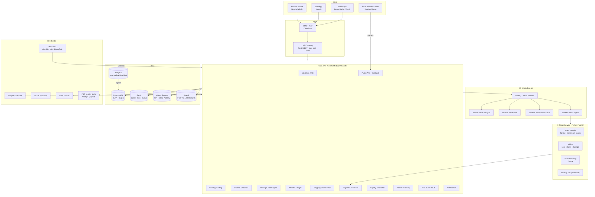
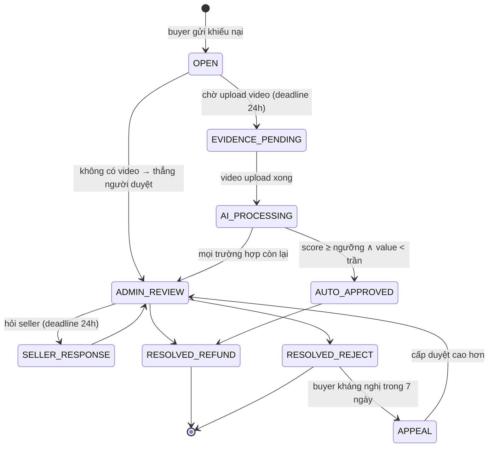

# REBOX - Technical Specification

Phiên bản 1.0 · Trạng thái: Draft để review · Đọc kèm `00-TONG-QUAN-VA-MAU-THUAN.md`

---

## 1. Phạm vi & mục tiêu kỹ thuật

### 1.1. Trong phạm vi (v1)

Mobile App (Buyer + Seller), Web App (Buyer + Seller), Admin Console, Backend API, AI Triage Service, Public API + Webhook cho phần mềm kho, tích hợp ĐVVC và thanh toán.

### 1.2. Ngoài phạm vi (v1)

Livestream, đấu giá, chat realtime seller–buyer (v1 dùng ticket CSKH), đa ngôn ngữ, đa tiền tệ, logistics tự vận hành, blind-box.

### 1.3. Ràng buộc thiết kế bắt buộc

| #   | Ràng buộc                                               | Hệ quả kỹ thuật                                                  |
| --- | ------------------------------------------------------- | ---------------------------------------------------------------- |
| C1  | Mọi listing có `quantity = 1`, không tái tạo            | Cần reservation lock; không dùng mô hình kho số lượng            |
| C2  | Tiền bán hàng **không** đi qua REBOX                    | Không xây escrow tiền hàng; chỉ xây ledger ký quỹ                |
| C3  | Phí sàn chỉ thu được từ ví ký quỹ                       | Ledger phải tuyệt đối chính xác, có kiểm toán                    |
| C4  | Video khiếu nại là chứng cứ pháp lý                     | Lưu WORM, hash SHA-256, chain of custody, không sửa được         |
| C5  | Dữ liệu người dùng VN lưu tại VN                        | Chọn cloud có region VN hoặc VPS trong nước                      |
| C6  | AI không được tự động từ chối khiếu nại                 | Kiến trúc quyết định 2 nhánh: auto-approve / escalate            |
| C7  | Đội dev 1–2 người ở GĐ1, ngân sách ~2–3tr/tháng hạ tầng | Modular monolith, không microservices; managed service tối thiểu |

---

## 2. Kiến trúc tổng thể

### 2.1. Sơ đồ hệ thống



### 2.2. Nguyên tắc kiến trúc

1. **Modular monolith, không microservices.** Một deployable NestJS, ranh giới module rõ, giao tiếp giữa module qua interface + domain event nội bộ. Khi cần tách service sau này, đường cắt đã sẵn.
2. **Ngoại lệ duy nhất: AI Triage** tách thành service Python riêng - khác ngôn ngữ, khác profile tài nguyên (GPU/CPU nặng), scale độc lập, và có thể chết mà không kéo sập sàn.
3. **Async by default cho mọi tác vụ chạm bên thứ ba.** Gọi Shopee/GHN/PSP không bao giờ nằm trong request path của user.
4. **Mọi thao tác tiền là idempotent** và ghi vào sổ cái kép. Không có ngoại lệ.
5. **Event sourcing cục bộ cho ví** - số dư là kết quả suy ra từ sổ cái, bảng balance chỉ là materialized view có version.

### 2.3. Chiến lược web-first và khả năng tái sử dụng cho mobile

> **Quyết định:** làm **web trước, mobile sau**. Mục tiêu là khi làm mobile ở GĐ3 thì tái sử dụng được tối đa, chứ không phải viết lại từ đầu.

#### 2.3.1. Cái gì tái sử dụng được, cái gì không

Không có framework nào "chuyển web thành mobile". React Native **không chạy** HTML/CSS — `<div>`, `<span>`, CSS thật đều không tồn tại. **Tầng giao diện luôn phải viết lại**, bất kể chọn công nghệ gì.

| Tái sử dụng được | Phải viết lại |
|---|---|
| Kiểu dữ liệu, DTO, schema Zod | Toàn bộ màn hình |
| API client (sinh từ OpenAPI) | Điều hướng |
| Logic nghiệp vụ: tính phí, định dạng tiền, state machine | Component UI |
| Quản lý state server (TanStack Query) | |
| Validate form | |

Tổ chức code kỷ luật ⇒ dùng lại **50–60%**. Không kỷ luật ⇒ gần **0%**. **Đây mới là yếu tố quyết định, không phải việc chọn framework nào.**

#### 2.3.2. Vì sao không dùng một codebase duy nhất

Phương án **Expo + React Native Web** cho một codebase chạy cả web lẫn native, tái sử dụng ~85%. Đã cân nhắc và **loại**.

Lý do: nó xuất ra SPA, Google index kém — trong khi kênh thu hút người mua của REBOX phụ thuộc vào việc tìm thấy trang sản phẩm qua tìm kiếm. Next.js SSR giải quyết việc đó.

**Đánh đổi có ý thức:** mất ~35% khả năng tái sử dụng để giữ SEO. Với mô hình marketplace, đáng.

#### 2.3.3. Mắt xích giao diện duy nhất mang sang được: Tailwind → NativeWind

Chọn **Tailwind** thay vì CSS Modules hay styled-components vì **NativeWind cho phép dùng đúng class name đó trên React Native**:

```jsx
// chạy được ở CẢ Next.js lẫn React Native
<View className="flex-1 p-4 rounded-lg bg-white" />
```

Đây là mắt xích duy nhất trong tầng giao diện có thể mang sang. Chọn sai chỗ này là mất luôn khả năng tái sử dụng UI.

### 2.4. Stack và lý do chọn

| Lớp | Công nghệ | Lý do |
|---|---|---|
| Backend | **NestJS + TypeScript** | Cùng ngôn ngữ với FE ⇒ dùng chung type/DTO/validation. DI giúp test được sổ cái; module boundary ép kỷ luật. ⚠️ Đường học dốc hơn Express — xem §2.6 |
| DB chính | **PostgreSQL 16** | ACID nghiêm ngặt cho ledger, `SELECT FOR UPDATE`, partial index, JSONB cho payload sàn, FTS tiếng Việt (`unaccent` + `pg_trgm`) |
| ORM | **Drizzle** | SQL-first, type-safe, migration rõ ràng. Quan trọng với module ví: cần nhìn thấy SQL thật đang chạy |
| Cache / Lock / Queue | **Redis 7 + BullMQ** | Reservation lock, rate-limit, hàng đợi job. Không cần Kafka ở quy mô <10k đơn/tháng |
| Object storage | **Cloudflare R2** (hoặc VNG Cloud) | Video khiếu nại tốn dung lượng; R2 **egress = 0đ**. Cân nhắc VNG/Viettel để đảm bảo lưu trú dữ liệu (`05-PHAP-LY` §4) |
| Search | PG FTS (v1) → **Meilisearch** (v2) | Dưới 50k listing, PG FTS là đủ |
| **Web + Admin** | **Next.js 15 (App Router)** | **Nền tảng chính của GĐ1.** SEO cho trang sản phẩm, SSR |
| UI | **Tailwind + shadcn/ui** | shadcn là code copy vào repo, không phải dependency nặng. Tailwind là mắt xích sang NativeWind (§2.3.3) |
| State | **TanStack Query + Zustand** | Query cho server state; Zustand cho UI state cục bộ. Cả hai chạy được trên RN |
| Form | **React Hook Form + Zod** | Zod schema dùng chung với backend qua `packages/shared` |
| **Mobile (GĐ3)** | **Expo + NativeWind** | Thêm sau. `react-native-vision-camera` + ML Kit cho quét barcode/OCR on-device |
| AI service | **Python FastAPI** + ffmpeg, PySceneDetect, ONNXRuntime, CLIP, YOLO; **Claude API** cho reasoning trên keyframe | Hệ sinh thái CV chỉ có ở Python |
| IaC / Deploy | Docker Compose (GĐ1) → Kubernetes hoặc Fly/ECS (GĐ2) | Ngân sách GĐ1 chỉ cho 1–2 VPS |
| Observability | OpenTelemetry → Grafana Cloud free tier / self-host Loki + Prometheus | Bắt buộc có từ ngày đầu vì luồng tiền |

### 2.5. Cấu trúc monorepo — quyết định thật nằm ở đây

```
rebox/
├─ apps/
│  ├─ api/          # NestJS
│  ├─ worker/       # BullMQ, dùng chung code với api
│  ├─ web/          # Next.js — buyer + seller + admin
│  ├─ mobile/       # Expo — THÊM Ở GĐ3, để trống bây giờ
│  └─ ai-triage/    # Python FastAPI — GĐ3
├─ packages/
│  ├─ shared/       # ⭐ type, enum, Zod schema, hằng số
│  ├─ core/         # ⭐ logic thuần: tính phí, định dạng, state machine
│  ├─ api-client/   # ⭐ sinh từ OpenAPI
│  └─ ui-tokens/    # màu, spacing, typography — dạng token, KHÔNG phải CSS
├─ db/
│  ├─ migrations/
│  └─ seeds/
└─ docs/
```

Ba package đánh dấu ⭐ quyết định việc làm mobile sau này mất **3 tuần hay 3 tháng**.

#### Ba quy tắc bắt buộc giữ từ ngày đầu

| # | Quy tắc | Vi phạm thì sao |
|---|---|---|
| 1 | **Không gọi `fetch` trong component.** Mọi lời gọi API đi qua `packages/api-client` | Làm mobile phải viết lại toàn bộ tầng gọi API |
| 2 | **Không tính toán nghiệp vụ trong component.** Tính phí, quy đổi điểm, kiểm tra điều kiện — nằm trong `packages/core`, là hàm thuần, có test | **Lỗi tốn kém nhất.** Logic tính phí rải trong JSX thì mobile phải viết lại, và hai bên sẽ lệch nhau — nghĩa là hai bản tính tiền khác nhau |
| 3 | **Không import gì từ `apps/web` vào `packages/`** | Package biết mình chạy trên web ⇒ không mang sang native được |

Ba quy tắc này nên là **lint rule**, không phải thỏa thuận miệng. Cấu hình `eslint-plugin-boundaries` hoặc `dependency-cruiser` để CI chặn tự động.

### 2.6. Hai cảnh báo trước khi bắt đầu

**NestJS có đường học dốc.** Decorator, dependency injection, module system — mất khoảng **1 tuần** để quen nếu chưa từng dùng. Vẫn giữ vì hệ thống xử lý tiền cần khung sườn ép kỷ luật. Nhưng **dành hẳn tuần đầu Sprint 1 để học, đừng vừa học vừa code module ví.**

**Quét mã vạch trên trình duyệt có giới hạn thật:**

| | Android Chrome | iOS Safari |
|---|---|---|
| `BarcodeDetector` API | ✅ nhanh | ❌ không hỗ trợ |
| ZXing WASM (dự phòng) | ✅ | ✅ nhưng **chậm hơn rõ rệt** |

Nhân viên kho quét 50 kiện liên tiếp trên iPhone bằng web sẽ thấy khó chịu. Đây là lý do **app mobile cho seller đáng làm trước app cho buyer** ở GĐ3 — ngược với trực giác thông thường.

---

## 3. Phân rã module nghiệp vụ

| #   | Module              | Trách nhiệm                                                                | Phụ thuộc                          |
| --- | ------------------- | -------------------------------------------------------------------------- | ---------------------------------- |
| 1   | **IAM**             | Đăng ký/đăng nhập (OTP SMS + email), RBAC, phiên, thiết bị, eKYC seller    | -                                  |
| 2   | **Shop**            | Hồ sơ shop, địa chỉ kho, trạng thái hoạt động, hạng ký quỹ, auto-lock      | IAM, Wallet                        |
| 3   | **Catalog**         | Listing đơn chiếc, tình trạng hàng, ảnh, danh mục, kiểm duyệt, giá trần    | Shop, Risk                         |
| 4   | **ReturnInventory** | "Kho hàng hoàn": ingest CSV/API/scan, dedupe theo mã vận đơn, thống kê SKU | Catalog, MarketplaceSync           |
| 5   | **MarketplaceSync** | OAuth Shopee/TikTok, kéo đơn hoàn, mapping SKU, ánh xạ mã vận đơn          | ReturnInventory                    |
| 6   | **Cart & Checkout** | Giỏ tách theo seller, reservation lock, tính phí, khởi tạo hold            | Catalog, Fee, Wallet               |
| 7   | **Order**           | State machine đơn, sub-order theo seller, huỷ, hoàn                        | Checkout, Shipping, Wallet         |
| 8   | **Fee Engine**      | Phí ship buyer, hoa hồng, min fee, giá trần, quy đổi điểm                  | - (pure function, có test bảng)    |
| 9   | **Wallet & Ledger** | Sổ cái kép, hold/release/capture, nạp/rút, công nợ, đối soát               | - (module lõi, không phụ thuộc gì) |
| 10  | **Payment**         | VietQR động qua PSP, đối chiếu biến động số dư, payout hoàn tiền           | Wallet, Order                      |
| 11  | **Shipping**        | Abstraction ĐVVC, tạo vận đơn, gộp kiện, tracking webhook, phí thực tế     | Order                              |
| 12  | **Dispute**         | Vòng đời khiếu nại, upload chứng cứ, chain of custody, phân xử, kháng nghị | Order, Wallet, AITriage            |
| 13  | **AITriage**        | Chấm điểm video, giải thích, ngưỡng cấu hình được                          | Dispute                            |
| 14  | **Loyalty**         | Điểm lũy tiến, voucher freeship, chống tách đơn                            | Order, Risk                        |
| 15  | **Risk**            | Điểm rủi ro buyer/seller, phát hiện thông đồng, chặn hành vi               | tất cả (đọc)                       |
| 16  | **PublicAPI**       | OAuth2 client, REST cho ERP, webhook có ký, rate-limit                     | Catalog, Order, ReturnInventory    |
| 17  | **Notification**    | Push (Expo/FCM), Zalo ZNS, email, in-app                                   | -                                  |
| 18  | **Audit**           | Append-only log mọi hành động admin & mọi bút toán                         | tất cả                             |

---

## 4. Data model

### 4.1. Quy ước chung

- Khóa chính: **ULID** dạng text (`RBX-01J8...`) - sắp xếp theo thời gian, không lộ số thứ tự, an toàn khi sinh phân tán.
- **Tiền: `BIGINT`, đơn vị VNĐ nguyên**. Tuyệt đối không dùng float/decimal cho tiền.
- Timestamp: `TIMESTAMPTZ`, luôn UTC, quy đổi `Asia/Ho_Chi_Minh` ở tầng hiển thị.
- Soft delete chỉ áp dụng cho catalog; **bảng ledger và audit là append-only, không có UPDATE/DELETE** (enforce bằng DB trigger + revoke quyền).

### 4.2. Bảng lõi (rút gọn - chỉ cột quan trọng)

```sql
-- ========== IAM & SHOP ==========
CREATE TABLE users (
  id              TEXT PRIMARY KEY,
  phone_e164      TEXT UNIQUE NOT NULL,
  email           TEXT UNIQUE,
  password_hash   TEXT,
  full_name_enc   BYTEA,                 -- mã hóa tầng app (AES-GCM, key ở KMS)
  status          TEXT NOT NULL,         -- ACTIVE | SUSPENDED | DELETED
  created_at      TIMESTAMPTZ NOT NULL DEFAULT now()
);

CREATE TABLE shops (
  id                    TEXT PRIMARY KEY,
  owner_user_id         TEXT NOT NULL REFERENCES users(id),
  display_name          TEXT NOT NULL,
  legal_type            TEXT NOT NULL,   -- INDIVIDUAL | HOUSEHOLD | ENTERPRISE
  tax_code              TEXT,
  kyc_status            TEXT NOT NULL,   -- PENDING | VERIFIED | REJECTED
  kyc_verified_at       TIMESTAMPTZ,
  status                TEXT NOT NULL,   -- ACTIVE | LOCKED_INSUFFICIENT_FUND | SUSPENDED
  deposit_tier          TEXT NOT NULL,   -- NEW | STANDARD | TRUSTED
  min_deposit_required  BIGINT NOT NULL,
  payout_bank_bin       TEXT,            -- ngân hàng nhận tiền bán hàng
  payout_account_enc    BYTEA,
  payout_verified_at    TIMESTAMPTZ,     -- đã xác thực chủ tài khoản
  locked_at             TIMESTAMPTZ,
  created_at            TIMESTAMPTZ NOT NULL DEFAULT now()
);

-- ========== VÍ & SỔ CÁI (module lõi) ==========
CREATE TABLE wallets (
  id                TEXT PRIMARY KEY,
  shop_id           TEXT UNIQUE NOT NULL REFERENCES shops(id),
  available_amount  BIGINT NOT NULL DEFAULT 0,   -- materialized, suy ra từ ledger
  locked_amount     BIGINT NOT NULL DEFAULT 0,
  debt_amount       BIGINT NOT NULL DEFAULT 0,   -- công nợ khi ví âm
  version           BIGINT NOT NULL DEFAULT 0,   -- optimistic lock
  updated_at        TIMESTAMPTZ NOT NULL DEFAULT now(),
  CONSTRAINT chk_nonneg CHECK (available_amount >= 0 AND locked_amount >= 0)
);

-- Sổ cái kép: mỗi giao dịch sinh >= 2 dòng, tổng amount của cùng txn_id = 0
CREATE TABLE ledger_entries (
  id            BIGSERIAL PRIMARY KEY,
  txn_id        TEXT NOT NULL,            -- gom các dòng của cùng 1 giao dịch
  txn_type      TEXT NOT NULL,            -- xem §5.2
  account       TEXT NOT NULL,            -- xem §5.1
  wallet_id     TEXT REFERENCES wallets(id),
  amount        BIGINT NOT NULL,          -- dương = ghi Nợ tài khoản, âm = ghi Có
  currency      TEXT NOT NULL DEFAULT 'VND',
  ref_type      TEXT,                     -- ORDER | DISPUTE | TOPUP | WITHDRAWAL
  ref_id        TEXT,
  idempotency_key TEXT NOT NULL,
  memo          TEXT,
  created_at    TIMESTAMPTZ NOT NULL DEFAULT now()
);
CREATE UNIQUE INDEX uq_ledger_idem ON ledger_entries(idempotency_key, account);
CREATE INDEX idx_ledger_wallet_time ON ledger_entries(wallet_id, created_at DESC);
CREATE INDEX idx_ledger_ref ON ledger_entries(ref_type, ref_id);

-- Bản ghi hold, tách riêng để truy vấn nhanh và đối soát
CREATE TABLE fund_holds (
  id              TEXT PRIMARY KEY,
  wallet_id       TEXT NOT NULL REFERENCES wallets(id),
  sub_order_id    TEXT NOT NULL,
  amount          BIGINT NOT NULL,
  breakdown       JSONB NOT NULL,   -- {item, buyer_ship, commission, ship_reserve}
  status          TEXT NOT NULL,    -- ACTIVE | RELEASED | CAPTURED | PARTIALLY_CAPTURED
  expires_at      TIMESTAMPTZ,      -- hold ở bước checkout có TTL
  created_at      TIMESTAMPTZ NOT NULL DEFAULT now(),
  settled_at      TIMESTAMPTZ
);
CREATE UNIQUE INDEX uq_hold_suborder ON fund_holds(sub_order_id) WHERE status = 'ACTIVE';

-- ========== CATALOG ==========
CREATE TABLE listings (
  id                   TEXT PRIMARY KEY,          -- ULID công khai, KHÔNG phải mã vận đơn
  shop_id              TEXT NOT NULL REFERENCES shops(id),
  return_item_id       TEXT REFERENCES return_items(id),
  title                TEXT NOT NULL,
  description          TEXT,
  category_id          TEXT NOT NULL,
  condition_grade      TEXT NOT NULL,   -- NEW_SEALED | LIKE_NEW_99 | GOOD | FAIR | DEFECT
  condition_notes      TEXT NOT NULL,   -- mô tả trung thực khuyết điểm - bắt buộc
  price                BIGINT NOT NULL,
  original_price       BIGINT,
  price_cap            BIGINT,          -- 0.9 * original_price, chỉ ép khi price_source đã đối chiếu
  price_source         TEXT NOT NULL,   -- VERIFIED_PLATFORM | VERIFIED_CSV | SELLER_DECLARED, xem §4.2.1
  weight_gram          INT NOT NULL,
  dim_cm               JSONB,           -- {l,w,h} - cần cho tính cước
  images               JSONB NOT NULL,  -- [{key, w, h, phash}]
  status               TEXT NOT NULL,   -- xem §6.2
  hidden_reason        TEXT,            -- INSUFFICIENT_FUND | POLICY | SELLER
  published_at         TIMESTAMPTZ,
  reserved_until       TIMESTAMPTZ,
  search_tsv           TSVECTOR,
  created_at           TIMESTAMPTZ NOT NULL DEFAULT now(),
  CONSTRAINT chk_price_cap CHECK (price_cap IS NULL OR price <= price_cap)
);
CREATE INDEX idx_listing_active ON listings(shop_id, price DESC)
  WHERE status = 'ACTIVE';
CREATE INDEX idx_listing_search ON listings USING GIN(search_tsv);

#### 4.2.1. `price_source` — vì sao cần tách nguồn gốc giá

Trần 90% chỉ có ý nghĩa khi `original_price` đến từ dữ liệu đã đối chiếu được (API sàn hoặc CSV do seller tự xuất, đối chiếu chéo với sản phẩm cùng SKU đã có trên hệ thống). Với listing tạo hoàn toàn thủ công, seller tự gõ cả `original_price` lẫn `price` — REBOX không có cách nào kiểm chứng con số gốc đó, nên ép trần 90% lên nó chỉ là ảo giác kiểm soát: seller có thể khai giá gốc cao hơn thực tế để mức giảm luôn "hợp lệ" mà giá bán thực chất không hề rẻ.

Nghiêm trọng hơn: hiển thị `original_price` gạch ngang kèm % giảm cho một con số REBOX không kiểm chứng là đưa ra **giá tham chiếu không có căn cứ** — hành vi cung cấp thông tin gây nhầm lẫn cho người tiêu dùng, và trách nhiệm thuộc về REBOX với tư cách bên xuất bản, không thuộc về seller.

**Quy tắc bắt buộc, thực thi ở tầng API (không chỉ ở UI):**

| `price_source` | Sinh ra khi | `price_cap` | Trả về cho client |
|---|---|---|---|
| `VERIFIED_PLATFORM` | Listing tạo từ scan có đối chiếu API sàn thành công | `0.9 × original_price`, ép cứng bằng `CHECK` | `original_price`, `discount_pct`, nhãn "Giá gốc đối chiếu từ {sàn}" |
| `VERIFIED_CSV` | Listing tạo từ dòng CSV seller tự xuất | `0.9 × original_price` | như trên, nhãn "Giá gốc đối chiếu từ dữ liệu người bán" |
| `SELLER_DECLARED` | Listing tạo hoàn toàn thủ công, không có `return_item_id` liên kết | `NULL` — không ép | **chỉ `price`**. API không trả `original_price`, không trả `discount_pct`, dù seller có nhập |

Endpoint public (`GET /listings/{id}`, danh sách tìm kiếm) **không serialize** `original_price` khi `price_source = SELLER_DECLARED`, kể cả khi cột đó có giá trị trong DB. Đây là quy tắc ở tầng response serializer, không phải quy ước ở frontend — tránh trường hợp một client khác (web, mobile, hoặc đối tác Public API) vô tình hiển thị con số chưa kiểm chứng.

-- ========== KHO HÀNG HOÀN ==========
CREATE TABLE return_items (
  id                    TEXT PRIMARY KEY,
  shop_id               TEXT NOT NULL REFERENCES shops(id),
  source_platform       TEXT NOT NULL,   -- SHOPEE | TIKTOK | LAZADA | MANUAL
  source_tracking_enc   BYTEA NOT NULL,  -- MÃ VẬN ĐƠN - mã hóa, không bao giờ ra API công khai
  source_tracking_hash  TEXT NOT NULL,   -- HMAC để dedupe mà không cần giải mã
  source_order_ref      TEXT,
  source_sku            TEXT,
  original_price        BIGINT,
  return_reason         TEXT,            -- BOMB | CHANGE_MIND | DEFECT | WRONG_ITEM
  returned_at           TIMESTAMPTZ,
  ingest_method         TEXT NOT NULL,   -- SCAN | CSV | API | MANUAL
  liquidation_status    TEXT NOT NULL,   -- IN_STOCK | LISTED | SOLD | DISCARDED
  raw_payload           JSONB,
  created_at            TIMESTAMPTZ NOT NULL DEFAULT now()
);
CREATE UNIQUE INDEX uq_return_dedupe ON return_items(shop_id, source_tracking_hash);

-- ========== ĐƠN HÀNG ==========
CREATE TABLE orders (                     -- đơn cấp giỏ, có thể nhiều seller
  id                TEXT PRIMARY KEY,
  buyer_user_id     TEXT NOT NULL REFERENCES users(id),
  status            TEXT NOT NULL,
  payment_method    TEXT NOT NULL,        -- VIETQR | COD
  ship_address_enc  BYTEA NOT NULL,
  ship_address_hash TEXT NOT NULL,        -- để phát hiện tách đơn / cụm địa chỉ
  grand_total       BIGINT NOT NULL,
  created_at        TIMESTAMPTZ NOT NULL DEFAULT now()
);

CREATE TABLE sub_orders (                 -- đơn vị nghiệp vụ thực sự: 1 seller, 1 kiện
  id                    TEXT PRIMARY KEY,
  order_id              TEXT NOT NULL REFERENCES orders(id),
  shop_id               TEXT NOT NULL REFERENCES shops(id),
  status                TEXT NOT NULL,     -- xem §6.1
  item_total            BIGINT NOT NULL,
  buyer_shipping_fee    BIGINT NOT NULL,   -- 0 hoặc 15.000
  voucher_discount      BIGINT NOT NULL DEFAULT 0,
  buyer_payable         BIGINT NOT NULL,
  commission_amount     BIGINT,            -- chốt khi settle
  actual_ship_cost_out  BIGINT,            -- từ đối soát ĐVVC
  actual_ship_cost_back BIGINT,
  hold_id               TEXT REFERENCES fund_holds(id),
  carrier_code          TEXT,
  tracking_no_enc       BYTEA,
  delivered_at          TIMESTAMPTZ,       -- NGUỒN SỰ THẬT cho cửa sổ khiếu nại
  claim_deadline_at     TIMESTAMPTZ,       -- delivered_at + 3 ngày
  settled_at            TIMESTAMPTZ,
  created_at            TIMESTAMPTZ NOT NULL DEFAULT now()
);
CREATE INDEX idx_suborder_settle ON sub_orders(claim_deadline_at)
  WHERE status = 'DELIVERED';

CREATE TABLE sub_order_items (
  id            TEXT PRIMARY KEY,
  sub_order_id  TEXT NOT NULL REFERENCES sub_orders(id),
  listing_id    TEXT NOT NULL REFERENCES listings(id),
  snapshot      JSONB NOT NULL,   -- ĐÓNG BĂNG title/ảnh/mô tả/giá tại thời điểm mua
  price         BIGINT NOT NULL
);

-- ========== TRANH CHẤP ==========
CREATE TABLE disputes (
  id                  TEXT PRIMARY KEY,
  sub_order_id        TEXT NOT NULL REFERENCES sub_orders(id),
  raised_by_user_id   TEXT NOT NULL,
  reason_code         TEXT NOT NULL,   -- NOT_AS_DESCRIBED | DAMAGED | MISSING | EMPTY_BOX | COUNTERFEIT
  buyer_statement     TEXT,
  claimed_amount      BIGINT NOT NULL,
  status              TEXT NOT NULL,   -- xem §6.3
  ai_score            NUMERIC(5,2),
  ai_verdict          TEXT,            -- AUTO_APPROVE | ESCALATE
  ai_report           JSONB,           -- sub-score + explainability + model version
  resolution          TEXT,            -- REFUND_FULL | REFUND_PARTIAL | REJECT | MUTUAL
  refund_amount       BIGINT,
  resolved_by         TEXT,            -- 'AI' | admin_user_id
  resolved_at         TIMESTAMPTZ,
  appeal_of           TEXT REFERENCES disputes(id),
  sla_deadline_at     TIMESTAMPTZ NOT NULL,
  created_at          TIMESTAMPTZ NOT NULL DEFAULT now()
);

-- BẢN GỐC: chỉ admin cấp phân xử xem được. KHÔNG BAO GIỜ hiển thị cho seller.
CREATE TABLE dispute_evidences (
  id             TEXT PRIMARY KEY,
  dispute_id     TEXT NOT NULL REFERENCES disputes(id),
  uploaded_by    TEXT NOT NULL,
  kind           TEXT NOT NULL,   -- UNBOXING_VIDEO | PHOTO | DOCUMENT | SELLER_PACKING_VIDEO
  storage_key    TEXT NOT NULL,   -- bucket có Object Lock (WORM), tách riêng
  sha256         TEXT NOT NULL,
  size_bytes     BIGINT NOT NULL,
  duration_ms    INT,
  capture_meta   JSONB,           -- device, ffprobe, in-app capture attestation
  consent_id     TEXT NOT NULL REFERENCES consent_records(id),
  retention_until DATE NOT NULL,  -- video gốc: đóng vụ việc + 90 ngày (05-PHAP-LY §3.4.6)
  created_at     TIMESTAMPTZ NOT NULL DEFAULT now()
);

-- BẢN DẪN XUẤT đã khử nhận dạng: đây là thứ DUY NHẤT seller được xem.
-- Lý do: seller cần biết hàng có hỏng không, không cần xem nhà buyer.
-- Cắt gần hết rủi ro dữ liệu bên thứ ba trong video. Xem 05-PHAP-LY §3.4.3.
CREATE TABLE evidence_derivatives (
  id              TEXT PRIMARY KEY,
  evidence_id     TEXT NOT NULL REFERENCES dispute_evidences(id),
  kind            TEXT NOT NULL,   -- KEYFRAME_REDACTED | CLIP_REDACTED
  storage_key     TEXT NOT NULL,
  sha256          TEXT NOT NULL,
  frame_ts_ms     INT,             -- vị trí khung hình trong video gốc
  redaction       JSONB NOT NULL,  -- {faces_blurred: n, method, model_version, reviewed_by}
  visible_to      TEXT NOT NULL,   -- SELLER | ADMIN_ONLY
  retention_until DATE NOT NULL,   -- bản khử nhận dạng: đóng vụ việc + 3 năm
  created_at      TIMESTAMPTZ NOT NULL DEFAULT now()
);
CREATE INDEX idx_deriv_seller ON evidence_derivatives(evidence_id)
  WHERE visible_to = 'SELLER';

-- BẰNG CHỨNG ĐỒNG Ý: phải chứng minh được buyer đã nhìn thấy CHÍNH XÁC nội dung gì.
-- Nghị định 13/2023 yêu cầu sự đồng ý ở định dạng in/sao chép/kiểm chứng được.
CREATE TABLE consent_records (
  id              TEXT PRIMARY KEY,
  user_id         TEXT NOT NULL REFERENCES users(id),
  scope           TEXT NOT NULL,   -- DISPUTE_EVIDENCE | EKYC_BIOMETRIC | MARKETING
  ref_type        TEXT, ref_id TEXT,  -- gắn với từng vụ việc, KHÔNG phải đồng ý một lần khi đăng ký
  notice_version  TEXT NOT NULL,   -- phiên bản văn bản đã hiển thị
  notice_sha256   TEXT NOT NULL,   -- hash nội dung chính xác đã render ra màn hình
  purposes        JSONB NOT NULL,  -- [{key:'claim_processing', granted:true, required:true},
                                   --  {key:'ai_training',      granted:false, required:false}]
  granted_at      TIMESTAMPTZ NOT NULL,
  ip              INET,
  user_agent      TEXT,
  device_id       TEXT,
  withdrawn_at    TIMESTAMPTZ,     -- chỉ áp dụng cho purposes có required=false
  created_at      TIMESTAMPTZ NOT NULL DEFAULT now()
);
CREATE INDEX idx_consent_lookup ON consent_records(user_id, scope, ref_id);

-- ========== ĐIỂM THƯỞNG ==========
CREATE TABLE loyalty_ledger (
  id            BIGSERIAL PRIMARY KEY,
  user_id       TEXT NOT NULL REFERENCES users(id),
  points        NUMERIC(6,1) NOT NULL,   -- cho phép 0.5
  reason        TEXT NOT NULL,           -- ORDER_COMPLETED | VOUCHER_REDEEM | FRAUD_CLAWBACK
  ref_id        TEXT,
  idempotency_key TEXT NOT NULL UNIQUE,
  created_at    TIMESTAMPTZ NOT NULL DEFAULT now()
);

-- ========== AUDIT ==========
CREATE TABLE audit_logs (
  id          BIGSERIAL PRIMARY KEY,
  actor_type  TEXT NOT NULL,   -- USER | ADMIN | SYSTEM | AI
  actor_id    TEXT,
  action      TEXT NOT NULL,
  target_type TEXT, target_id TEXT,
  before      JSONB, after JSONB,
  ip INET, user_agent TEXT,
  created_at  TIMESTAMPTZ NOT NULL DEFAULT now()
);
```

### 4.3. Bảng cấu hình runtime

Mọi con số chính sách **phải nằm trong DB**, không hardcode - vì chúng sẽ thay đổi và có thể phải chứng minh với cơ quan quản lý là đã áp dụng đúng vào từng thời điểm.

```sql
CREATE TABLE system_configs (
  key           TEXT NOT NULL,
  value         JSONB NOT NULL,
  effective_from TIMESTAMPTZ NOT NULL,
  effective_to   TIMESTAMPTZ,
  changed_by    TEXT NOT NULL,
  reason        TEXT,
  PRIMARY KEY (key, effective_from)
);
```

Khóa cấu hình bắt buộc:

| Key                          | Mặc định                              | Ghi chú                                          |
| ---------------------------- | ------------------------------------- | ------------------------------------------------ |
| `fee.commission_rate`        | `0.20`                                |                                                  |
| `fee.commission_min`         | `10000`                               |                                                  |
| `fee.free_ship_threshold`    | `100000`                              |                                                  |
| `fee.buyer_flat_ship`        | `15000`                               |                                                  |
| `fee.price_cap_ratio`        | `0.90`                                | Giá trần xả kho                                  |
| `hold.shipping_reserve`      | `45000`                               | Xem L1                                           |
| `deposit.min_new_shop`       | `500000`                              | Xem L3                                           |
| `deposit.debt_ceiling`       | `0`                                   |                                                  |
| `dispute.claim_window_hours` | `72`                                  |                                                  |
| `dispute.damage_threshold`   | `0.30`                                | Xem M3 - **cần chốt**                            |
| `ai.auto_approve_score`      | `85`                                  | Cao hơn 70 trong tài liệu để giảm false-positive |
| `ai.auto_approve_max_value`  | `300000`                              | Trên ngưỡng này luôn có người duyệt              |
| `loyalty.tiers`              | `[[20000,0.5],[100000,1],[200000,2]]` |                                                  |
| `loyalty.voucher_cost`       | `15`                                  | 15 điểm = voucher 15k                            |

---

## 5. Thiết kế sổ cái tiền (module quan trọng nhất)

### 5.1. Danh sách tài khoản (chart of accounts)

| Account                       | Loại                           | Ý nghĩa                        |
| ----------------------------- | ------------------------------ | ------------------------------ |
| `SHOP_DEPOSIT_AVAILABLE`      | Nợ phải trả của REBOX với shop | Số dư ký quỹ shop rút được     |
| `SHOP_DEPOSIT_LOCKED`         | Nợ phải trả                    | Phần đang bị đóng băng cho đơn |
| `SHOP_DEBT`                   | Tài sản (phải thu)             | Công nợ khi ví âm              |
| `PLATFORM_COMMISSION_REVENUE` | Doanh thu                      | Hoa hồng đã ghi nhận           |
| `PLATFORM_SHIPPING_EXPENSE`   | Chi phí                        | Phần ship REBOX gánh           |
| `PLATFORM_PROMO_EXPENSE`      | Chi phí                        | Voucher, bù ship               |
| `BUYER_REFUND_PAYABLE`        | Nợ phải trả                    | Đã duyệt hoàn nhưng chưa chi   |
| `BANK_SETTLEMENT`             | Tài sản                        | Tài khoản ngân hàng REBOX      |
| `CARRIER_PAYABLE`             | Nợ phải trả                    | Phải trả ĐVVC                  |

**Bất biến hệ thống:** với mọi `txn_id`, `SUM(amount) = 0`. Kiểm tra bằng CHECK constraint deferred + job đối soát chạy mỗi giờ.

### 5.2. Các loại giao dịch và bút toán

```
DEPOSIT_TOPUP  (shop nạp 1.000.000)
  +1.000.000  BANK_SETTLEMENT
  -1.000.000  SHOP_DEPOSIT_AVAILABLE     (tăng nợ phải trả)

HOLD_CREATE  (đơn 150k → hold 225k)
  +225.000    SHOP_DEPOSIT_AVAILABLE     (giảm phần khả dụng)
  -225.000    SHOP_DEPOSIT_LOCKED

HOLD_RELEASE  (đơn thành công, hết hạn khiếu nại)
  +225.000    SHOP_DEPOSIT_LOCKED
  -225.000    SHOP_DEPOSIT_AVAILABLE

COMMISSION_CHARGE  (thu 30k hoa hồng)
  +30.000     SHOP_DEPOSIT_AVAILABLE
  -30.000     PLATFORM_COMMISSION_REVENUE

REFUND_APPROVED  (hoàn buyer 165k, không thu hoa hồng)
  +165.000    SHOP_DEPOSIT_LOCKED        (dùng tiền đóng băng)
  -165.000    BUYER_REFUND_PAYABLE
  ; phần hold còn lại release về available

REFUND_PAID  (đã chuyển tiền cho buyer)
  +165.000    BUYER_REFUND_PAYABLE
  -165.000    BANK_SETTLEMENT

SHIPPING_CHARGE_SELLER  (lỗi shop, thu 2 chặng 44k)
  +44.000     SHOP_DEPOSIT_LOCKED
  -44.000     CARRIER_PAYABLE

WITHDRAWAL  (shop rút 500k)
  +500.000    SHOP_DEPOSIT_AVAILABLE
  -500.000    BANK_SETTLEMENT
```

### 5.3. Quy tắc thực thi bắt buộc

1. **Mọi API chạm ví nhận `Idempotency-Key`** từ client; server lưu key + response hash trong 7 ngày. Retry cùng key trả cùng kết quả, không tạo bút toán mới.
2. **Khóa bi quan trên ví**: mọi transaction bắt đầu bằng
   ```sql
   SELECT * FROM wallets WHERE shop_id = $1 FOR UPDATE;
   ```
   Isolation level `READ COMMITTED` là đủ vì đã có row lock. Timeout lock 3 giây.
3. **Không bao giờ gọi HTTP bên ngoài bên trong DB transaction.** Pattern: ghi ledger + ghi `outbox` trong cùng txn → worker đọc outbox gọi bên ngoài.
4. **Job đối soát hằng giờ**: `SUM(ledger by wallet) == wallets.available_amount + locked_amount`. Lệch ⇒ cảnh báo P0, đóng băng mọi rút tiền của ví đó.
5. **Job đối soát hằng ngày với ngân hàng**: tổng `BANK_SETTLEMENT` khớp sao kê thực tế.

### 5.4. Fee Engine - hàm thuần, phải có bảng test

```typescript
type FeeInput = {
  itemTotal: number; // tổng giá listing trong sub-order
  voucherFreeship: boolean;
  config: FeeConfig;
};

function computeFees(i: FeeInput) {
  const freeShip = i.itemTotal >= i.config.freeShipThreshold;
  const buyerShipping =
    freeShip || i.voucherFreeship ? 0 : i.config.buyerFlatShip;

  const commission = Math.max(
    Math.round(i.itemTotal * i.config.commissionRate),
    i.config.commissionMin,
  );

  const hold =
    i.itemTotal + buyerShipping + commission + i.config.shippingReserve;

  const loyaltyPoints =
    i.itemTotal >= 200_000
      ? 2
      : i.itemTotal >= 100_000
        ? 1
        : i.itemTotal >= 20_000
          ? 0.5
          : 0;

  return {
    buyerPayable: i.itemTotal + buyerShipping,
    buyerShipping,
    commission,
    hold,
    loyaltyPoints,
  };
}
```

**Bảng test bắt buộc (golden test):**

| itemTotal | buyerShipping | commission | hold    | points |
| --------- | ------------- | ---------- | ------- | ------ |
| 15.000    | 15.000        | 10.000     | 85.000  | 0      |
| 40.000    | 15.000        | 10.000     | 110.000 | 0,5    |
| 60.000    | 15.000        | 12.000     | 132.000 | 0,5    |
| 99.999    | 15.000        | 20.000     | 179.999 | 0,5    |
| 100.000   | 0             | 20.000     | 165.000 | 1      |
| 150.000   | 0             | 30.000     | 225.000 | 1      |
| 200.000   | 0             | 40.000     | 285.000 | 2      |
| 500.000   | 0             | 100.000    | 645.000 | 2      |

---

## 6. State machines

### 6.1. Sub-order

```mermaid
stateDiagram-v2
  [*] --> RESERVED: checkout init (hold tạo, TTL 15p)
  RESERVED --> EXPIRED: quá TTL, chưa trả tiền
  RESERVED --> AWAITING_PAYMENT: chọn VietQR
  RESERVED --> CONFIRMED: chọn COD (qua kiểm tra rủi ro)
  AWAITING_PAYMENT --> CONFIRMED: bank webhook khớp số tiền + nội dung
  AWAITING_PAYMENT --> EXPIRED: quá 15 phút
  CONFIRMED --> READY_TO_SHIP: seller xác nhận, vận đơn đã tạo
  CONFIRMED --> CANCELLED_BY_SELLER: seller từ chối / hết hàng
  READY_TO_SHIP --> IN_TRANSIT: ĐVVC nhận hàng
  IN_TRANSIT --> DELIVERED: webhook DELIVERED  ← mốc claim_deadline
  IN_TRANSIT --> DELIVERY_FAILED: giao thất bại
  DELIVERY_FAILED --> RETURNING --> RETURNED_TO_SELLER
  DELIVERED --> DISPUTED: buyer mở khiếu nại trong 72h
  DELIVERED --> COMPLETED: hết 72h, không khiếu nại
  DISPUTED --> REFUNDED: duyệt hoàn
  DISPUTED --> COMPLETED: từ chối khiếu nại
  COMPLETED --> [*]
  REFUNDED --> [*]
  EXPIRED --> [*]
```

**Tác động ví theo transition:**

| Transition                            | Ledger                                                                                            |
| ------------------------------------- | ------------------------------------------------------------------------------------------------- |
| `→ RESERVED`                          | `HOLD_CREATE`                                                                                     |
| `→ EXPIRED` / `→ CANCELLED_BY_SELLER` | `HOLD_RELEASE` toàn bộ                                                                            |
| `→ COMPLETED`                         | `HOLD_RELEASE` + `COMMISSION_CHARGE`                                                              |
| `→ REFUNDED`                          | `REFUND_APPROVED` + `SHIPPING_CHARGE_SELLER`, **không** `COMMISSION_CHARGE`, phần hold dư release |
| `→ RETURNED_TO_SELLER`                | `HOLD_RELEASE` + `SHIPPING_CHARGE_SELLER` (ship 2 chặng)                                          |

### 6.2. Listing

```
DRAFT → PENDING_REVIEW → ACTIVE ⇄ HIDDEN_BY_FUND
                          ↓            ↓
                       RESERVED    (seller nạp tiền → ACTIVE)
                          ↓
                        SOLD → (nếu hoàn tiền + hàng về) → RELISTABLE → ACTIVE
ANY → SUSPENDED (vi phạm chính sách)
ANY → DELISTED (seller gỡ)
```

`PENDING_REVIEW` là bắt buộc theo Nghị định 85/2021 (sàn phải có cơ chế kiểm duyệt). Ở MVP: auto-approve + hậu kiểm bằng AI classifier chặn danh mục cấm; hàng giá trị cao hoặc danh mục nhạy cảm ⇒ duyệt tay.

### 6.3. Dispute



SLA: `AI_PROCESSING` ≤ 5 phút; `ADMIN_REVIEW` ≤ 48h; quá SLA ⇒ tự động escalate lên trưởng ca, cảnh báo.

---

## 7. Đặc tả tích hợp bên thứ ba

### 7.1. Shopee / TikTok Shop (Phase 2 - có Plan B, xem L7)

#### 7.1.1. Mô hình truy cập: TRA CỨU THEO YÊU CẦU, không đồng bộ toàn bộ

> **Quyết định kiến trúc.** Phương án ban đầu là đồng bộ nền toàn bộ đơn hoàn của shop để xây chỉ mục ngược `tracking → product`. **Đã thay bằng tra cứu theo từng đơn khi seller quét.** Lý do bên dưới.

```
KHÔNG có tiến trình đồng bộ nền.
KHÔNG sao chép cơ sở dữ liệu đơn hàng của shop.
CHỈ đọc đúng đơn mà seller chủ động đưa ra bằng cách quét mã trên kiện hàng vật lý.
```

| Tiêu chí                             | Đồng bộ nền (đã loại)     | Tra cứu theo yêu cầu (chọn)                      |
| ------------------------------------ | ------------------------- | ------------------------------------------------ |
| Độ trễ khi quét                      | ~50ms                     | 2–4s (giảm bằng cache, xem dưới)                 |
| Sàn sập / rate limit                 | Không ảnh hưởng           | Tính năng ngừng - **phải có đường lùi nhập tay** |
| Dữ liệu lưu trữ                      | Toàn bộ đơn hoàn của shop | Chỉ đơn đã quét                                  |
| Bề mặt rủi ro nếu bị xâm nhập        | Lớn                       | Nhỏ                                              |
| Dữ liệu người mua gốc (§3.6 pháp lý) | Rộng                      | Hẹp                                              |
| **Khả năng được duyệt partner app**  | Thấp                      | **Cao hơn đáng kể**                              |

Dòng cuối là lý do quan trọng nhất. Hồ sơ đăng ký mô tả _"chỉ đọc thông tin từng đơn khi người bán chủ động quét mã, không sao chép cơ sở dữ liệu đơn hàng, không lưu thông tin người mua"_ có khả năng được chấp nhận cao hơn nhiều so với _"đồng bộ toàn bộ đơn hàng sang nền tảng của chúng tôi"_ - và nó **là sự thật**, nên bền vững. Giảm được một phần rủi ro L7.

**⚠️ Giới hạn phải nói đúng:** OAuth của Shopee/TikTok cấp quyền ở **tầng shop theo scope**, không có cơ chế giới hạn theo từng đơn. Đây là **REBOX tự giới hạn mình**, không phải sàn kỹ thuật chặn. Tuyệt đối không mô tả với seller là _"bạn kiểm soát REBOX đọc gì"_ - mô tả sai sự thật. Thực thi bằng code + `audit_logs` + trang minh bạch cho seller xem lại đã đọc những đơn nào.

#### 7.1.2. Ba đường tra cứu, theo thứ tự ưu tiên

Nút thắt: API có `order_sn → tracking_number`, **không có chiều ngược lại**.

```
ĐƯỜNG A - nhãn có MÃ ĐƠN HÀNG           ← ưu tiên, chờ kiểm chứng vật lý
  quét/OCR order_sn → get_order_detail(order_sn)
  Tối thiểu hoá triệt để. Một lần gọi.

ĐƯỜNG B - nhãn CHỈ có mã vận đơn
  1. get_order_list(status=RETURNED, 60 ngày gần nhất)
     → CHỈ lấy cặp (order_sn, tracking_number), không lấy chi tiết
  2. đối chiếu trong bộ nhớ, tìm đơn khớp
  3. CHỈ gọi get_order_detail cho đúng đơn đó
  4. cặp đối chiếu ở bước 1 giữ trong cache ngắn hạn, KHÔNG ghi xuống DB
  → giảm thiểu ở tầng LƯU TRỮ, không giảm được ở tầng ĐỌC. Phải nói rõ, không che.

ĐƯỜNG C - nhập tay / CSV vài đơn
  Không cần API. LUÔN phải có làm đường lùi.
```

**Đường A hay B phụ thuộc vào việc nhãn thật in những trường gì** - không suy luận được, phải kiểm chứng vật lý. Xem `04-IMPLEMENTATION-PLAN` Sprint 1.

#### 7.1.3. Cache - khác hoàn toàn với chỉ mục

```
Quét mã → tra cache (CHỈ chứa đơn ĐÃ TỪNG được quét, TTL 30 ngày)
   ├─ HIT  → trả tức thì
   └─ MISS → gọi API theo đường A/B
             → ghi cache CHỈ các trường sản phẩm (allowlist §3.6 pháp lý)
             → KHÔNG BAO GIỜ ghi tên/SĐT/địa chỉ người mua gốc
```

Cache chỉ chứa thứ seller **đã chủ động đưa ra**, không phải thứ REBOX tự đi lấy. Nó xử lý các tình huống thật ở kho - quét trùng, quét lại sau lỗi, mất mạng giữa chừng - mà không mở rộng phạm vi dữ liệu. Seller có nút **"Xoá dữ liệu đã đọc"**.

#### 7.1.4. Thông số kỹ thuật

| Hạng mục      | Chi tiết                                                                                                                                                                                          |
| ------------- | ------------------------------------------------------------------------------------------------------------------------------------------------------------------------------------------------- |
| Xác thực      | OAuth2 authorization code; `shop_id` + `access_token` (4h) + `refresh_token` (30 ngày); ký request HMAC-SHA256 `partner_id + path + timestamp`                                                    |
| API dùng      | `get_order_detail`, `get_order_list`, `get_return_list`, `get_return_detail`, `get_item_base_info`, `get_model_list` - **tên và hành vi endpoint phải kiểm chứng lại với tài liệu API hiện hành** |
| Refresh token | Job chạy trước hạn 1h; hết hạn ⇒ `NEEDS_REAUTH`, thông báo seller                                                                                                                                 |
| Rate limit    | Token bucket per shop; quét lô ở web app phải **xếp hàng + backoff**, hiển thị điền dần thay vì chặn màn hình                                                                                     |
| Lưu trữ       | `raw_payload` đi qua **bộ lọc allowlist trường dữ liệu ngay tại tầng ingest**, trước khi ghi                                                                                                      |
| Audit         | Mỗi lần đọc đơn ghi `audit_logs`, hiển thị lại cho seller                                                                                                                                         |
| **Rủi ro**    | ToS + partner approval - xem L7. **Không để MVP phụ thuộc luồng này**; đường C luôn hoạt động độc lập                                                                                             |

### 7.2. Đơn vị vận chuyển (GHN / GHTK)

Abstraction bắt buộc: `CarrierAdapter` với các phương thức `quote()`, `createOrder()`, `cancel()`, `getLabel()`, `handleWebhook()`, `getSettlement()`.

| Sự kiện            | Xử lý                                                                                                                                                                                     |
| ------------------ | ----------------------------------------------------------------------------------------------------------------------------------------------------------------------------------------- |
| `quote`            | Gọi lúc listing publish (cache theo vùng + cân nặng, TTL 24h) để ước tính `shipping_reserve`                                                                                              |
| `createOrder`      | Sau khi seller xác nhận; **gộp nhiều listing cùng shop cùng đơn vào 1 vận đơn**                                                                                                           |
| Webhook trạng thái | **Bắt buộc verify chữ ký**. Idempotent theo `(carrier, tracking_no, status, event_time)`. Trạng thái đến trễ/không đúng thứ tự ⇒ chỉ chấp nhận nếu tiến về phía trước trong state machine |
| `DELIVERED`        | Ghi `delivered_at`, tính `claim_deadline_at`, đặt job settle tại thời điểm đó                                                                                                             |
| Đối soát           | Job hằng ngày kéo bảng kê ⇒ ghi `actual_ship_cost_out/back`, đối chiếu với ước tính, cảnh báo lệch >20%                                                                                   |

**Vấn đề COD cần chốt với ĐVVC:** hợp đồng phải quy định ĐVVC **chi hộ trực tiếp về tài khoản seller**, không qua tài khoản REBOX. Nếu tiền COD về tài khoản REBOX rồi mới chuyển cho seller thì REBOX đang thực hiện hoạt động thu hộ/chi hộ - xem `05-PHAP-LY` §2.

### 7.3. Thanh toán

| Luồng               | Cơ chế                                                                                                        | Ghi chú                                                                   |
| ------------------- | ------------------------------------------------------------------------------------------------------------- | ------------------------------------------------------------------------- |
| VietQR động         | Sinh QR theo chuẩn NAPAS VietQR trỏ về **tài khoản của seller**, `addInfo` chứa mã đối soát `RBX<subOrderId>` | Cần seller liên kết & xác thực tài khoản                                  |
| Xác nhận thanh toán | Webhook biến động số dư từ bank hub (SePay/Casso) hoặc PSP; đối chiếu `amount` + `addInfo`                    | **Không tin client**; chỉ tin webhook đã verify chữ ký                    |
| Nạp ký quỹ          | Qua PSP có giấy phép về tài khoản REBOX                                                                       | Đây là tiền REBOX giữ hộ ⇒ tài khoản phải tách biệt (xem `05-PHAP-LY` §2) |
| Chi hoàn tiền buyer | Payout API của PSP                                                                                            | REBOX chi từ ví ký quỹ shop                                               |
| Rút ký quỹ          | Payout API, có hạn mức + xác thực 2 lớp + delay 24h với lệnh lớn                                              | Chống chiếm đoạt tài khoản                                                |

**Ràng buộc thiết kế:** toàn bộ tương tác thanh toán đi qua interface `PaymentProvider`. Không có lời gọi PSP nào rải rác trong domain code - vì rất có khả năng phải đổi PSP giữa chừng vì lý do pháp lý.

### 7.4. Public API cho KiotViet / Sapo

```
Base: https://api.rebox.vn/v1
Auth: OAuth2 client_credentials, scope: returns:read listings:write inventory:sync
Rate: 600 req/phút/client, trả 429 kèm Retry-After

GET    /returns?since=&cursor=&limit=        # danh sách hàng hoàn
POST   /returns                              # ERP đẩy hàng hoàn sang REBOX
GET    /listings/{id}
POST   /listings                             # tạo listing từ ERP
PATCH  /listings/{id}                        # đổi giá, gỡ bán
GET    /orders?status=&since=
POST   /inventory/sync                       # đồng bộ 2 chiều tồn kho
```

**Webhook đẩy về ERP:**

| Event              | Payload                                                     |
| ------------------ | ----------------------------------------------------------- |
| `listing.sold`     | `{listing_id, source_sku, sold_at, price}` - để ERP trừ tồn |
| `listing.relisted` | hàng hoàn về sau tranh chấp, ERP cộng lại tồn               |
| `order.completed`  | chốt doanh thu                                              |
| `dispute.resolved` | kết quả xử lý                                               |

Ký: `X-Rebox-Signature: t=<ts>,v1=<HMAC_SHA256(secret, ts + "." + body)>`. Từ chối request có `ts` lệch >5 phút. Retry: 8 lần, backoff 10s → 24h. Có endpoint replay thủ công cho đối tác.

---

## 8. AI Triage Service

### 8.1. Pipeline

```
1. INGEST      video upload trực tiếp lên object storage (presigned multipart)
               → SHA-256, kích thước, MIME thật (magic bytes, không tin extension)
2. PROBE       ffprobe: duration, codec, encoder tag, creation_time, GPS,
               số lượng stream, bitrate ladder
               → cờ đỏ: encoder ≠ encoder của app, creation_time > thời điểm giao hàng
3. INTEGRITY   phát hiện cắt ghép:
               - PySceneDetect: số scene cut bất thường trong 5s đầu
               - kiểm tra tính liên tục GOP / timestamp gap
               - liên tục waveform âm thanh (cắt ghép thường để lộ jump)
               - phát hiện quay lại màn hình (moiré, tần số làm tươi)
4. SEAL_CHECK  5s đầu: detector kiện hàng + nhãn/mối dán
               → seal_intact ∈ {intact, tampered, already_open, not_visible}
               → coverage: có thấy đủ các mặt không (ước lượng qua chuyển động camera)
5. OBJECT      YOLO detect vật thể chính; CLIP embedding so với ảnh listing
               → similarity ∈ [0,1]
6. DAMAGE      VLM (Claude) trên 6–10 keyframe + mô tả listing + lời khai buyer
               → damage_ratio ∈ [0,1], mismatch_reason, mức tin cậy, giải thích văn bản
7. SCORE       tổng hợp có trọng số, sinh sub-score có giải thích
8. DECIDE      AUTO_APPROVE nếu tất cả đều đúng, ngược lại ESCALATE
9. REDACT      sinh bản khử nhận dạng cho seller - xem 8.1.1
```

#### 8.1.1. Bước REDACT - khử nhận dạng trước khi chia sẻ cho seller

Chạy trên 6–10 keyframe đã chọn ở bước DAMAGE. Đầu ra ghi vào `evidence_derivatives`.
Căn cứ: `05-PHAP-LY` §3.4.3 và §3.4.3.1.

```
Với mỗi keyframe:
  a. FACE      phát hiện + làm mờ TẤT CẢ khuôn mặt
               (không phân biệt được đâu là buyer, đâu là người thân → che hết)
  b. LABEL     phát hiện vùng NHÃN VẬN ĐƠN → che toàn bộ vùng
               ⚠ RỦI RO ĐẶC THÙ CAO NHẤT CỦA REBOX:
                 seller tái sử dụng thùng còn nhãn đơn Shopee cũ
                 → lộ tên/SĐT/địa chỉ của người mua khác, hoàn toàn vô can
               ⚠ Phải che CẢ MÃ VẠCH VÀ QR, không chỉ dãy số.
                 Mã vạch đọc được bằng máy - che chữ mà để lộ vạch là vô nghĩa
  c. OCR_PII   quét text trong khung hình → che: số điện thoại, địa chỉ,
               số CCCD, số tài khoản ngân hàng
  d. CHILD     phát hiện trẻ em → KHÔNG tự động chia sẻ,
               gắn cờ needs_manual_redaction, buộc admin duyệt tay
  e. WATERMARK đóng mã vụ việc + thời điểm lên ảnh

Kiểm tra đầu ra:
  nếu bất kỳ bước nào thất bại HOẶC độ tin cậy < 0.90:
     → KHÔNG sinh bản cho seller
     → dispute.needs_manual_redaction = true, admin chọn khung hình thủ công
     → TUYỆT ĐỐI KHÔNG fallback về video gốc
```

**Lưu ý về mâu thuẫn mục đích:** bước SEAL_CHECK (b.4) _cần nhìn thấy_ nhãn niêm phong để chấm điểm, còn bước REDACT _phải che_ nhãn đi. Không xung đột - REDACT chỉ áp dụng cho **bản dẫn xuất chia sẻ cho seller**; mọi phân tích của AI và của admin vẫn chạy trên bản gốc.

### 8.2. Công thức chấm điểm

```python
score = (
    0.30 * integrity_score      # video không bị can thiệp
  + 0.25 * seal_score           # 5s đầu chứng minh kiện còn nguyên
  + 0.25 * evidence_score       # damage_ratio / mismatch có bằng chứng rõ
  + 0.10 * (1 - buyer_risk)     # lịch sử khiếu nại của buyer
  + 0.10 * seller_risk          # lịch sử bị khiếu nại của seller
) * 100
```

**Điều kiện auto-approve (phải thỏa TẤT CẢ):**

```
score            >= config.ai.auto_approve_score        (mặc định 85)
integrity_score  >= 0.90        # tuyệt đối không auto-duyệt video khả nghi
damage_ratio     >= config.dispute.damage_threshold
sub_order.item_total <= config.ai.auto_approve_max_value  (mặc định 300.000)
buyer_risk       <  0.30
KHÔNG có cờ: EMPTY_BOX, COUNTERFEIT, HIGH_VALUE, REPEAT_CLAIMER
```

Mọi trường hợp khác ⇒ `ESCALATE`. **AI không có nhánh auto-reject** (xem L6).

### 8.3. Yêu cầu về tính giải trình

Mỗi lần chạy lưu bản ghi bất biến gồm: `model_versions{}`, `config_snapshot{}`, `input_hashes[]`, `sub_scores{}`, `keyframe_refs[]`, `vlm_prompt_hash`, `vlm_raw_response`, `decision`, `latency_ms`.

Bản ghi này là căn cứ khi buyer/seller khiếu nại quyết định, khi bị thanh tra, và để đo drift chất lượng model. Đây không phải log debug - nó là **hồ sơ pháp lý**, giữ tối thiểu 2 năm.

### 8.4. Chống lạm dụng chính AI

- Rate limit: mỗi user tối đa 3 khiếu nại đang mở; >5 khiếu nại/30 ngày ⇒ đưa vào diện review thủ công vĩnh viễn.
- Phát hiện tái sử dụng video: perceptual hash toàn bộ video + hash 5s đầu, so với kho video đã nộp.
- Phát hiện thông đồng: đồ thị buyer–seller, phát hiện cặp giao dịch lặp có tỷ lệ hoàn tiền bất thường.

---

## 9. Yêu cầu phi chức năng

### 9.1. Hiệu năng

| Endpoint                       | p95            | Ghi chú                          |
| ------------------------------ | -------------- | -------------------------------- |
| Tìm kiếm / danh sách listing   | 300ms          | cache CDN 60s cho khách vãng lai |
| Chi tiết listing               | 200ms          |                                  |
| Checkout init (có hold)        | 800ms          | có DB lock, chấp nhận chậm hơn   |
| Webhook thanh toán → xác nhận  | 2s             |                                  |
| Quét mã → autofill (CSV/local) | 1s             |                                  |
| Quét mã → autofill (API sàn)   | 3s, timeout 8s | có fallback nhập tay             |
| AI triage end-to-end           | 5 phút p95     |                                  |

Mục tiêu quy mô v1: 10.000 đơn/tháng, 50.000 listing active, 200 CCU. Đây là quy mô một VPS 4vCPU/8GB xử lý thoải mái.

### 9.2. Bảo mật

| Hạng mục         | Yêu cầu                                                                                                        |
| ---------------- | -------------------------------------------------------------------------------------------------------------- |
| Mật khẩu         | Argon2id                                                                                                       |
| Phiên            | JWT access 15 phút + refresh token xoay vòng, có phát hiện tái sử dụng                                         |
| Dữ liệu nhạy cảm | CCCD, số tài khoản, địa chỉ, mã vận đơn: **AES-256-GCM tầng ứng dụng**, key trong KMS, xoay key hằng năm       |
| Quyền            | RBAC + kiểm tra quyền sở hữu ở tầng repository (không chỉ ở controller)                                        |
| Chống IDOR       | ID là ULID; mọi truy vấn detail luôn kèm điều kiện chủ sở hữu                                                  |
| Upload           | Presigned URL, giới hạn kích thước, quét MIME thật, quét virus (ClamAV), bucket không public                   |
| Video khiếu nại  | Bucket riêng, **Object Lock chế độ compliance**, chỉ truy cập qua presigned URL 5 phút, mọi lượt xem ghi audit |
| Rate limit       | Theo IP + theo user + theo endpoint; nghiêm ngặt với OTP, login, checkout                                      |
| Secrets          | Không nằm trong repo; dùng Doppler/SOPS hoặc secret manager của cloud                                          |
| Admin            | Bắt buộc MFA; mọi hành động ghi `audit_logs`; không có tài khoản admin dùng chung                              |

### 9.3. Độ tin cậy

- Backup PostgreSQL: WAL archiving liên tục + snapshot hằng ngày, giữ 30 ngày, **kiểm thử phục hồi hằng tháng** (backup chưa từng restore = không có backup).
- RPO 5 phút, RTO 4 giờ ở GĐ1.
- Job settle chạy lại được (idempotent) - nếu worker chết giữa chừng, chạy lại không sinh bút toán trùng.
- Circuit breaker cho mọi tích hợp ngoài; sàn vẫn bán được khi Shopee API chết.

### 9.4. Observability

- **Trace**: OpenTelemetry, trace-id xuyên suốt từ mobile → API → worker → AI service.
- **Metric bắt buộc**: `wallet_reconcile_diff` (phải = 0), `hold_create_failure_rate`, `dispute_ai_escalation_rate`, `carrier_webhook_lag`, `settle_job_backlog`, `payment_confirm_lag`.
- **Alert P0**: lệch sổ cái ≠ 0; job settle trễ >30 phút; tỷ lệ lỗi webhook thanh toán >1%.

---

## 10. Rủi ro kỹ thuật

| #   | Rủi ro                                      | Mức        | Giảm thiểu                                                                       |
| --- | ------------------------------------------- | ---------- | -------------------------------------------------------------------------------- |
| R1  | Không được cấp quyền API Shopee/TikTok      | **Cao**    | MVP dựa trên CSV + OCR; API là tính năng cộng thêm (L7)                          |
| R2  | Chưa có giấy phép/đối tác thanh toán hợp lệ | **Cao**    | Chốt PSP trước sprint 4; thiết kế `PaymentProvider` thay được (`05-PHAP-LY` §2)  |
| R3  | Sai lệch sổ cái tiền                        | **Cao**    | Sổ cái kép + idempotency + job đối soát + chặn rút khi lệch                      |
| R4  | AI false-positive gây thất thoát cho seller | Trung bình | Ngưỡng 85 + trần giá trị + không auto-reject + kháng nghị                        |
| R5  | Oversell hàng đơn chiếc                     | Trung bình | Reservation lock TTL + unique index + kiểm tra lại lúc xác nhận                  |
| R6  | Webhook ĐVVC trễ/mất                        | Trung bình | Job polling trạng thái bù mỗi 30 phút cho đơn đang vận chuyển                    |
| R7  | Chi phí lưu trữ video vượt dự toán          | Trung bình | Transcode 480p, giới hạn 90 giây, xóa theo `retention_until`, R2 egress 0đ       |
| R8  | Đội 1–2 dev không kham nổi phạm vi          | **Cao**    | Cắt phạm vi theo `04-IMPLEMENTATION-PLAN`; MVP không có app mobile seller đầy đủ |
