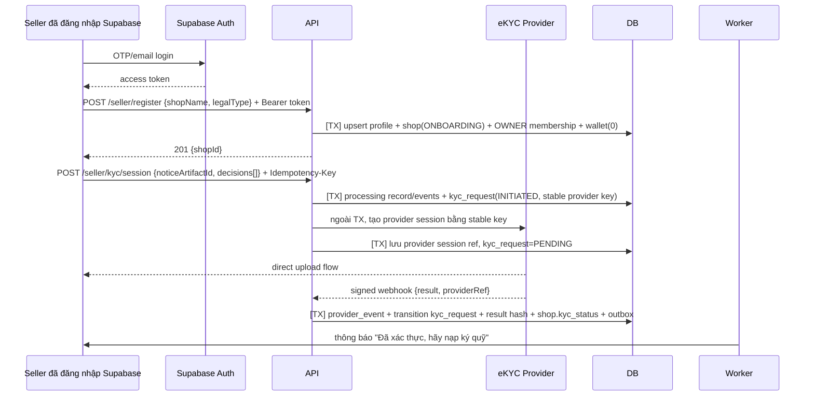
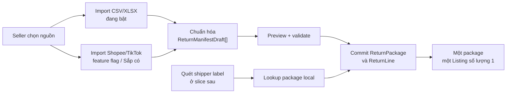
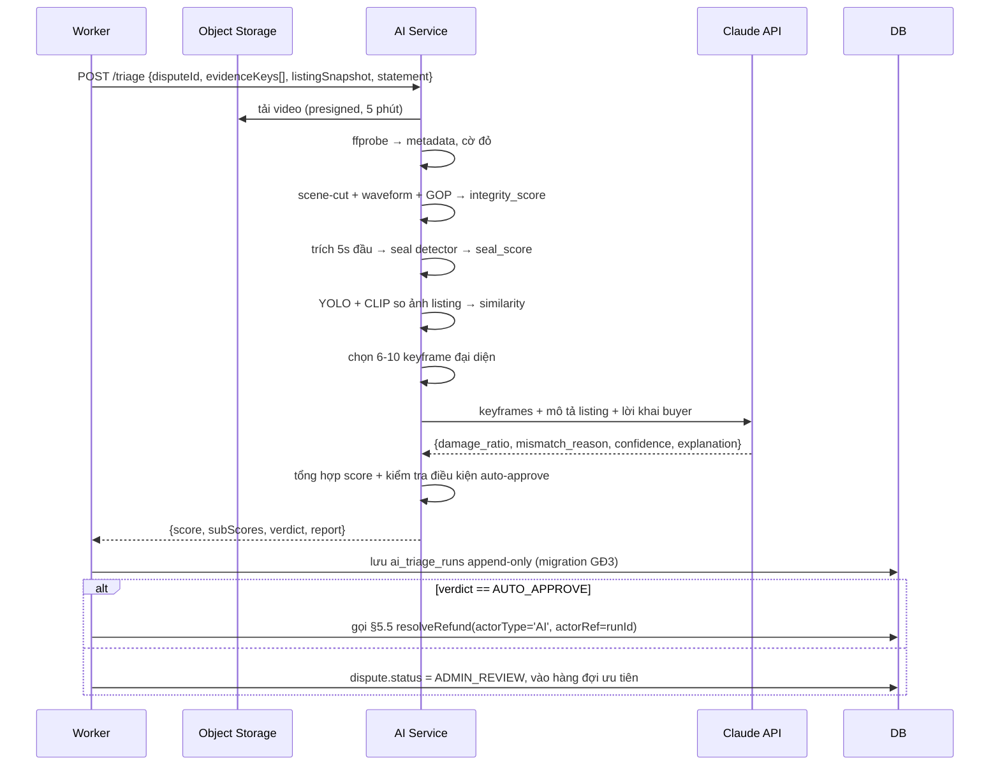

# REBOX - Luồng Backend chi tiết

Đọc kèm `01-TECHNICAL-SPEC.md` và quyết định canonical trong `07-ARCHITECTURE-DECISIONS.md`. Mỗi luồng gồm: sequence, ranh giới transaction, idempotency, và **error path**.

Quy ước ký hiệu:

- `[TX]` = nằm trong một database transaction
- `[OUTBOX]` = ghi vào PostgreSQL `outbox_events` trong cùng TX, worker claim bằng `FOR UPDATE SKIP LOCKED`
- `[IDEM:key]` = thao tác idempotent theo khóa

---

## 1. Luồng Seller onboarding & ký quỹ

### 1.1. Đăng ký shop + eKYC



**Ràng buộc:**

- Không gửi ảnh CCCD/selfie base64 qua JSON. Ưu tiên upload trực tiếp tới eKYC provider hoặc kho private cô lập.
- `/kyc/session` idempotent: server tự resolve artifact/purpose/basis như §5.2, tạo processing record và `kyc_request` trước side effect. Retry/crash dùng lại stable provider key; worker resume request `INITIATED`, không tạo session mới. Client không tự khai hash/legal basis.
- Xóa ảnh gốc sau verify nếu Legal/provider không bắt buộc giữ; chỉ giữ dữ liệu tối thiểu đã mã hóa, provider reference, kết quả, hash, audit và `retention_until` do Legal duyệt.
- eKYC fail 3 lần ⇒ chuyển duyệt tay, không cho retry vô hạn (chống dò).
- KYC pending chỉ chặn publish của shop, không làm user mất capability buyer.

### 1.2. Nạp ký quỹ

```
POST /seller/wallet/topup  {amount}  Idempotency-Key: <uuid>
```

```
1. Validate theo `topup.min/max_amount` của PSP/config. Sau settle, shop chỉ ACTIVE khi tổng số dư đạt `deposit.activation_min_balance = 100.000`.
2. [TX] tạo payment_intent (PENDING), sinh mã đối soát RBXTOPUP<id>
3. Trả về QR/link PSP
--- bất đồng bộ ---
4. PSP webhook → verify chữ ký → tra payment_intent theo mã đối soát
5. [TX] [IDEM: "topup:" + psp_txn_id]
     - SELECT wallet FOR UPDATE
     - top-up trả `SHOP_DEBT` trước; chỉ phần dư ghi `SHOP_DEPOSIT_AVAILABLE`
     - cập nhật wallet.debt/available theo đúng postings, version += 1
     - payment_intent.status = SUCCEEDED
     - [OUTBOX] job shop.reevaluate_lock
6. Worker shop.reevaluate_lock → chỉ mở shop/listing khi debt = 0, KYC VERIFIED
   và số dư activation đạt 100.000đ; sau đó greedy coverage có thể hiện lại listing
```

**Error path:**

| Tình huống                              | Xử lý                                                                                              |
| --------------------------------------- | -------------------------------------------------------------------------------------------------- |
| Webhook đến 2 lần                       | `IDEM` key theo `psp_txn_id` ⇒ lần 2 no-op, vẫn trả 200                                            |
| Webhook đến trước khi API trả về client | Không sao - nguồn sự thật là DB, client poll trạng thái                                            |
| Số tiền webhook ≠ số tiền intent        | **Không tự động ghi có.** Tạo `manual_review_case`, cảnh báo ops. Đây là vector gian lận kinh điển |
| PSP không gửi webhook                   | Job reconcile mỗi 15 phút: query PSP theo các intent PENDING >10 phút                              |
| Webhook đến sau khi intent đã EXPIRED   | Vẫn ghi có (tiền đã vào thật), nhưng gắn cờ `late_settlement`                                      |

### 1.3. Rút ký quỹ

```
1. Validate: không có hold/dispute/nghĩa vụ chặn rút; shop ACTIVE không được rút xuống dưới `deposit.activation_min_balance = 100.000`.
   Muốn rút hết phải pause shop và hoàn tất mọi nghĩa vụ mở.
2. Kiểm tra rủi ro: tài khoản nhận đã xác thực? có tranh chấp/unmatched reserve mở?
   Đổi tài khoản <72h là hard block; sau đó có thể enhanced review tới 7 ngày.
3. [TX] tạo withdrawal (PENDING) + payout_operation với stable provider key
   + ledger WITHDRAWAL_HOLD (khóa tiền ngay)
4. Ngưỡng duyệt/delay lấy từ runtime risk config có version và snapshot vào withdrawal;
   không hardcode 5.000.000đ/24h trong code
5. [OUTBOX] job payout.execute → PSP payout API
6. Thành công đã xác minh: ledger WITHDRAWAL_SETTLED
   Terminal failure đã xác minh: [TX] WITHDRAWAL_FAILED, hoàn về available
   Timeout/không rõ: UNKNOWN → RECONCILING, vẫn giữ SHOP_WITHDRAWAL_PENDING,
   query provider bằng cùng provider key; không release và không tạo payout key mới
```

**Chống chiếm đoạt tài khoản:** đổi tài khoản ngân hàng nhận tiền ⇒ khóa rút tiền 72h + thông báo qua mọi kênh (push, SMS, email). Sau 72h, enhanced review có thể kéo dài theo risk config đã version; đây là policy vận hành có audit, không phải con số rải rác trong code.

---

## 2. Luồng đăng bán

### 2.1. Nguồn bản kê - hai kênh nhập song song



`SPREADSHEET` và `PLATFORM_API` là hai lựa chọn ngang hàng; không có thứ tự ưu tiên hoặc fallback tự động. Cả hai trả `ReturnManifestDraft[]` và dùng chung preview/validate/commit. Bản đầu chỉ implement CSV/XLSX; nút API chưa gọi backend cho tới khi đủ gate. Spreadsheet canonical có grain `ReturnLine`, nên nhiều dòng cùng tracking được nhóm thành một package. Các field cấp package lặp trên mọi dòng phải giống nhau. Dedupe package bằng `(shop_id, source_platform, source_tracking_hash)` và line bằng `(return_package_id, source_item_ref)`.

`source_quantity` chỉ mô tả bản kê nguồn. REBOX không mở kiện, không có `received_quantity`, không sinh `ReturnUnit` và không tạo nhiều listing từ các line. Đăng thủ công là flow catalog riêng, không phải fallback tự động của scan-to-list.

### 2.2. Scan-to-list (luồng nhanh)

Seller phải hoàn thành import và commit bằng một trong hai kênh trước. Scan chỉ lookup package local đã commit; nó không gọi API sàn và không tự chuyển nguồn.

```
POST /seller/scan  {scannedCode, codeType, platformHint}
      codeType ∈ {ORDER_SN, TRACKING_NO, UNKNOWN}

1.  Chuẩn hoá mã + nhận diện nguồn
    - bỏ khoảng trắng, viết hoa
    - đoán ĐVVC/sàn theo tiền tố và định dạng (SPX / GHN / GHTK / J&T / Ninja…)
    - đoán codeType nếu client gửi UNKNOWN
    ⚠ Heuristic này DỄ VỠ khi các bên đổi định dạng → tách thành bảng cấu hình,
      có test theo mẫu thật, không hardcode rải rác

2.  Tra ReturnPackage theo shop_id + platform + source_tracking_hash
    ├─ HIT   → trả package, lines và listing draft/hiện hành. KẾT THÚC.
    └─ MISS  → trả SOURCE_MANIFEST_NOT_FOUND và link về màn hình chọn nguồn import.

3.  Không gọi API sàn, không parse file và không tạo package/line giả trong scan.
    Import là workflow riêng có preview/commit; scan chỉ dùng dữ liệu đã commit.

4.  [TX] get-or-create đúng một listing DRAFT cho package đã tìm thấy.
    - disclosure bắt buộc UNOPENED_UNINSPECTED
    - package.inventory_status = AVAILABLE
    - retry cùng dữ liệu trả cùng package/listing
    - conflict không sửa listing ACTIVE hoặc package RESERVED/SOLD
```

**Bộ lọc allowlist - bắt buộc, chặn ở tầng ingest:**

```
CHO PHÉP :  order/return ref, tracking, item_name, sku, quantity,
            variant/model, item_images[], original_price, category,
            package weight/dimensions, return reason
CHẶN     :  buyer_name, buyer_phone, buyer_address, buyer_user_id,
            recipient_*, mọi trường định danh người mua gốc
```

Chặn tại tầng ingest chứ không lọc lúc hiển thị: dữ liệu không được phép **tồn tại** trong `raw_payload`, chứ không phải chỉ ẩn đi. Xem `05-PHAP-LY` §3.6.

**Đường lùi khi quét thất bại** - tỷ lệ lỗi ở kho thật không nhỏ (nhãn rách, dán đè, ướt, mờ):

```
Barcode không đọc được  → OCR vùng text trong web nếu browser hỗ trợ
OCR không ra            → nhập tay mã vận đơn
Không có bản kê         → quay về chọn import Shopee/TikTok hoặc CSV/XLSX, commit rồi quét lại
```

ML Kit/VisionCamera chỉ thuộc mobile GĐ3. Flow nguyên kiện không tạo package/line giả khi không tìm thấy bản kê. Seller vẫn có thể dùng flow listing thủ công hiện hành, nhưng đó không phải trải nghiệm "quét là đăng".

**Seam API:** hai importer chỉ gặp nhau ở normalized DTO và pipeline preview/commit. Không dựng adapter giả, OAuth flow hay scheduler khi chưa có sandbox/credential. Lỗi của một kênh được báo tại kênh đó; hệ thống không tự lấy dữ liệu từ kênh còn lại.

### 2.3. Publish listing

```
POST /seller/return-packages/{packageId}/listing

[TX]
  1. Kiểm tra access token + shop membership; OWNER/MANAGER được publish,
     WAREHOUSE chỉ được tạo/lưu draft
  2. Kiểm tra shop.kyc_status = VERIFIED và shop.status = ACTIVE trước transition ACTIVE
  3. Khóa package; kiểm tra thuộc shop, manifest đầy đủ, status AVAILABLE và
     chưa có listing khác
  4. Kiểm tra giá:
       original_price = SUM(line.source_quantity * line.original_price)
       nếu manifest từ PLATFORM_API/SPREADSHEET
         → price <= 0.9 * original_price
       price >= 10.000  (dưới ngưỡng này phí sàn min 10k nuốt hết)
  5. Kiểm tra tất cả ReturnLine; policy nghiêm ngặt nhất của package thắng
  6. Tạo listing status = PENDING_REVIEW, disclosure = UNOPENED_UNINSPECTED
  7. Không ghi quantity vào listing; availableQuantity = 1 khi package AVAILABLE, ngược lại = 0
  8. [OUTBOX] job listing.moderate
COMMIT

Listing thủ công tiếp tục dùng endpoint hiện có và `SELLER_DECLARED`; nó không đi qua endpoint package ở trên.

Worker listing.moderate:
  - Re-check shop.kyc_status = VERIFIED, shop.status = ACTIVE và membership còn hiệu lực
  - Rule xác định: MIME/kích thước/hash ảnh, từ khóa cấm, thông tin liên hệ,
    category policy và các field bắt buộc; không gọi ML classifier ở GĐ1
  - Danh mục nhạy cảm hoặc tín hiệu không chắc chắn → hàng đợi admin
  → PASS rule rõ ràng: status = ACTIVE, published_at = now(), cập nhật search_tsv
  → FLAG/MANUAL_REVIEW: giữ PENDING_REVIEW + đưa vào hàng đợi admin
  → BANNED rõ ràng: status = SUSPENDED + lý do + cho phép seller sửa/kháng nghị
```

**Sau khi ACTIVE**, gọi `shop.reevaluate_coverage`:

```
required = Σ hold_estimate(listing) cho toàn bộ listing ACTIVE của shop
coverage = wallet.available / required
nếu coverage < 0.15 → gửi cảnh báo "kho sắp bị hạn chế"
nếu wallet.available < hold_estimate(listing đắt nhất) → greedy hide (§2.5)
```

### 2.4. Kiểm soát danh mục hàng hóa

Bảng `restricted_categories` với 3 mức:

| Mức             | Ví dụ                                                                    | Xử lý                                       |
| --------------- | ------------------------------------------------------------------------ | ------------------------------------------- |
| `BANNED`        | thuốc, TPCN, vũ khí, chất cấm, động vật hoang dã, tiền tệ, hàng nhập lậu | Chặn cứng khi publish                       |
| `MANUAL_REVIEW` | mỹ phẩm, thực phẩm, đồ chơi trẻ em, thiết bị điện, hàng hiệu             | Bắt buộc admin duyệt + yêu cầu ảnh tem/nhãn |
| `DISCLOSURE`    | đồ điện tử đã qua sử dụng, quần áo đã mặc thử                            | Bắt buộc điền `condition_notes` chi tiết    |

**Danh mục đầy đủ ở `06-DANH-MUC-HANG-CAM.md`.** Do Pháp lý sở hữu và duy trì, không phải Tech.

### 2.5. Greedy hide khi thiếu ký quỹ

```
Trigger: sau mọi thay đổi wallet.available, sau publish/đổi giá listing

function reevaluate(shopId):
  [TX]
    wallet = SELECT ... FOR UPDATE
    shop = SELECT ... FOR UPDATE

    # Coverage không được mở khóa một gate khác.
    if shop.status in {SUSPENDED, PAUSED, ONBOARDING} or shop.kyc_status != VERIFIED:
        return without changing shop.status
    if wallet.debt_amount > 0 or wallet.available < deposit.activation_min_balance:
        UPDATE listing ACTIVE → HIDDEN_BY_FUND, hidden_reason='INSUFFICIENT_FUND'
        shop.status = LOCKED_INSUFFICIENT_FUND
        return
    # Chỉ từ đây status mới được chuyển trong cặp ACTIVE↔LOCKED_INSUFFICIENT_FUND.
    budget = wallet.available
    listings = SELECT ACTIVE + HIDDEN_BY_FUND của shop FOR UPDATE
               ORDER BY hold_estimate ASC, id ASC

    # Giữ được nhiều listing rẻ trước; listing đắt bị ẩn trước khi thiếu quỹ
    covered = []
    for L in listings:
        need = hold_estimate(L)
        if budget >= need:
            covered.append(L); budget -= need
        # KHÔNG break - listing rẻ hơn phía sau vẫn có thể phủ được

    hide  = listings không nằm trong covered và đang ACTIVE
    show  = listings nằm trong covered và đang HIDDEN_BY_FUND

    UPDATE hide → HIDDEN_BY_FUND, hidden_reason='INSUFFICIENT_FUND'
    UPDATE show → ACTIVE
    if listings rỗng:
        # Inventory trống không phải thiếu quỹ; các gate trên đã đạt.
        shop.status = ACTIVE
    else:
        shop.status = (covered rỗng) ? LOCKED_INSUFFICIENT_FUND : ACTIVE
  COMMIT
  [OUTBOX] thông báo seller nếu có thay đổi
```

Lưu ý: đây chỉ là **hiển thị**, không phải hold thật. Hold thật xảy ra ở checkout. Mục đích là để buyer không nhìn thấy hàng mà shop không đủ tiền bảo đảm - tránh việc đơn bị hủy sau khi buyer đã trả tiền.

---

## 3. Luồng mua hàng (Buyer)

### 3.1. Giỏ hàng → Checkout init (luồng nhạy cảm nhất)

```mermaid
sequenceDiagram
  participant B as Buyer
  participant API
  participant DB
  participant FEE as Fee Engine

  B->>API: POST /checkout/init {items:[{listingId, quantity:1}], addressId} + Idempotency-Key
  API->>DB: resolve cart/listing/shop IDs read-only; BEGIN; SELECT wallet rồi shop FOR UPDATE
  API->>DB: SELECT listings rồi ReturnPackage AVAILABLE FOR UPDATE theo ULID
  API->>API: kiểm tra đúng một package listing, quantity=1 và shop_id bất biến đã resolve
  API->>API: kiểm tra shop.status=ACTIVE, KYC=VERIFIED, debt=0 và activation gate
  alt nhiều package hoặc lẫn nhiều seller
    API-->>B: 422 ONE_PACKAGE_PER_CHECKOUT hoặc MULTI_SELLER_CHECKOUT_NOT_SUPPORTED
  else shop/KYC/debt/activation không hợp lệ
    API-->>B: 409 SHOP_UNAVAILABLE
  end
  API->>FEE: computeFees + snapshot config
  alt listing không ACTIVE hoặc package không AVAILABLE
    API-->>B: 409 ITEM_BEING_PURCHASED hoặc ITEM_SOLD
  else available < hold
    API->>DB: listing → HIDDEN_BY_FUND
    API-->>B: 409 SHOP_UNAVAILABLE
  else hợp lệ
    API->>DB: ledger HOLD_CREATE + fund_hold(expires=+30p)
    API->>DB: order + đúng 1 sub_order + fee_snapshot + package RESERVED,
             reserved_until=expiresAt + scheduled outbox expiry
    API->>DB: COMMIT
  end
  API-->>B: 200 {orderId, breakdown, expiresAt}
```

**Thứ tự khóa cố định (bắt buộc):** `wallet → shop → listings → return_packages (ULID tăng dần) → order → sub_order → fund_hold → dispute_case/dispute/refund`. Bảng không tồn tại ở flow thì bỏ qua, không đảo thứ tự. Checkout re-check package `AVAILABLE` dưới lock; không tin giá/address do client gửi.

**Toàn bộ thay đổi nghiệp vụ nằm trong một transaction.** Một order có đúng một sub-order ở MVP (`UNIQUE(sub_orders.order_id)`).

Catalog public cũng chỉ trả listing `ACTIVE` khi join shop `status=ACTIVE`, `kyc_status=VERIFIED` và không có debt/activation block. Đây là filter defense-in-depth cho browse; checkout vẫn re-check toàn bộ gate dưới lock và là authority.

**Vì sao hold trước khi thanh toán:** nếu hold sau khi buyer trả tiền và shop không đủ số dư, ta có tiền của buyer trong tài khoản shop nhưng không có bảo đảm - tình huống tệ nhất về cả nghiệp vụ lẫn pháp lý. Xem L2.

### 3.2. Thanh toán VietQR

```
POST /checkout/{orderId}/pay  {method: VIETQR}

1. [TX] resolve ID rồi khóa wallet → shop → listings → packages theo ULID → order → sub_order → fund_hold;
   chỉ tiếp tục khi trạng thái RESERVED,
   payment_method chưa chốt (hoặc đã là VIETQR) và now() < fund_hold.expires_at
   - orders.payment_method = VIETQR
   - sub_order.status = AWAITING_PAYMENT; payment_status = UNPAID
   - seller_confirmation_deadline_at = order.created_at + 12 giờ
   - gia hạn active fund_hold.expires_at đúng bằng seller_confirmation_deadline_at
   - tạo payment_intent snapshot provider/merchantRef/expectedAccountHash,
     amount/currency/addInfo/sellerConfirmationDeadlineAt; QR chỉ đọc snapshot này
   - reschedule job expiry ban đầu thành seller-confirmation-expiry tại deadline mới
   COMMIT
2. Sinh đúng một QR cho sub_order, trỏ về TK NGÂN HÀNG CỦA SELLER
   addInfo = "RBX" + subOrderId  (mã đối soát duy nhất)
   amount  = sub_order.buyer_payable
3. Trả về một QR + breakdown + sellerConfirmationDeadlineAt

POST /orders/{subOrderId}/payment-reported
1. Buyer bấm "Đã chuyển khoản"; API ghi khai báo + thời điểm + proof ref tùy chọn,
   payment_status: UNPAID → BUYER_REPORTED.
2. Đây **không phải** bằng chứng đủ để payout hoặc mở fulfillment; đơn tiếp tục chờ
   seller xác nhận hay provider event đã verify.

--- webhook bank hub ---
POST /webhooks/bank  {providerEventId, direction, settlementState,
                      accountRef, amount, currency, content, occurredAt}
1. Verify chữ ký theo signature config version + anti-replay; normalize event
   và chỉ tiếp tục với direction=CREDIT, settlementState=FINAL|SETTLED
2. Trích subOrderId từ content bằng regex /RBX([0-9A-HJKMNP-TV-Z]{26})/
3. [TX] [IDEM: "bankwh:" + provider + ":" + account + ":" + providerEventId]
     - resolve ID rồi SELECT wallet + listings + packages theo ULID + order + sub_order
       + active fund_hold FOR UPDATE theo đúng thứ tự canonical
     - yêu cầu order.payment_method = VIETQR và now() < seller_confirmation_deadline_at
     - cho phép sub_order.status = AWAITING_PAYMENT | AWAITING_SELLER_CONFIRMATION
     - so khớp accountRef hash == payment_intent.expected_account_ref_hash
     - so khớp amount   == buyer_payable   (KHÔNG chấp nhận lệch)
     - so khớp currency == payment_intent.currency
     - so khớp content chứa đúng subOrderId canonical
     - sub_order.status → AWAITING_SELLER_CONFIRMATION
     - sub_order.payment_status → PAYMENT_OBSERVED
     - **không** đổi ReturnPackage sang SOLD và **không** tạo vận đơn
     - [OUTBOX] noti seller + buyer
4. Nếu sai bất kỳ state/deadline/account/content/amount nào → payment_unmatched.
   Webhook chỉ là bằng chứng tiền vào; không bao giờ thay seller bấm xác nhận đơn.

POST /seller/orders/{subOrderId}/confirm-payment
1. Actor phải có quyền trên đúng shop; request có Idempotency-Key.
2. [TX] khóa theo thứ tự canonical, re-read order/sub_order/hold/payment evidence.
3. Yêu cầu VIETQR, state AWAITING_PAYMENT|AWAITING_SELLER_CONFIRMATION và
   now() < seller_confirmation_deadline_at.
4. Seller xác nhận đã nhận đủ `buyer_payable`:
   - payment_status → CONFIRMED; seller_confirmed_payment_at = now();
   - sub_order.status → CONFIRMED; ReturnPackage RESERVED → SOLD;
   - ghi actor/time/audit và outbox thông báo buyer;
   - từ đây mới cho phép tạo vận đơn và bàn giao ĐVVC.
```

**Worker timeout 12 giờ (tính từ `orders.created_at`):** claim idempotent, khóa wallet → shop → listings → packages theo ULID → order → sub-order → active hold. Nếu seller chưa xác nhận khi hết `seller_confirmation_deadline_at` thì hủy đơn và trả package về `AVAILABLE`. Sau đó áp dụng đúng một nhánh dưới cùng transaction/orchestration:

- `PAYMENT_OBSERVED`: tạo full refund `source_type=SELLER_CONFIRMATION_TIMEOUT`, `amount=buyer_payable`, `fault_party/refund_funder=SELLER`; capture đúng khoản này từ hold/ký quỹ rồi đi payout workflow. Không release phần hold còn bảo đảm refund.
- `UNPAID`: `payment_status → CANCELLED`, release toàn bộ hold; **không tạo refund**.
- `BUYER_REPORTED` nhưng chưa có event khớp: hủy đơn và đưa vào review/đối soát; không auto-payout chỉ dựa vào nút buyer.

Seller confirm, bank webhook và timeout tranh cùng row lock nên đúng một nhánh thắng. Webhook đến sau deadline đi `payment_unmatched`, không hồi sinh order đã hủy.

Reversal/correction của provider không được xử như một credit payment mới. Nó tạo immutable event liên kết giao dịch gốc và đi compensating/reconciliation workflow; mọi thay đổi ledger dùng idempotency key riêng.

**Error path - quan trọng:**

| Tình huống                            | Xử lý                                                                                                                                                                                                                      |
| ------------------------------------- | -------------------------------------------------------------------------------------------------------------------------------------------------------------------------------------------------------------------------- |
| Buyer chuyển thiếu tiền               | Không confirm. Vào `payment_unmatched`; ops phối hợp seller hoàn/đối soát rồi buyer tạo checkout mới. MVP không hướng dẫn “chuyển bù” vì matching không cộng gộp nhiều event                                                               |
| Buyer chuyển thừa                     | **Không confirm.** Toàn giao dịch vào `payment_unmatched`; ops xử lý vì REBOX không được tự suy diễn ý định buyer                                                                                                          |
| Buyer chuyển sau hạn 12 giờ           | Order đã hủy và listing có thể được bán lại. Ghi `payment_unmatched`, không hồi sinh order; đối soát và hoàn theo workflow có kiểm soát                                                                                  |
| Seller không xác nhận trong 12 giờ    | Có `PAYMENT_OBSERVED` thì hủy + full refund từ ký quỹ seller; không có bằng chứng chuyển tiền thì chỉ hủy; buyer tự khai nhưng chưa khớp thì review                                                                       |
| Buyer quên nhập nội dung chuyển khoản | Vào `payment_unmatched`. Đối chiếu tay theo số tiền + thời gian + số tài khoản gửi                                                                                                                                         |
| Bank hub chết                         | Chỉ polling feed/virtual account tối thiểu mà hợp đồng A10 cho phép; filter allowlist trước khi lưu, không ingest nguyên sao kê hay giao dịch người thứ ba không liên quan                                                   |

**Đây là điểm yếu cấu trúc của mô hình "tiền đi thẳng về seller".** Pilot phải đo tỷ lệ đối soát tay thật; không dùng tỷ lệ ước đoán làm cam kết vận hành.

**Workflow `payment_unmatched` (không phải nút sửa tay):** raw provider event/signature outcome được lưu bất biến hoặc qua immutable payload ref. Case đi `OPEN → UNDER_REVIEW → PROPOSED → RESOLVED/REJECTED`; proposal có immutable payload hash/version, maker và checker **khác người**, reason, attachment, idempotency key và audit. Không sửa trực tiếp wallet/order balance: mọi điều chỉnh phải đi qua ledger/refund workflow. Khi event đã map được shop, A10/Legal phải chọn: tạo `SHOP_UNMATCHED_RESERVE` tối đa từ available (phần thiếu tiếp tục hard-block withdrawal), hoặc nếu không được cấn ký quỹ thì chặn toàn bộ withdrawal cho tới resolution. Release/capture reserve chỉ bằng posting idempotent. Order `EXPIRED|CANCELLED_BY_TIMEOUT` luôn terminal; nếu buyer vẫn muốn mua, workflow tạo **order/reservation/payment allocation mới** sau khi khóa wallet → listing theo canonical order, dựng hold và lấy xác nhận buyer, rồi link case unmatched sang order mới — không sửa/hồi sinh order cũ.

### 3.3. Thanh toán COD

```
POST /checkout/{orderId}/pay  {method: COD}

1. [TX] khóa wallet → shop → listings → packages theo ULID → order → sub_order → fund_hold;
   yêu cầu RESERVED,
   payment_method chưa chốt và now() < fund_hold.expires_at
2. Kiểm tra rủi ro buyer:
     - buyer mới (<2 đơn hoàn thành) + đơn > 300.000 → chặn COD
     - tỷ lệ boom hàng > 20% → chặn COD
     - địa chỉ nằm trong cụm rủi ro → chặn COD
3. Trong cùng TX:
     - orders.payment_method = COD
     - sub_order.status = CONFIRMED; payment_status = COD_PENDING
     - ReturnPackage đã phân bổ `RESERVED → SOLD`; hold vẫn giữ nguyên
   COMMIT
4. ĐVVC thu tiền, chi hộ về TK seller trong 24–48h
5. Job đối soát COD hằng ngày: so khớp bảng kê ĐVVC với sub_orders và snapshot
   outbound `shipment.settlement_mode`, gross/fees/deductions/net/beneficiary
     - Đủ tiền về đúng beneficiary → payment_status = COD_REMITTED
     - ĐVVC báo giao thành công nhưng chưa thấy tiền sau 72h → cảnh báo ops
```

### 3.4. Tạo vận đơn mới cho nguyên kiện

```
Trigger: seller đã bấm xác nhận nhận tiền, `sub_order → CONFIRMED`, rồi bấm "Xác nhận & In vận đơn"

1. Lấy đúng ReturnPackage đã bán; không mở, không đóng gói lại và không gom với package khác
2. Dùng cân nặng/kích thước cả kiện từ manifest; nếu thiếu thì seller chỉ cân/đo bên ngoài
3. [TX] tạo shipment_intent(PENDING) + idempotency key; COMMIT
4. Ngoài TX: CarrierAdapter.createOrder({from, to, weight, dim, codAmount,
                                          insuranceValue, idempotencyKey})
5. [TX] lưu shipment với tracking_no_enc + HMAC tracking_no_hash, provider ref,
        settlement mode; shipment_intent=SUCCEEDED, sub_order=READY_TO_SHIP.
   Timeout/ambiguous → intent UNKNOWN/RECONCILING và query bằng cùng stable key;
   terminal fail mới FAILED, không tạo intent/direction thứ hai
6. Trả về PDF/PNG nhãn vận đơn (khổ A6 hoặc 10x15 cho máy in nhiệt)
7. UI nhắc seller che kín hoặc bóc nhãn cũ chứa tên/SĐT/địa chỉ/QR trước khi dán nhãn mới
```

**Chọn ĐVVC:** ở v1 chọn theo cấu hình shop + vùng giao. Không làm thuật toán tối ưu cước ở MVP - độ phức tạp cao, lợi ích thấp khi sản lượng còn nhỏ.

### 3.5. Webhook trạng thái vận chuyển

```
POST /webhooks/carrier/{carrierCode}

1. Verify chữ ký theo cơ chế của từng ĐVVC (GHN: token header; GHTK: HMAC)
2. [IDEM: carrier + providerEventId]; provider không có ID thì dùng HMAC của
   normalized tracking + status + eventTime, không log/persist raw tracking trong key
3. Normalize tracking rồi lookup shipment bằng `(carrier_code, tracking_no_hash)`
4. Map trạng thái ĐVVC → trạng thái REBOX (bảng ánh xạ riêng mỗi ĐVVC)
5. Chỉ chấp nhận nếu tiến về phía trước trong state machine
   (webhook đến không đúng thứ tự là chuyện bình thường)
6. Nếu provider hủy trước bàn giao với reason đã normalize = SELLER_NO_HANDOVER/PICKUP_FAILED:
     → outbox job riêng resolve IDs rồi khóa canonical, re-read payment evidence
     → sub_order = CANCELLED_BY_PICKUP_FAILURE; package → AVAILABLE sau kiểm tra vận hành cần thiết
     → nếu payment_status = CONFIRMED: tạo full refund `source_type=PICKUP_FAILURE`,
       `amount=buyer_payable`, `fault_party/refund_funder=SELLER`; capture từ hold/ký quỹ
       rồi đi payout workflow §5.5
     → nếu không có bằng chứng buyer đã chuyển: chỉ hủy, release hold, không tạo refund
     → reason do lỗi carrier/platform không được map thành lỗi seller và không tự debit seller
7. Nếu status = DELIVERED:
     [TX] sub_order.delivered_at   = event_time
          sub_order.claim_deadline_at = event_time + 72h
          status = DELIVERED
          [OUTBOX] schedule job settle.suborder AT claim_deadline_at
          [OUTBOX] noti buyer "Nhớ quay video khi khui hộp"
8. Nếu status = DELIVERY_FAILED (boom hàng):
     → chỉ cập nhật RETURNING + outbox; webhook transaction không lock wallet sau sub_order
     → khi RETURNED_TO_SELLER, outbox job riêng resolve IDs rồi khóa theo canonical
       wallet → shop → listings → order → sub_order → hold trước khi chạy reversal matrix:
       - COD chưa thu: payment_status = CANCELLED, capture ship charge theo policy
         từ hold rồi release phần dư; carrier invoice hạch toán riêng
       - VIETQR đã CONFIRMED: tạo refund `source_type=DELIVERY_FAILURE` rồi đi chung
         §5.5 (`WAITING_COST` trước, sau đó `WAITING_RECIPIENT/PAYOUT_READY` hoặc
         `SELLER_ACTION_REQUIRED` theo A10); không capture/release hold khi cost/funding
         chưa final, chỉ đánh REFUNDED/PARTIALLY_REFUNDED sau PAID/VERIFIED
       - lỗi ĐVVC/platform: phần ship tương ứng vào PLATFORM_SHIPPING_EXPENSE,
         không mặc định charge seller
```

**Job polling bù:** mỗi 30 phút, quét `sub_orders` ở `IN_TRANSIT` quá 24h không có event mới ⇒ chủ động gọi API tra cứu ĐVVC. Webhook mất là chuyện thường xuyên xảy ra.

---

## 4. Luồng đối soát & giải phóng tiền

### 4.1. Settle sub-order (hết hạn khiếu nại)

```
Job settle.suborder chạy tại claim_deadline_at
[IDEM: "settle:" + subOrderId]

[TX]
  1. Resolve IDs read-only rồi khóa wallet → shop → listings → order → sub_order → fund_hold
     → dispute_case (nếu có) theo thứ tự canonical; SELECT state lại dưới lock
  2. Nếu status != DELIVERED → thoát (đã có tranh chấp hoặc đã settle)
  3. Nếu case ở OPEN/APPEAL_WINDOW/REMEDIATION_PENDING → hoãn. Nếu không có case
     hoặc case ở SETTLEMENT_PENDING do reject đã hết appeal → được tiếp tục; settlement
     thành công sẽ đóng case trong cùng orchestration idempotent
  4. Payment guard:
     - VIETQR chỉ settle khi payment_status = CONFIRMED
     - COD chỉ settle khi payment_status = COD_REMITTED
     - COD_PENDING giữ nguyên hold, vào reconcile/ops; tuyệt đối không COMPLETED/release
  5. Wallet đã được khóa ở bước 1
  6. Đọc commission_amount, buyer_shipping_fee, tax_rule_version và config_version từ fee_snapshot;
     KHÔNG tính lại bằng config hiện hành
  7. Capture commission theo tax/accounting mapping đã duyệt
  8. Chỉ capture shipping recovery + carrier payable theo ma trận settlement mode
     đã snapshot; nếu carrier remit net thì không áp posting gross-to-seller mặc định
  9. Release phần hold còn lại về available
  10. Nếu chi phí thực vượt hold: available vẫn bằng 0, ghi SHOP_DEBT và khóa shop;
     không bao giờ cho materialized balance âm
  11. fund_hold.status = SETTLED, lưu captured_amount + released_amount = amount,
     settled_at = now(); số chi tiết phải khớp ledger
  12. sub_order.status = COMPLETED, settled_at = now()
  13. [OUTBOX] noti seller; loyalty/Public API event chỉ bật ở giai đoạn tương ứng
COMMIT
```

**Bẫy phiên bản cấu hình:** phí phải chốt bằng config **có hiệu lực tại thời điểm đặt hàng**, không phải lúc settle. Snapshot cả input, output, breakdown và config version vào `sub_orders.fee_snapshot`; settlement chỉ dùng số đã snapshot.

### 4.2. Cộng điểm thưởng — deferred theo A15

Không có job, bảng hoặc API loyalty/voucher trong GĐ1. Khi mở lại phải có ADR/policy riêng và cập nhật Fee Engine; không giữ công thức điểm cũ như một hợp đồng ngầm.

### 4.3. Đối soát tự động hằng ngày

```
Job reconcile.daily 02:00 mỗi ngày

A. Sổ cái nội bộ:
   với mỗi wallet:
     available_amount = -SUM(SHOP_DEPOSIT_AVAILABLE postings)
     locked_amount    = -SUM(SHOP_DEPOSIT_LOCKED postings)
     withdrawal_pending_amount = -SUM(SHOP_WITHDRAWAL_PENDING postings)
     unmatched_reserve_amount = -SUM(SHOP_UNMATCHED_RESERVE postings)
     debt_amount      =  SUM(SHOP_DEBT postings)
   lệch → P0 alert + đóng băng rút tiền của ví đó

B. Ngân hàng:
   theo từng provider/account/currency/cutoff:
   closing = opening + settled_in - settled_out - provider_fees ± adjustments
   đối chiếu statement/provider balance với SETTLEMENT_ASSET tương ứng
   lệch → P0 alert; không net các account/provider khác nhau

C. ĐVVC:
   kéo bảng kê hôm qua → finalize độc lập `shipment.actual_cost/cost_status/source_ref`
   cho direction OUTBOUND và RETURN (RETURN có thể chưa tồn tại),
   gross_collected/carrier_fee/deductions/net_remitted/beneficiary theo shipment
   so với ước tính, lệch > 20% → cảnh báo, xem lại shipping_reserve

D. Hold mồ côi:
   dùng hàm thuần `holdRequired(subOrder, disputeCase, refund, payment)` canonical;
   không suy từ một danh sách state logistics chứa DISPUTED/REFUNDED giả.
   Khi hàm trả false, invariant bắt buộc = không còn fund_holds ACTIVE
   → vi phạm thì P0, khóa ví liên quan và chạy repair idempotent theo reversal matrix;
     không blind-release khi prepaid/refund có thể còn nghĩa vụ

E. Đơn kẹt:
   sub_orders ở AWAITING_PAYMENT|AWAITING_SELLER_CONFIRMATION quá seller_confirmation_deadline_at,
   READY_TO_SHIP quá pickup SLA, IN_TRANSIT > 14 ngày,
   DELIVERED quá claim_deadline > 1h mà chưa settle,
   DELIVERED + COD_PENDING quá SLA remittance
   → hàng đợi ops
```

Mục D và E là lưới an toàn. Trong thực tế vận hành, job chết giữa chừng, webhook mất, và deploy sai luôn xảy ra - hệ thống tiền phải tự phát hiện và tự chữa.

---

## 5. Luồng khiếu nại & tranh chấp

### 5.1. Mở khiếu nại

```
POST /orders/{subOrderId}/disputes  {reasonCode, statement, claimedAmount}

1. Kiểm tra: now() <= claim_deadline_at
   NẾU QUÁ HẠN: vẫn nhận hồ sơ nhưng gắn cờ LATE_CLAIM, đi thẳng ADMIN_REVIEW,
   và KHÔNG được auto-approve. (Không từ chối tiếp nhận - xem L5)
2. Kiểm tra chưa có dispute đang mở cho sub_order này
3. [TX]
     - resolve IDs read-only rồi khóa wallet → shop → listings → order → sub_order → fund_hold
       → dispute_case/dispute theo thứ tự canonical; re-check deadline/state dưới lock
     - initial_status = late ? ADMIN_REVIEW : EVIDENCE_PENDING
     - tạo dispute_case(status=OPEN) cho sub_order + dispute round_no = 1,
       dispute.status = initial_status, late_claim = late, sla_deadline = now + 48h
     - HỦY job settle đã đặt (hoặc để job tự thoát ở bước 3 của §4.1)
     - hold GIỮ NGUYÊN, không release
4. Trả dispute + trạng thái `evidenceUploadAvailable`; KHÔNG trả URL trước notice/authz
5. Thông báo seller: "Có khiếu nại, bạn có 24h phản hồi"
```

### 5.2. Upload chứng cứ (chain of custody)

```
0. GHI NHẬN NOTICE/CONSENT TRƯỚC KHI MỞ CAMERA HOẶC FILE PICKER
   POST /disputes/{id}/processing-record
        {noticeArtifactId, decisions[{purpose, decision}]}
   Server kiểm tra artifact hiện hành/locale/UI scope và tự resolve exact body ref/hash,
        purpose allowlist, recordType và legalBasis từ registry đã được Legal duyệt;
        client không được tự khai các field này
   [TX] tạo processing_record mới cho đúng lần tương tác + append một event vào tail
        của từng processing_purpose_chain ổn định; không suy im lặng thành GRANTED
   → trả processingRecordId
   Buyer không cung cấp video: KHÔNG chặn khiếu nại; đi ADMIN_REVIEW (L5)

   Rút consent (nếu purpose đó thật sự dựa trên consent): tạo processing_record mới
   cho interaction withdrawal rồi append WITHDRAWN tham chiếu event tail cùng chain;
   không UPDATE/xóa lịch sử. Worker dừng xử lý tương lai của đúng purpose đó,
   không tự xóa hồ sơ lõi có căn cứ/nghĩa vụ giữ khác.

1. Client yêu cầu presigned multipart URL:
   POST /disputes/{id}/evidence/init
        {kind, sizeBytes, durationMs, captureMeta, processingRecordId}
   → kiểm tra actor sở hữu dispute, kind/size hợp lệ, video 15s <= duration <= 90s
   → kiểm tra processingRecordId thuộc đúng user/dispute và latest event của từng
     purpose bắt buộc cho phép xử lý; không dùng một cờ "consent còn hiệu lực" chung
   → trả uploadId + phần presigned URLs

2. Client upload trực tiếp vào staging bucket (không qua API server)

3. POST /disputes/{id}/evidence/complete {uploadId, parts[], clientSha256}
   [TX]
     - đánh dấu upload PENDING_VERIFICATION
     - [OUTBOX] job evidence.ingest

4. Worker evidence.ingest (mọi I/O object storage nằm NGOÀI DB transaction):
     - đọc magic bytes/size/duration và tự tính SHA-256; không tin client
     - lệch hoặc file sai chuẩn → REJECTED + xóa staging theo lifecycle
     - hợp lệ → chuyển sang evidence-original với Object Lock tạm theo horizon
       tối thiểu đã được Legal duyệt; provider lock chỉ được gia hạn, không rút ngắn
     - lấy và cố định provider/bucket/key/objectVersionId/lockMode/lockUntil/etag;
       đọc verify lại đúng version và SHA-256, không chỉ đọc theo object key
     - [TX] ghi dispute_evidences + immutable object tuple + hash + processing record;
             retention_until để NULL vì dispute chưa đóng
             và đánh dấu upload VERIFIED
     - sau khi verify bản WORM đúng version/hash: xóa staging ngoài TX, lưu delete
       receipt/status; watchdog TTL dọn mọi staging upload bỏ dở hoặc copy thất bại
     - MVP đưa vào ADMIN_REVIEW/manual redaction
     - GĐ3, nếu feature flag + legal gate bật: [OUTBOX] ai.triage
```

**Sinh bản khử nhận dạng cho seller:** MVP do admin chọn frame rồi worker chạy redact; GĐ3 có thể dùng frame do `ai.triage` chọn. Hai đường đều phải tạo cùng loại derivative:

```
4. Với 6-10 keyframe admin chọn ở GĐ1 (hoặc AI chọn ở GĐ3):
     - phát hiện khuôn mặt → làm mờ TẤT CẢ khuôn mặt (không chỉ người lạ:
       không phân biệt được đâu là buyer, đâu là người thân)
     - che mã vận đơn, tên/địa chỉ/SĐT, QR/barcode và text PII; chỉ giữ vùng seal/hư hỏng
     - đóng watermark mã vụ việc
     - ghi evidence_derivatives với provider/bucket/key/objectVersionId/lock/checksum,
       kind=KEYFRAME_REDACTED, visible_to='SELLER',
       redaction={faces_blurred, pii_regions_redacted, method, model_version, reviewed_by},
       retention_until = NULL cho tới khi vụ việc đóng)

5. Nếu khâu che mặt THẤT BẠI hoặc độ tin cậy thấp:
     - KHÔNG sinh bản cho seller
     - đánh dấu dispute.needs_manual_redaction = true
     - admin chọn khung hình thủ công trước khi seller xem được
     - TUYỆT ĐỐI KHÔNG fallback về video gốc
```

Bản gốc chỉ role `DISPUTE_ARBITRATOR` có MFA/AAL2 truy cập được, URL 5 phút, bắt buộc nhập lý do và **mọi lượt xem ghi `audit_logs`**. Seller không có đường chạm tới `dispute_evidences.storage_key`.

**Guard khi vụ còn mở:** job `evidence.retention-guard` chạy định kỳ, khóa từng original/derivative sắp đi vào safety window và gia hạn Object Lock cho mọi `dispute_case` chưa có `final_closed_at` hoặc legal hold chưa release vật lý. Object/derivative tạo mới trong lúc case có hold phải inherit/apply hold trước khi visible. Sau mỗi lần gọi provider, cập nhật đúng version ID/lock timestamp và reconcile; lỗi gia hạn là P0.

**Chốt retention khi đóng case:** claims state machine — không phải retention worker — đặt `dispute_case.final_closed_at` khi toàn appeal chain và remediation payout/proof/return đã kết thúc. Legal hold không dịch mốc đóng nghiệp vụ. Worker consume event đóng case, snapshot policy key/version/effective date đã được Legal duyệt rồi tính target mặc định hiện tại: original `+90 ngày`, derivative/biên bản `+3 năm`; các con số này là policy versioned, không hardcode trong worker. Job gia hạn Object Lock tới ít nhất target/preserve-until và cập nhật `retention_until`; tuyệt đối không cố rút ngắn lock tạm.

**Xóa bytes và legal hold:** xóa chỉ target đúng `object_version_id`, verify SHA-256, `retention_until` phải khác NULL và đã qua mốc muộn hơn giữa retention, Object Lock và mọi `preserve_until`. `evidence_hold_applications` là authority theo từng original/derivative version; `ACTIVE`, `PENDING_RELEASE` hoặc `FAILED` ở bất kỳ application nào đều chặn xóa. Chỉ khi không còn active hold và mọi application đã `RELEASED` với reconcile mới thì chạy. Job chuyển DB `ACTIVE → DELETE_PENDING`, gọi provider ngoài TX, rồi ghi `DELETED`, `object_deleted_at` và delete receipt; giữ row/hash/chain metadata để không gãy FK và read API chỉ phục vụ bytes `ACTIVE`. Một hold chỉ được gửi physical release sau khi hold active cuối cùng của case được gỡ. Mọi object sinh ra khi hold đang active phải tạo/apply application trước khi visible. Mọi đặt/gỡ có actor/lý do/audit, outbox và reconcile; row case-level đơn lẻ không chứng minh mọi bytes đã được hold.

**captureMeta lưu được gì thì ghi đúng đó**, không dùng field giả để chặn upload. Web MVP và mobile GĐ3 có capability khác nhau:

```json
{
  "capturedInApp": true,
  "cameraApi": "MediaRecorder",
  "deviceModel": "SM-A546E",
  "osVersion": "Android 14",
  "recordStartedAt": "2026-08-24T09:12:03Z",
  "recordEndedAt": "2026-08-24T09:13:11Z",
  "appIntegrityToken": null
}
```

**Nguyên tắc:** cho phép upload file có sẵn. Ở GĐ3, `capturedInApp: false` có thể loại hồ sơ khỏi auto-approve, nhưng không làm mất quyền khiếu nại.

### 5.3. AI Triage (GĐ3 — không chạy trong MVP)



**Xử lý lỗi AI service:**

| Lỗi                             | Xử lý                                                                                                    |
| ------------------------------- | -------------------------------------------------------------------------------------------------------- |
| AI service không phản hồi       | Retry 3 lần backoff; vẫn fail ⇒ `ADMIN_REVIEW` (fail-safe về phía con người, không phải về phía từ chối) |
| Video hỏng/không decode được    | `ADMIN_REVIEW` + ghi lý do; **không** kết luận buyer gian lận                                            |
| VLM trả JSON sai định dạng      | Retry với prompt sửa lỗi; 2 lần fail ⇒ bỏ qua thành phần damage, `ADMIN_REVIEW`                          |
| Chi phí VLM vượt ngân sách ngày | Circuit breaker ⇒ toàn bộ chuyển `ADMIN_REVIEW`, cảnh báo ops                                            |

### 5.4. Admin phân xử

```
GET /admin/disputes?status=ADMIN_REVIEW&sort=sla_deadline

Guard: platform role = DISPUTE_ARBITRATOR và Supabase session đạt MFA/AAL2.
Mỗi lần xin URL evidence gốc phải gửi reason; API audit actor, dispute, reason và expiry.

Màn hình phân xử MVP hiển thị:
  - Video player có scrubber; admin tự chọn mốc để tạo derivative đã khử nhận dạng
  - Snapshot listing lúc mua (ảnh + mô tả + condition_notes)
  - Lịch sử buyer: số đơn, số khiếu nại, tỷ lệ được duyệt
  - Lịch sử seller: số đơn, tỷ lệ bị khiếu nại, kết quả
  - Phản hồi của seller

POST /disputes/{id}/seller-response {position: AGREE|DISAGREE, statement}
  - actor phải có membership của đúng shop và còn trong seller_response_deadline_at
  - tạo dispute_response bất biến; evidence của seller dùng cùng processing/upload/
    WORM pipeline §5.2, không truyền object key hoặc file bytes trong request này

POST /admin/disputes/{id}/resolve
  {resolution, refundAmount, faultParty: SELLER|CARRIER|PLATFORM|UNDETERMINED,
   requireReturn: bool, reason}

Bắt buộc: reason không rỗng, tối thiểu 30 ký tự.
Ghi audit_logs với before/after đầy đủ.
```

Nhánh `REJECT` cũng là transaction có kiểm soát: khóa theo thứ tự canonical, lưu toàn bộ reason/fault/policy snapshot trên dispute. Round đầu chuyển case `APPEAL_WINDOW` và **giữ nguyên hold**. Hết 7 ngày không appeal, hoặc round cuối bị reject, chuyển case `SETTLEMENT_PENDING` rồi schedule settle; chỉ sau settle thành công mới `CLOSED/final_closed_at`. Nhánh refund đi §5.5 và chuyển `REMEDIATION_PENDING`.

Khi GĐ3 bật AI qua feature flag, panel sub-score/giải thích chỉ là thông tin tham khảo và không có nút "Chấp nhận đề xuất của AI". Admin vẫn phải tự chọn kết quả và tự viết lý do để giảm automation bias.

### 5.5. Thực thi kết quả hoàn tiền

```
[TX] [IDEM: "resolve:" + disputeId]
  1. Resolve IDs read-only rồi khóa wallet → shop → listings → order → sub_order → fund_hold
     → dispute_case → dispute → refund theo thứ tự canonical; re-read state dưới lock
  2. Nếu resolution = REFUND_FULL:
       refund_to_buyer = buyer_payable - cumulative_refund_effective
     Nếu resolution = REFUND_PARTIAL:
       bắt buộc 0 < refundAmount < remaining_refundable và requireReturn=false
     Tổng refund ở mọi state effective của sub-order không vượt buyer_payable dưới lock.
  3. Snapshot `fault_party`, `refund_funder`, policy/config/tax version và
     `execution_mode` do gate A10 cho đúng scenario; combo chưa duyệt → reject BLOCKED.
     Không suy "không phải seller" thành seller phải trả hoặc REBOX tự gánh.
  4. Tạo refund idempotent theo (source_type, source_id):
       requireReturn → WAITING_RETURN và tạo reverse_shipment intent
       không return nhưng carrier cost chưa FINAL → WAITING_COST
       PSP_CUSTODIAL cần recipient → WAITING_RECIPIENT
       PSP_CUSTODIAL đủ điều kiện → PAYOUT_READY
       SELLER_DIRECT → SELLER_ACTION_REQUIRED với deadline/proof requirement
  5. dispute → RESOLVED_REFUND; case → REMEDIATION_PENDING;
     full: payment_status → FULL_REFUND_PENDING
     partial: payment_status → PARTIAL_REFUND_PENDING
     sub_order fulfillment status KHÔNG đổi chỉ vì duyệt refund
  6. Giữ hold tới khi return/inspection, cost và funding obligation đã xác định.
     Chưa post payout/ship charge hoặc settle/release hold khi actual cost còn thiếu.
  7. [OUTBOX] reverse shipment/cost fetch/recipient collection/seller action theo state;
     notification cả hai bên; Public API ERP chỉ ở GĐ4
COMMIT
```

**Hoàn tất return/cost và funding:**

```
1. Nếu requireReturn: chỉ sau carrier xác nhận hàng về + inspection mới cho đi tiếp;
   listing chỉ RELISTABLE sau inspection pass. MVP không refund-before-return.
2. Shipment OUTBOUND phải `cost_status=FINAL`; nếu có RETURN thì shipment RETURN
   cũng phải FINAL, còn không thì không được giả tạo cost 0. Mỗi direction có source ref.
   Nếu policy đặc biệt cho estimate, snapshot estimate
   source/version và tạo adjustment idempotent khi invoice final; không COALESCE NULL=0.
3. Với seller fault, obligation seller được lấy theo thứ tự dưới row lock:
     from_locked=min(active_hold_remaining, charge)
     from_available=min(wallet.available, charge-from_locked)
     to_debt=phần còn lại
   chỉ from_locked tăng captured_amount; wallet bucket không âm. Late claim có hold
   đã SETTLED thì bắt đầu từ AVAILABLE rồi SHOP_DEBT và reverse commission idempotent
   nếu policy yêu cầu.
4. Với carrier fault: không debit seller; dùng CARRIER_CLAIM_RECEIVABLE và chỉ front
   refund nếu policy/A10 đã duyệt. Với platform fault: dùng PLATFORM_REFUND_EXPENSE.
5. Carrier invoice/payable hạch toán riêng. Shipping chỉ charge seller khi seller fault;
   carrier/platform fault dùng expense/receivable tương ứng.
6. Khi mọi obligation đã post, settle/release phần hold còn lại sao cho
   captured_amount + released_amount = hold.amount; refund chuyển state tiếp theo.
```

**Nhánh thực thi theo A10:**

```text
PSP_CUSTODIAL
  - Chỉ REBOX/PSP tạo BUYER_REFUND_PAYABLE và payout khi văn bản A10 xác nhận custody,
    nguồn tài trợ, refund rail và quyền dùng deposit cho đúng scenario.
  - VietQR: dùng original rail/reference đã xác minh, không suy từ raw sender string.
  - COD: buyer step-up auth + ownership/name verification, snapshot recipient ref/hash.
  - Tạo một payout_operation cho refund, stable provider idempotency key
    `refund:{refund_id}`; mọi execute/query/webhook là attempt append-only của operation.

SELLER_DIRECT
  - Seller là bên hoàn buyer theo deadline; REBOX không tự tạo BUYER_REFUND_PAYABLE
    hoặc payout từ ký quỹ.
  - refund: SELLER_ACTION_REQUIRED → PROOF_REVIEW → VERIFIED | OVERDUE.
  - REBOX chỉ reserve/capture deposit theo nghĩa vụ seller với REBOX nếu Legal/hợp đồng
    cho phép; không diễn giải khoản đó là REBOX đã trả buyer.
```

**Worker payout cho `PSP_CUSTODIAL`:**

```
Job payout.buyer_refund
  - Chỉ claim refund PAYOUT_READY; [TX] chuyển PENDING và append attempt, COMMIT
  - Gọi provider ngoài TX bằng stable key/request hash của payout_operation
  - VietQR: chỉ dùng original payment/refund rail mà provider A10 xác nhận có
    ownership/reference tin cậy; không giả định webhook luôn có tài khoản người gửi
  - COD: buyer step-up auth, cung cấp tài khoản đã qua ownership/name verification;
    snapshot ref/hash bất biến, không payout tới chuỗi nhập tùy ý
  - Thành công/webhook đã verify: [TX] ledger REFUND_PAID, refund → PAID;
    full payment_status → REFUNDED, partial → PARTIALLY_REFUNDED
  - Terminal failure đã query/verify: refund → FAILED, payment vẫn *_REFUND_PENDING;
    ops xử lý, không hiển thị "đã hoàn"
  - Timeout/ambiguous: UNKNOWN → RECONCILING; giữ payable/funds, query provider bằng
    cùng key. Không release, không đổi key và không tạo payout mới cho tới outcome cuối.
```

Job payout chỉ được bật với tiền thật sau khi A10 được Legal/PSP giải quyết. Khi refund `PAID` hoặc seller-direct `VERIFIED`, return/inspection (nếu có) hoàn tất và không còn remediation khác, claims module chuyển case `CLOSED`, set `final_closed_at`, rồi cho sub-order `COMPLETED` nếu không return hoặc giữ terminal `RETURNED_TO_SELLER`. Legal hold là override xóa độc lập, không trì hoãn `final_closed_at`.

### 5.6. Kháng nghị

```
POST /disputes/{id}/appeal  {reason}

- Chỉ cho phép khi resolution = REJECT
- Trong 7 ngày kể từ resolved_at
- Tạo dispute round tiếp theo trong cùng `dispute_case`, với `appeal_of = <id gốc>`;
  case `APPEAL_WINDOW → OPEN`, không tạo mốc retention riêng và chưa set `final_closed_at`
- Evidence bổ sung phải init/upload qua đúng pipeline §5.2 sau notice/authz; không nhúng
  `additionalEvidence[]` hoặc object key tùy ý vào appeal request
- Bắt buộc chuyển cho admin cấp cao hơn (khác người đã xử lý lần 1)
- Không đi qua AI triage lần 2
- Quyết định lần 2 là quyết định cuối cùng trong hệ thống REBOX
  (không loại trừ quyền khởi kiện của người tiêu dùng - phải ghi rõ trong thông báo)
```

Khi round đầu bị từ chối, case chuyển `APPEAL_WINDOW` trong 7 ngày; hold và settlement tiếp tục bị chặn. Hết hạn không appeal, case sang `SETTLEMENT_PENDING`; job dưới lock settle sale thành công rồi mới `CLOSED/final_closed_at`. Round cuối bị từ chối cũng đi qua `SETTLEMENT_PENDING`; nếu duyệt refund thì `REMEDIATION_PENDING` theo §5.5. Legal hold/khiếu kiện bên ngoài chỉ kéo dài bảo toàn/xóa evidence, không giữ case nghiệp vụ mở giả tạo.

### 5.7. Yêu cầu quyền của chủ thể dữ liệu

```text
POST /privacy/requests {type, scope}
1. Step-up auth khi yêu cầu access/export/delete dữ liệu nhạy cảm.
2. [TX] tạo privacy_request RECEIVED với SLA do Legal/config version quyết định.
3. Worker lập inventory theo data class/purpose và phân loại:
   - xử lý ngay: export/correct/delete/anonymize theo policy;
   - giữ có thời hạn: ledger, fraud, dispute/evidence có obligation/legal hold;
   - backup: ghi deletion/anonymization tombstone để replay sau restore.
4. Ops/Legal duyệt exception; không trả secret, dữ liệu người khác hoặc evidence bị chặn.
5. Trả receipt nêu phần COMPLETED, phần PARTIAL/REJECTED, lý do và mốc purge dự kiến;
   mọi action audit. Rút consent nối vào processing chain §5.2, không xóa lịch sử event.
```

---

## 6. Luồng Public API cho ERP — GĐ4, deferred theo A15

Chỉ mở lại khi có ít nhất 5 shop thật yêu cầu. Không tạo OAuth/client credential/webhook delivery production trong MVP.

### 6.1. Cấp quyền

```
1. Seller vào Web App → "Kết nối phần mềm kho" → chọn KiotViet/Sapo/Khác
2. Sinh client_id + client_secret (secret hiển thị MỘT LẦN)
3. ERP: POST /oauth/token {grant_type: client_credentials, scope}
   → access_token TTL 1h
4. Mọi request kèm Authorization: Bearer <token>
5. Rate limit theo client_id, trả 429 + Retry-After
```

### 6.2. Đồng bộ tồn kho 2 chiều

```
REBOX → ERP  (khi bán được hàng)
  webhook inventory.package_sold → ERP đánh dấu đúng kiện đã bán

ERP → REBOX  (khi hàng được bán ở kênh khác)
  POST /v1/inventory/sync {externalPackageRef, status: SOLD}
  → REBOX map đúng ReturnPackage, không ghi counter vào Listing
  → package AVAILABLE chuyển SOLD; availableQuantity thành 0
  → package RESERVED: KHÔNG ghi đè, trả 409 + cảnh báo ERP
```

**Xử lý xung đột:** REBOX là nguồn sự thật cho package đang `RESERVED` hoặc `SOLD`; ERP không được ghi đè. API ERP vẫn là GĐ4.

### 6.3. Giao webhook

```
Bảng webhook_deliveries:
  id, endpoint_id, event_type, payload, signature,
  attempt, next_retry_at, status, response_code, response_body

Lịch retry: 10s, 30s, 2p, 10p, 1h, 6h, 24h, 24h  (8 lần, tổng ~56h)
Sau 8 lần: status = FAILED, tắt endpoint sau 20 lần FAILED liên tiếp
Đối tác có endpoint /v1/webhooks/replay?from=&to= để tự lấy lại
```

---

## 7. Ma trận idempotency (tra cứu nhanh)

| Thao tác            | Khóa idempotency                                  | Nguồn khóa     |
| ------------------- | ------------------------------------------------- | -------------- |
| Nạp ký quỹ          | `topup:{psp_txn_id}`                              | PSP            |
| Rút ký quỹ          | `withdraw:{withdrawal_id}`                        | REBOX          |
| Checkout init       | `checkout:{client_uuid}`                          | Client gửi lên |
| Quan sát chuyển khoản | `bankwh:{provider}:{account}:{bank_txn_id}`       | Bank hub       |
| Seller xác nhận nhận tiền | `confirm-payment:{sub_order_id}:{client_uuid}` | Seller client  |
| Hủy do quá 12 giờ   | `seller-confirm-timeout:{sub_order_id}`             | REBOX worker   |
| Hủy do lấy hàng lỗi | `pickup-failure:{sub_order_id}:{provider_event_id}`  | ĐVVC           |
| Webhook ĐVVC        | `carrier:{code}:{provider_event_id}`; fallback HMAC event tuple | ĐVVC |
| Settle sub-order    | `settle:{sub_order_id}`                           | REBOX          |
| Xử lý tranh chấp    | `resolve:{dispute_id}`                            | REBOX          |
| Chi hoàn tiền       | `refund:{refund_id}`                              | REBOX          |

**Quy tắc:** mọi handler nhận sự kiện từ bên ngoài phải lưu khóa **trước** khi xử lý, trong cùng transaction với thay đổi nghiệp vụ. Lưu sau khi xử lý là race condition kinh điển. Namespace provider key tối thiểu gồm provider/account/event ID để hai merchant account không va chạm.

- Request từ client dùng `idempotency_requests`; cached response có thể có TTL.
- Webhook dùng `provider_events(provider, provider_event_id)` và giữ khóa vĩnh viễn.
- Mỗi bút toán dùng `ledger_transactions.idempotency_key` unique và giữ vĩnh viễn.

Cùng client key nhưng `request_hash` khác trả `409 IDEMPOTENCY_CONFLICT` + audit. Với provider duplicate: cùng event ID + cùng `payload_hash` trả outcome cũ; cùng ID nhưng payload hash khác bị reject, alert security P0 và không chạy nghiệp vụ. Mỗi delivery attempt vẫn append vào `provider_event_attempts`. Payout retry/reconcile luôn dùng stable provider key của `payout_operations`; timeout `UNKNOWN` không cho phép đổi key.

Ba lớp này không dùng chung một bảng/TTL vì tuổi thọ và nguồn khóa khác nhau.
