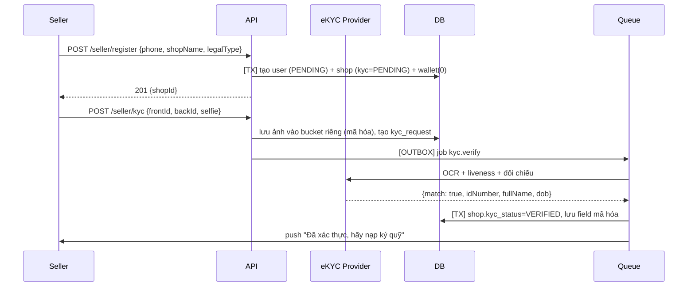
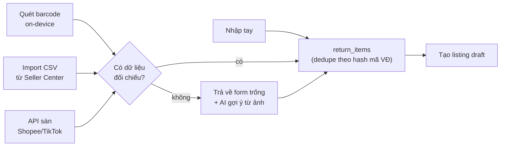
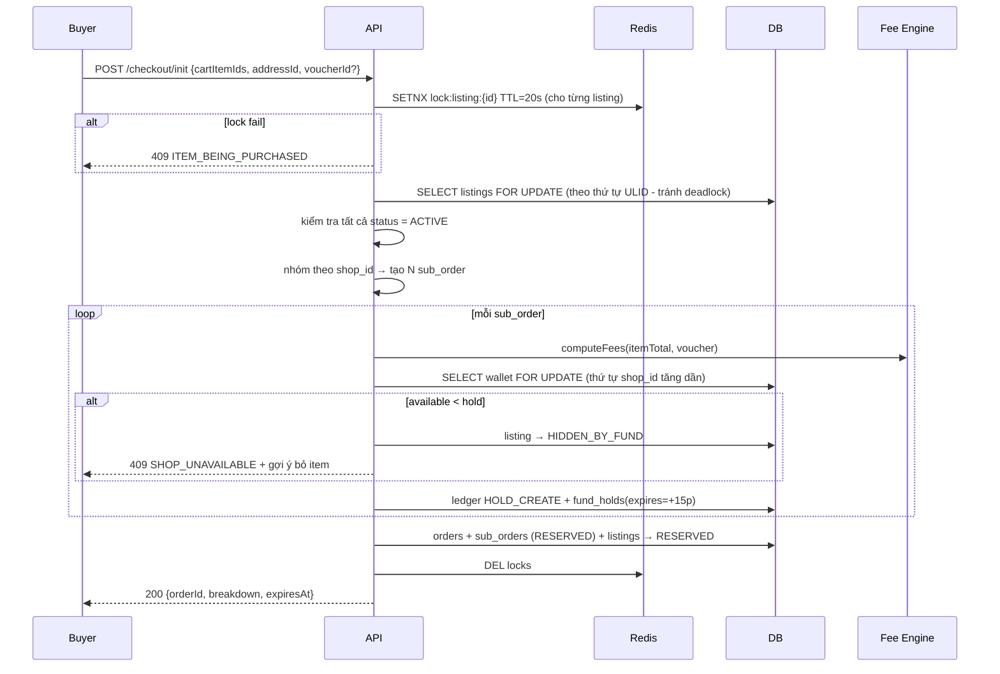

# REBOX - Luồng Backend chi tiết

Đọc kèm `01-TECHNICAL-SPEC.md`. Mỗi luồng gồm: sequence, ranh giới transaction, idempotency, và **error path** (phần hay bị bỏ sót nhất và cũng là phần gây mất tiền).

Quy ước ký hiệu:

- `[TX]` = nằm trong một database transaction
- `[OUTBOX]` = ghi vào bảng outbox trong cùng TX, worker xử lý sau
- `[IDEM:key]` = thao tác idempotent theo khóa

---

## 1. Luồng Seller onboarding & ký quỹ

### 1.1. Đăng ký shop + eKYC



**Ràng buộc:**

- Ảnh CCCD là **dữ liệu cá nhân nhạy cảm**. Lưu bucket riêng, mã hóa, `retention_until = kyc_verified_at + 5 năm` (thời hiệu tranh chấp), audit mọi lượt truy cập.
- Không lưu ảnh CCCD gốc sau khi verify nếu không bắt buộc - chỉ giữ `idNumber` mã hóa + kết quả verify + hash ảnh. Giảm bề mặt rủi ro rò rỉ.
- eKYC fail 3 lần ⇒ chuyển duyệt tay, không cho retry vô hạn (chống dò).

### 1.2. Nạp ký quỹ

```
POST /seller/wallet/topup  {amount}  Idempotency-Key: <uuid>
```

```
1. Validate amount >= 50.000, <= 50.000.000
2. [TX] tạo payment_intent (PENDING), sinh mã đối soát RBXTOPUP<id>
3. Trả về QR/link PSP
--- bất đồng bộ ---
4. PSP webhook → verify chữ ký → tra payment_intent theo mã đối soát
5. [TX] [IDEM: "topup:" + psp_txn_id]
     - SELECT wallet FOR UPDATE
     - ghi 2 dòng ledger DEPOSIT_TOPUP
     - wallet.available += amount, version += 1
     - payment_intent.status = SUCCEEDED
     - [OUTBOX] job shop.reevaluate_lock
6. Worker shop.reevaluate_lock → có thể mở lại listing đang HIDDEN_BY_FUND
```

**Error path:**

| Tình huống                              | Xử lý                                                                                              |
| --------------------------------------- | -------------------------------------------------------------------------------------------------- |
| Webhook đến 2 lần                       | `IDEM` key theo `psp_txn_id` ⇒ lần 2 no-op, vẫn trả 200                                            |
| Webhook đến trước khi API trả về client | Không sao - nguồn sự thật là DB, client poll trạng thái                                            |
| Số tiền webhook ≠ số tiền intent        | **Không tự động ghi có.** Tạo `manual_review_case`, cảnh báo ops. Đây là vector gian lận kinh điển |
| PSP không gửi webhook                   | Job reconcile mỗi 15 phút: query PSP theo các intent PENDING >10 phút                              |
| Webhook đến sau khi intent đã EXPIRED   | Vẫn ghi có (tiền đã vào thật), nhưng gắn cờ `late_settlement`                                      |

### 1.3. Rút ký quỹ

```
1. Validate: amount <= wallet.available - min_deposit_required
              (KHÔNG cho rút xuống dưới mức ký quỹ tối thiểu)
2. Kiểm tra rủi ro: tài khoản nhận đã xác thực? đổi TK gần đây <7 ngày? có tranh chấp mở?
3. [TX] tạo withdrawal (PENDING) + ledger WITHDRAWAL_HOLD (khóa tiền ngay)
4. Nếu amount > 5.000.000 → chờ duyệt tay + delay 24h
5. [OUTBOX] job payout.execute → PSP payout API
6. Thành công: ledger WITHDRAWAL_SETTLED
   Thất bại:   [TX] hoàn tiền về available + đánh dấu FAILED + thông báo
```

**Chống chiếm đoạt tài khoản:** đổi tài khoản ngân hàng nhận tiền ⇒ khóa rút tiền 72h + thông báo qua mọi kênh (push, SMS, email). Đây là biện pháp bắt buộc, không phải tùy chọn.

---

## 2. Luồng đăng bán

### 2.1. Ingest hàng hoàn - 4 nguồn



**Dedupe:** `source_tracking_hash = HMAC_SHA256(pepper, normalize(tracking_no))`. Unique index `(shop_id, source_tracking_hash)`. Quét trùng ⇒ trả về `return_item` đã có kèm trạng thái, **không tạo bản ghi mới** - nhân viên kho quét trùng là chuyện xảy ra hằng ngày.

### 2.2. Scan-to-list (luồng nhanh)

**Mô hình truy cập: tra cứu theo yêu cầu, KHÔNG đồng bộ toàn bộ** (`01-SPEC` §7.1.1).
REBOX chỉ đọc đúng đơn seller chủ động đưa ra bằng cách quét mã trên kiện hàng vật lý.

```
POST /seller/scan  {scannedCode, codeType, platformHint}
      codeType ∈ {ORDER_SN, TRACKING_NO, UNKNOWN}

1.  Chuẩn hoá mã + nhận diện nguồn
    - bỏ khoảng trắng, viết hoa
    - đoán ĐVVC/sàn theo tiền tố và định dạng (SPX / GHN / GHTK / J&T / Ninja…)
    - đoán codeType nếu client gửi UNKNOWN
    ⚠ Heuristic này DỄ VỠ khi các bên đổi định dạng → tách thành bảng cấu hình,
      có test theo mẫu thật, không hardcode rải rác

2.  Tra return_items theo source_tracking_hash
    ├─ HIT   → trả dữ liệu đã có (≈50ms). KẾT THÚC.
    └─ MISS  → tiếp

3.  Tra cache đơn-đã-quét (TTL 30 ngày, chỉ chứa đơn seller đã từng đưa ra)
    ├─ HIT   → tạo return_item từ cache. KẾT THÚC.
    └─ MISS  → tiếp

4.  ĐƯỜNG C - tra csv_staging (seller đã import trước đó)
    ├─ HIT   → tạo return_item từ dòng CSV. KẾT THÚC.
    └─ MISS  → tiếp
    ※ Đường này KHÔNG cần API, luôn hoạt động → giữ làm luồng chính của MVP (L7)

5.  Nếu shop đã kết nối API sàn VÀ tính năng bật:

    ĐƯỜNG A - codeType == ORDER_SN                    ← ưu tiên
      get_order_detail(order_sn)                      1 lần gọi, tối thiểu hoá triệt để

    ĐƯỜNG B - codeType == TRACKING_NO
      b1. get_order_list(status=RETURNED, 60 ngày)
          → CHỈ lấy cặp (order_sn, tracking_number)
          → giữ trong cache ngắn hạn, KHÔNG ghi xuống DB
      b2. đối chiếu trong bộ nhớ tìm đơn khớp
      b3. CHỈ get_order_detail cho đúng đơn đó
      ※ Giảm thiểu ở tầng LƯU TRỮ, không giảm được ở tầng ĐỌC - nêu rõ trong
        chính sách, không che

    Chung cho A và B:
      - timeout 8s, circuit breaker, backoff
      - lọc allowlist trường dữ liệu NGAY tại tầng ingest, trước khi ghi
      - ghi audit_logs: shop nào, đọc đơn nào, lúc nào
      ├─ OK    → tạo return_item + ghi cache (chỉ trường sản phẩm)
      └─ FAIL  → tiếp

6.  Trả form trống + mã đã điền sẵn + gợi ý "chụp ảnh để AI điền giúp"
```

**Bộ lọc allowlist - bắt buộc, chặn ở tầng ingest:**

```
CHO PHÉP :  item_name, sku, variant/model, item_images[],
            original_price, category, weight, dimensions
CHẶN     :  buyer_name, buyer_phone, buyer_address, buyer_user_id,
            recipient_*, mọi trường định danh người mua gốc
```

Chặn tại tầng ingest chứ không lọc lúc hiển thị: dữ liệu không được phép **tồn tại** trong `raw_payload`, chứ không phải chỉ ẩn đi. Xem `05-PHAP-LY` §3.6.

**Đường lùi khi quét thất bại** - tỷ lệ lỗi ở kho thật không nhỏ (nhãn rách, dán đè, ướt, mờ):

```
Barcode không đọc được  → OCR vùng text trên nhãn (on-device)
OCR không ra            → nhập tay mã
Không có mã             → đăng thủ công + AI gợi ý từ ảnh chụp
```

**Điểm thiết kế quan trọng:** bước 4 **không bao giờ chặn** trải nghiệm. Timeout 8s là quá lâu cho nhân viên kho đang quét liên tục - nên thực tế UI hiển thị form ngay ở 1,5s và **điền bù** khi API trả về (optimistic UI). Xem `03-FRONTEND-FLOWS` §2.2.

### 2.3. Publish listing

```
POST /seller/listings  {returnItemId, title, price, condition, images[], weight, dim}

[TX]
  1. Kiểm tra sở hữu return_item, trạng thái = IN_STOCK
  2. Kiểm tra giá:
       nếu original_price tồn tại → price <= 0.9 * original_price   (giá trần)
       price >= 10.000  (dưới ngưỡng này phí sàn min 10k nuốt hết)
  3. Kiểm tra danh mục: không thuộc danh sách cấm/hạn chế (§2.4)
  4. Tạo listing status = PENDING_REVIEW
  5. return_item.liquidation_status = LISTED
  6. [OUTBOX] job listing.moderate
COMMIT

Worker listing.moderate:
  - Ảnh: NSFW + trùng lặp (phash) + có phải ảnh chụp màn hình sàn khác không
  - Text: classifier danh mục cấm, phát hiện thông tin liên hệ (chống dẫn dắt ra ngoài sàn)
  - Đối chiếu tên hàng với danh mục hạn chế
  → PASS: status = ACTIVE, published_at = now(), cập nhật search_tsv
  → FLAG: status = PENDING_REVIEW + đưa vào hàng đợi admin
  → REJECT: status = SUSPENDED + lý do + cho phép seller sửa
```

**Sau khi ACTIVE**, gọi `shop.reevaluate_coverage`:

```
required = Σ hold_estimate(listing) cho toàn bộ listing ACTIVE của shop
coverage = wallet.available / required
nếu coverage < 0.15 → gửi cảnh báo "kho sắp bị hạn chế"
nếu wallet.available < hold_estimate(listing đắt nhất) → greedy hide (§2.5)
```

### 2.4. Kiểm soát danh mục hàng hóa

Bảng `restricted_categories` với 3 mức:

| Mức             | Ví dụ                                                                    | Xử lý                                       |
| --------------- | ------------------------------------------------------------------------ | ------------------------------------------- |
| `BANNED`        | thuốc, TPCN, vũ khí, chất cấm, động vật hoang dã, tiền tệ, hàng nhập lậu | Chặn cứng khi publish                       |
| `MANUAL_REVIEW` | mỹ phẩm, thực phẩm, đồ chơi trẻ em, thiết bị điện, hàng hiệu             | Bắt buộc admin duyệt + yêu cầu ảnh tem/nhãn |
| `DISCLOSURE`    | đồ điện tử đã qua sử dụng, quần áo đã mặc thử                            | Bắt buộc điền `condition_notes` chi tiết    |

Danh sách này do bộ phận Pháp lý duy trì, không phải Tech. Xem `05-PHAP-LY` §6.

### 2.5. Greedy hide khi thiếu ký quỹ

```
Trigger: sau mọi thay đổi wallet.available, sau publish/đổi giá listing

function reevaluate(shopId):
  [TX]
    wallet = SELECT ... FOR UPDATE
    budget = wallet.available
    listings = SELECT ACTIVE + HIDDEN_BY_FUND của shop ORDER BY price DESC

    # Đảm bảo phủ được ít nhất N đơn đồng thời (mặc định N=3)
    covered = []
    for L in listings:
        need = hold_estimate(L)
        if budget >= need:
            covered.append(L); budget -= need
        # KHÔNG break - listing rẻ hơn phía sau vẫn có thể phủ được

    hide  = listings không nằm trong covered và đang ACTIVE
    show  = listings nằm trong covered và đang HIDDEN_BY_FUND

    UPDATE hide → HIDDEN_BY_FUND, hidden_reason='INSUFFICIENT_FUND'
    UPDATE show → ACTIVE
    shop.status = (covered rỗng) ? LOCKED_INSUFFICIENT_FUND : ACTIVE
  COMMIT
  [OUTBOX] thông báo seller nếu có thay đổi
```

Lưu ý: đây chỉ là **hiển thị**, không phải hold thật. Hold thật xảy ra ở checkout. Mục đích là để buyer không nhìn thấy hàng mà shop không đủ tiền bảo đảm - tránh việc đơn bị hủy sau khi buyer đã trả tiền.

---

## 3. Luồng mua hàng (Buyer)

### 3.1. Giỏ hàng → Checkout init (luồng nhạy cảm nhất)



**Thứ tự khóa cố định (bắt buộc):** luôn khóa `listings` theo ULID tăng dần, rồi `wallets` theo `shop_id` tăng dần. Sai thứ tự ⇒ deadlock khi 2 buyer mua chéo 2 shop.

**Toàn bộ nằm trong MỘT transaction.** Nếu hold của sub-order thứ 2 thất bại, hold của sub-order thứ 1 phải rollback theo. Không có trạng thái nửa vời.

**Vì sao hold trước khi thanh toán:** nếu hold sau khi buyer trả tiền và shop không đủ số dư, ta có tiền của buyer trong tài khoản shop nhưng không có bảo đảm - tình huống tệ nhất về cả nghiệp vụ lẫn pháp lý. Xem L2.

### 3.2. Thanh toán VietQR

```
POST /checkout/{orderId}/pay  {method: VIETQR}

1. Với mỗi sub_order, sinh QR trỏ về TK NGÂN HÀNG CỦA SELLER
   addInfo = "RBX" + subOrderId  (mã đối soát duy nhất)
   amount  = sub_order.buyer_payable
2. Trả về danh sách QR (nhiều seller = nhiều QR - cần nêu rõ trong UI)
3. sub_order.status = AWAITING_PAYMENT
4. Đặt job hết hạn tại T+15 phút

--- webhook bank hub ---
POST /webhooks/bank  {txnId, accountNo, amount, content, time}
1. Verify chữ ký + IP allowlist
2. Trích subOrderId từ content bằng regex /RBX([0-9A-HJKMNP-TV-Z]{26})/
3. [TX] [IDEM: "bankwh:" + txnId]
     - so khớp accountNo == shop.payout_account
     - so khớp amount   == buyer_payable   (KHÔNG chấp nhận lệch)
     - sub_order.status: AWAITING_PAYMENT → CONFIRMED
     - listing → SOLD
     - [OUTBOX] noti seller + buyer
4. Nếu không khớp → bảng payment_unmatched, ops xử lý tay
```

**Error path - quan trọng:**

| Tình huống                            | Xử lý                                                                                                                                                                                                                      |
| ------------------------------------- | -------------------------------------------------------------------------------------------------------------------------------------------------------------------------------------------------------------------------- |
| Buyer chuyển thiếu tiền               | Không confirm. Vào `payment_unmatched`. Thông báo buyer chuyển bù hoặc hoàn trả. **Không tự động hoàn** - tài khoản nhận là của seller, REBOX không rút được                                                               |
| Buyer chuyển thừa                     | Confirm đơn, phần thừa vào `payment_unmatched` để ops hoàn tay                                                                                                                                                             |
| Buyer chuyển sau khi hết hạn 15 phút  | Hold đã release, listing có thể đã bán cho người khác. **Đây là rủi ro thật của mô hình.** Giảm thiểu: kéo dài TTL lên 30 phút, cảnh báo rõ trong UI, và giữ `RESERVED` thêm 10 phút ở chế độ grace nếu chưa có buyer khác |
| Buyer quên nhập nội dung chuyển khoản | Vào `payment_unmatched`. Đối chiếu tay theo số tiền + thời gian + số tài khoản gửi                                                                                                                                         |
| Bank hub chết                         | Job polling sao kê mỗi 5 phút làm phương án dự phòng                                                                                                                                                                       |

**Đây là điểm yếu cấu trúc của mô hình "tiền đi thẳng về seller".** Cần nêu rõ với ban dự án: đổi lại tốc độ thu hồi vốn cho seller, REBOX mất khả năng kiểm soát tiền và phải chấp nhận một tỷ lệ đối soát tay nhất định (~2–5% giao dịch VietQR theo kinh nghiệm các hệ thống tương tự).

### 3.3. Thanh toán COD

```
1. Kiểm tra rủi ro buyer:
     - buyer mới (<2 đơn hoàn thành) + đơn > 300.000 → chặn COD
     - tỷ lệ boom hàng > 20% → chặn COD
     - địa chỉ nằm trong cụm rủi ro → chặn COD
2. sub_order.status = CONFIRMED ngay (không chờ tiền)
3. Hold vẫn giữ nguyên
4. ĐVVC thu tiền, chi hộ về TK seller trong 24–48h
5. Job đối soát COD hằng ngày: so khớp bảng kê ĐVVC với sub_orders
     - Đủ tiền → OK
     - ĐVVC báo giao thành công nhưng chưa thấy tiền sau 72h → cảnh báo ops
```

### 3.4. Tạo vận đơn & gộp kiện

```
Trigger: sub_order → CONFIRMED, seller bấm "Xác nhận & In vận đơn"

1. Gom toàn bộ sub_order_items (đã cùng shop theo thiết kế)
2. Tính tổng cân nặng + kích thước bao ngoài (thuật toán đóng gói đơn giản:
   tổng thể tích, cạnh dài nhất)
3. CarrierAdapter.createOrder({from: shop.warehouse, to: buyer.address,
                               weight, dim, codAmount, insuranceValue})
4. [TX] lưu tracking_no (mã hóa), carrier_code, status = READY_TO_SHIP
5. Trả về PDF/PNG nhãn vận đơn (khổ A6 hoặc 10x15 cho máy in nhiệt)
```

**Chọn ĐVVC:** ở v1 chọn theo cấu hình shop + vùng giao. Không làm thuật toán tối ưu cước ở MVP - độ phức tạp cao, lợi ích thấp khi sản lượng còn nhỏ.

### 3.5. Webhook trạng thái vận chuyển

```
POST /webhooks/carrier/{carrierCode}

1. Verify chữ ký theo cơ chế của từng ĐVVC (GHN: token header; GHTK: HMAC)
2. [IDEM: carrier + trackingNo + status + eventTime]
3. Map trạng thái ĐVVC → trạng thái REBOX (bảng ánh xạ riêng mỗi ĐVVC)
4. Chỉ chấp nhận nếu tiến về phía trước trong state machine
   (webhook đến không đúng thứ tự là chuyện bình thường)
5. Nếu status = DELIVERED:
     [TX] sub_order.delivered_at   = event_time
          sub_order.claim_deadline_at = event_time + 72h
          status = DELIVERED
          [OUTBOX] schedule job settle.suborder AT claim_deadline_at
          [OUTBOX] noti buyer "Nhớ quay video khi khui hộp"
6. Nếu status = DELIVERY_FAILED (boom hàng):
     → RETURNING, hàng quay về shop
     → khi RETURNED_TO_SELLER: release hold + trừ ship 2 chặng của seller
       (đơn COD boom là rủi ro của seller, giống mọi sàn khác)
```

**Job polling bù:** mỗi 30 phút, quét `sub_orders` ở `IN_TRANSIT` quá 24h không có event mới ⇒ chủ động gọi API tra cứu ĐVVC. Webhook mất là chuyện thường xuyên xảy ra.

---

## 4. Luồng đối soát & giải phóng tiền

### 4.1. Settle sub-order (hết hạn khiếu nại)

```
Job settle.suborder chạy tại claim_deadline_at
[IDEM: "settle:" + subOrderId]

[TX]
  1. SELECT sub_order FOR UPDATE
  2. Nếu status != DELIVERED → thoát (đã có tranh chấp hoặc đã settle)
  3. Nếu tồn tại dispute đang mở → hoãn, đặt lại job sau khi dispute đóng
  4. SELECT wallet FOR UPDATE
  5. commission = max(item_total * rate, min_fee)     ← đọc config TẠI THỜI ĐIỂM ĐẶT HÀNG
  6. ledger HOLD_RELEASE   (toàn bộ hold về available)
     ledger COMMISSION_CHARGE
  7. Nếu available < 0:
       chuyển phần âm sang debt_amount, ghi ledger SHOP_DEBT
       shop → LOCKED_INSUFFICIENT_FUND
  8. fund_hold.status = CAPTURED, settled_at = now()
  9. sub_order.status = COMPLETED, settled_at = now()
 10. [OUTBOX] loyalty.award, noti seller, webhook ERP order.completed
COMMIT
```

**Bẫy phiên bản cấu hình:** phí phải tính theo config **có hiệu lực tại thời điểm đặt hàng**, không phải lúc settle. Nếu ngày 1 đặt hàng với phí 20%, ngày 3 sàn đổi thành 25%, settle ngày 4 vẫn phải tính 20%. Snapshot config vào `sub_orders.fee_snapshot` JSONB ngay lúc checkout. Đây vừa là đúng nghiệp vụ vừa là yêu cầu pháp lý (không được thay đổi điều khoản có hiệu lực hồi tố).

### 4.2. Cộng điểm thưởng (chống tách đơn)

```
Job loyalty.award  [IDEM: "loyalty:" + subOrderId]

1. points = tier(item_total)   # 0 / 0.5 / 1 / 2
2. Kiểm tra chống tách đơn:
     đếm sub_orders COMPLETED của cùng buyer
     trong cửa sổ 24h, cùng ship_address_hash, cùng shop_id
     nếu count > 1 VÀ tổng item_total của nhóm >= 100.000
        VÀ từng đơn < 100.000:
        → GỘP: cộng điểm theo tier(tổng), trừ đi điểm đã cộng cho nhóm
        → ghi cờ risk_flag = ORDER_SPLITTING
3. Ghi loyalty_ledger
```

Cơ chế lũy tiến trong tài liệu gốc đã triệt tiêu phần lớn động cơ tách đơn về mặt kinh tế (0,5 điểm × 3 đơn < 2 điểm × 1 đơn). Kiểm tra ở bước 2 là lớp phòng thủ thứ hai cho trường hợp buyer vẫn cố tình.

### 4.3. Đối soát tự động hằng ngày

```
Job reconcile.daily 02:00 mỗi ngày

A. Sổ cái nội bộ:
   với mỗi wallet: SUM(ledger.amount by account) == wallet.available/locked?
   lệch → P0 alert + đóng băng rút tiền của ví đó

B. Ngân hàng:
   SUM(BANK_SETTLEMENT) == số dư sao kê thực tế?
   lệch → P0 alert

C. ĐVVC:
   kéo bảng kê hôm qua → ghi actual_ship_cost
   so với ước tính, lệch > 20% → cảnh báo, xem lại shipping_reserve

D. Hold mồ côi:
   fund_holds ACTIVE có sub_order ở trạng thái cuối (COMPLETED/CANCELLED)
   → tự động release + ghi log bất thường

E. Đơn kẹt:
   sub_orders ở AWAITING_PAYMENT > 1h, IN_TRANSIT > 14 ngày,
   DELIVERED quá claim_deadline > 1h mà chưa settle
   → hàng đợi ops
```

Mục D và E là lưới an toàn. Trong thực tế vận hành, job chết giữa chừng, webhook mất, và deploy sai luôn xảy ra - hệ thống tiền phải tự phát hiện và tự chữa.

---

## 5. Luồng khiếu nại & tranh chấp

### 5.1. Mở khiếu nại

```
POST /orders/{subOrderId}/disputes  {reasonCode, statement, claimedAmount}

1. Kiểm tra: now() <= claim_deadline_at
   NẾU QUÁ HẠN: vẫn nhận hồ sơ nhưng gắn cờ LATE_CLAIM, đi thẳng ADMIN_REVIEW,
   và KHÔNG được auto-approve. (Không từ chối tiếp nhận - xem L5)
2. Kiểm tra chưa có dispute đang mở cho sub_order này
3. [TX]
     - tạo dispute status = EVIDENCE_PENDING, sla_deadline = now + 48h
     - sub_order.status = DISPUTED
     - HỦY job settle đã đặt (hoặc để job tự thoát ở bước 3 của §4.1)
     - hold GIỮ NGUYÊN, không release
4. Trả về danh sách presigned URL để upload chứng cứ
5. Thông báo seller: "Có khiếu nại, bạn có 24h phản hồi"
```

### 5.2. Upload chứng cứ (chain of custody)

```
0. GHI ĐỒNG Ý TRƯỚC KHI MỞ CAMERA  ← bắt buộc, xem 05-PHAP-LY §3.4.5
   POST /disputes/{id}/consent {noticeVersion, noticeSha256, purposes[]}
   [TX] ghi consent_records (văn bản đã hiển thị, từng ô đã tick, IP, thiết bị)
   → trả consentId
   Buyer từ chối: KHÔNG chặn khiếu nại. Hồ sơ đi thẳng ADMIN_REVIEW (L5)

1. Client yêu cầu presigned multipart URL:
   POST /disputes/{id}/evidence/init {kind, sizeBytes, durationMs, captureMeta, consentId}
   → server kiểm tra: size <= 200MB, duration <= 180s, kind hợp lệ
   → server kiểm tra consentId hợp lệ, thuộc đúng dispute, chưa rút lại
   → trả uploadId + phần presigned URLs

2. Client upload trực tiếp lên object storage (không qua API server)

3. POST /disputes/{id}/evidence/complete {uploadId, parts[], clientSha256}
   [TX]
     - server tự tính SHA-256 từ object storage (KHÔNG tin client)
     - đối chiếu với clientSha256; lệch → từ chối
     - ghi dispute_evidences với consent_id + retention_until (đóng vụ việc + 90 ngày)
     - đặt Object Lock (compliance mode) đến retention_until
     - [OUTBOX] job ai.triage
```

**Sinh bản khử nhận dạng cho seller** - chạy trong job `ai.triage`, sau bước chọn keyframe:

```
4. Với 6-10 keyframe AI đã chọn:
     - phát hiện khuôn mặt → làm mờ TẤT CẢ khuôn mặt (không chỉ người lạ:
       không phân biệt được đâu là buyer, đâu là người thân)
     - đóng watermark mã vụ việc
     - ghi evidence_derivatives(kind=KEYFRAME_REDACTED, visible_to='SELLER',
       redaction={faces_blurred, method, model_version},
       retention_until = đóng vụ việc + 3 năm)

5. Nếu khâu che mặt THẤT BẠI hoặc độ tin cậy thấp:
     - KHÔNG sinh bản cho seller
     - đánh dấu dispute.needs_manual_redaction = true
     - admin chọn khung hình thủ công trước khi seller xem được
     - TUYỆT ĐỐI KHÔNG fallback về video gốc
```

Bản gốc chỉ admin cấp phân xử truy cập được, presigned URL 5 phút, **mọi lượt xem ghi `audit_logs`** kèm danh tính người xem. Seller không có bất kỳ đường nào chạm tới `dispute_evidences.storage_key`.

**captureMeta bắt buộc có** (thu thập từ app, dùng để chấm điểm chứ không dùng để chặn):

```json
{
  "capturedInApp": true,
  "cameraApi": "vision-camera-4.x",
  "deviceModel": "SM-A546E",
  "osVersion": "Android 14",
  "recordStartedAt": "2026-08-24T09:12:03Z",
  "recordEndedAt": "2026-08-24T09:13:11Z",
  "appIntegrityToken": "<Play Integrity / DeviceCheck>"
}
```

**Nguyên tắc:** cho phép cả upload từ thư viện ảnh, nhưng `capturedInApp: false` làm giảm `integrity_score` và **loại khỏi diện auto-approve**. Chặn cứng upload từ thư viện là không hợp lý - người dùng có thể quay bằng app camera mặc định, và một số máy Android quay trong app bị lỗi.

### 5.3. AI Triage


**Xử lý lỗi AI service:**

| Lỗi                             | Xử lý                                                                                                    |
| ------------------------------- | -------------------------------------------------------------------------------------------------------- |
| AI service không phản hồi       | Retry 3 lần backoff; vẫn fail ⇒ `ADMIN_REVIEW` (fail-safe về phía con người, không phải về phía từ chối) |
| Video hỏng/không decode được    | `ADMIN_REVIEW` + ghi lý do; **không** kết luận buyer gian lận                                            |
| VLM trả JSON sai định dạng      | Retry với prompt sửa lỗi; 2 lần fail ⇒ bỏ qua thành phần damage, `ADMIN_REVIEW`                          |
| Chi phí VLM vượt ngân sách ngày | Circuit breaker ⇒ toàn bộ chuyển `ADMIN_REVIEW`, cảnh báo ops                                            |

### 5.4. Admin phân xử

```
GET /admin/disputes?status=ADMIN_REVIEW&sort=sla_deadline

Màn hình phân xử hiển thị:
  - Video player có scrubber + đánh dấu các mốc AI nghi vấn
  - Bảng sub-score kèm giải thích của AI (nhưng KHÔNG hiển thị "gợi ý quyết định"
    để tránh automation bias)
  - Snapshot listing lúc mua (ảnh + mô tả + condition_notes)
  - Lịch sử buyer: số đơn, số khiếu nại, tỷ lệ được duyệt
  - Lịch sử seller: số đơn, tỷ lệ bị khiếu nại, kết quả
  - Phản hồi của seller

POST /admin/disputes/{id}/resolve
  {resolution, refundAmount, sellerFault: bool, requireReturn: bool, reason}

Bắt buộc: reason không rỗng, tối thiểu 30 ký tự.
Ghi audit_logs với before/after đầy đủ.
```

**Chống automation bias:** không hiển thị nút "Chấp nhận đề xuất của AI". Admin phải tự chọn kết quả và tự viết lý do. Điểm AI là thông tin tham khảo, không phải quyết định mặc định.

### 5.5. Thực thi kết quả hoàn tiền

```
[TX] [IDEM: "resolve:" + disputeId]
  1. SELECT sub_order, fund_hold, wallet FOR UPDATE
  2. refund_to_buyer = item_total + buyer_shipping_fee   (hoàn đủ những gì buyer trả)
  3. Nếu sellerFault:
       commission = 0                                    (theo chính sách)
       ship_charge = actual_ship_out
                   + (requireReturn ? actual_ship_back : 0)
     Ngược lại (lỗi ĐVVC / bất khả kháng):
       commission = 0
       ship_charge = 0                                   (REBOX gánh)
  4. total_debit = refund_to_buyer + ship_charge
  5. ledger:
       REFUND_APPROVED       : LOCKED → BUYER_REFUND_PAYABLE  (refund_to_buyer)
       SHIPPING_CHARGE_SELLER: LOCKED → CARRIER_PAYABLE       (ship_charge)
       HOLD_RELEASE          : phần hold còn dư → AVAILABLE
  6. Nếu hold không đủ (total_debit > hold.amount):
       lấy tiếp từ available; vẫn thiếu → ghi SHOP_DEBT + khóa shop
  7. dispute → RESOLVED_REFUND; sub_order → REFUNDED
  8. Nếu requireReturn: tạo đơn vận chuyển ngược, listing → RELISTABLE khi hàng về
     Nếu không: listing → SOLD vĩnh viễn (buyer tự tiêu hủy)
  9. [OUTBOX] payout.buyer_refund, noti cả 2 bên, webhook ERP
COMMIT
```

**Chi tiền cho buyer:**

```
Job payout.buyer_refund
  - Buyer trả VietQR → hoàn về đúng tài khoản đã chuyển đến (lấy từ webhook bank)
  - Buyer trả COD    → cần buyer cung cấp tài khoản nhận; tạo yêu cầu, chờ buyer nhập
  - Thất bại → retry 3 lần → hàng đợi ops xử lý tay
  - Thành công → ledger REFUND_PAID
```

### 5.6. Kháng nghị

```
POST /disputes/{id}/appeal  {reason, additionalEvidence[]}

- Chỉ cho phép khi resolution = REJECT
- Trong 7 ngày kể từ resolved_at
- Tạo dispute mới với appeal_of = <id gốc>
- Bắt buộc chuyển cho admin cấp cao hơn (khác người đã xử lý lần 1)
- Không đi qua AI triage lần 2
- Quyết định lần 2 là quyết định cuối cùng trong hệ thống REBOX
  (không loại trừ quyền khởi kiện của người tiêu dùng - phải ghi rõ trong thông báo)
```

---

## 6. Luồng Public API cho ERP

### 6.1. Cấp quyền

```
1. Seller vào Web App → "Kết nối phần mềm kho" → chọn KiotViet/Sapo/Khác
2. Sinh client_id + client_secret (secret hiển thị MỘT LẦN)
3. ERP: POST /oauth/token {grant_type: client_credentials, scope}
   → access_token TTL 1h
4. Mọi request kèm Authorization: Bearer <token>
5. Rate limit theo client_id, trả 429 + Retry-After
```

### 6.2. Đồng bộ tồn kho 2 chiều

```
REBOX → ERP  (khi bán được hàng)
  webhook listing.sold → ERP trừ tồn kho SKU tương ứng

ERP → REBOX  (khi hàng được bán ở kênh khác)
  POST /v1/inventory/sync {sku, availableQty: 0}
  → REBOX tìm listing ACTIVE có source_sku khớp
  → nếu qty = 0: listing → DELISTED (tránh bán trùng)
  → nếu listing đang RESERVED: KHÔNG gỡ, trả 409 + cảnh báo ERP
```

**Xử lý xung đột:** REBOX là nguồn sự thật cho listing đang trong quy trình bán (`RESERVED`, `SOLD`). ERP không được ghi đè. Với listing `ACTIVE`, ERP có quyền ưu tiên vì kho vật lý nằm ở phía seller.

### 6.3. Giao webhook

```
Bảng webhook_deliveries:
  id, endpoint_id, event_type, payload, signature,
  attempt, next_retry_at, status, response_code, response_body

Lịch retry: 10s, 30s, 2p, 10p, 1h, 6h, 24h, 24h  (8 lần, tổng ~56h)
Sau 8 lần: status = FAILED, tắt endpoint sau 20 lần FAILED liên tiếp
Đối tác có endpoint /v1/webhooks/replay?from=&to= để tự lấy lại
```

---

## 7. Ma trận idempotency (tra cứu nhanh)

| Thao tác            | Khóa idempotency                                  | Nguồn khóa     |
| ------------------- | ------------------------------------------------- | -------------- |
| Nạp ký quỹ          | `topup:{psp_txn_id}`                              | PSP            |
| Rút ký quỹ          | `withdraw:{withdrawal_id}`                        | REBOX          |
| Checkout init       | `checkout:{client_uuid}`                          | Client gửi lên |
| Xác nhận thanh toán | `bankwh:{bank_txn_id}`                            | Bank hub       |
| Webhook ĐVVC        | `carrier:{code}:{tracking}:{status}:{event_time}` | ĐVVC           |
| Settle sub-order    | `settle:{sub_order_id}`                           | REBOX          |
| Cộng điểm           | `loyalty:{sub_order_id}`                          | REBOX          |
| Xử lý tranh chấp    | `resolve:{dispute_id}`                            | REBOX          |
| Chi hoàn tiền       | `refund:{dispute_id}`                             | REBOX          |

**Quy tắc:** mọi handler nhận sự kiện từ bên ngoài phải lưu khóa **trước** khi xử lý, trong cùng transaction với thay đổi nghiệp vụ. Lưu sau khi xử lý là race condition kinh điển.
